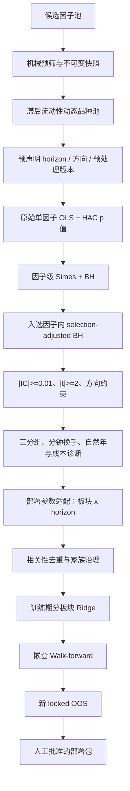

# 期货因子检验与准入流程（Validation Policy v2）

本文记录 `multi_factor` 当前正式因子发现、部署参数适配、Walk-forward 与人工准入顺序。
代码与配置的唯一基线是 `config/default.yaml::validation_policy`；每次正式研究会保存配置
内容、SHA-256、taxonomy SHA-256 和完整漏斗。GP 搜索期指标、SQLite 状态、历史显著性、
Ridge 系数和生产批准属于不同证据层，不能相互替代。

## 完整流程



Bonferroni/FWER 仍随每条假设输出，但只是证据等级标签，不再是硬闸门。

## 1. 候选池、预筛和正式研究边界

自动挖掘、WorldQuant、GTJA、spec 与手工因子先进入候选范围，不自动成为可交易因子。
挖掘模块 SQLite 保存可变候选目录和血缘；主框架只加载带哈希的不可变 JSON 快照，并
通过 `Factor` 桥接器运行。两者可以共存，不会与 spec 注册冲突。

机械预筛只淘汰表达式无效、字段缺失、输出全常数、覆盖不足或截面不足等不可研究候选。
合成数据调试、表达式编码和单元测试不要求执行正式流程；一旦查看真实历史 IC、t 值、
收益或最优周期，就必须冻结候选、频率、日期、horizon、预处理版本和假设数，并使用新的
只写一次输出目录。

## 2. 品种池与预处理假设

正式研究使用只依赖滞后信息的动态流动性品种池。成交额、持仓量和上市覆盖先 `shift(1)`，
避免当天信息决定当天可交易集合。

默认预处理为：

```text
动态品种掩码 -> 每日截面 MAD -> 板块中性化 -> 每日截面 Z-score -> 再应用掩码
```

对 `carry`、`trend` 和 `macro_trend` 家族，验证层同时测试 `raw` 与 `neutralized`；二者作为同一因子内
的两个预声明假设进入多重检验。最终只能部署实际通过的版本。其他家族默认只测试中性化
版本。组合构建层是否中性化仍是独立风控选择，不因验证层的 raw 版本而取消。

## 3. horizon 预声明与周期语义

周期始终表示 bar 数：1 分钟频率的 H=1/5/15 分别是 1/5/15 分钟，而不是交易日；日频
H=5 才表示 5 个交易日。`validation_policy.family_horizons` 可为有经济先验的家族冻结
1–2 个主持有期；未配置的家族保留既有窗口映射或命令行显式周期，全部周期作为因子内
假设接受 BH，不能事后只报告峰值周期。

## 4. 正式统计量

每个“因子 × horizon × 预处理版本”计算每日横截面 IC 和未收缩单因子横截面 OLS 斜率。
每日最少 10 个有效品种；斜率时间序列使用 Newey-West HAC，滞后阶数随 horizon 调整，
处理重叠前向收益的序列相关。Ridge 不参与此处的 p 值计算。

## 5. 层级 FDR 与经济量级

正式发现使用两层控制：

1. 每个经济因子的所有局部 p 值通过 Simes 聚合；全部因子的 Simes p 值执行 BH，
   `q=0.10`。
2. 若总计 `M` 个可估计因子家族、第一层选中 `R` 个，则入选因子内使用
   Benjamini–Bogomolov selection-adjusted 水平 `q_local = q × R / M` 执行 BH。

局部假设必须同时通过因子层和因子内层。此工程实现比“入选后仍直接用 q=0.10”更保守，
避免把选择后的局部 FDR 当作未经选择的普通 BH。所有假设同时输出 `fwer_significant`：

- `FWER`：也通过报告用 Bonferroni；
- `FDR`：通过层级 FDR，但未达 FWER；
- `not_discovered`：未发现。

FWER 标签不得反过来成为部署硬闸门。

层级 FDR 后的汇总门槛为：

- `|IC| >= 0.01`；
- `|OLS/HAC t| >= 2.0`；
- 若配置了因子方向先验，观测方向必须一致；
- 未预声明方向的显著结果保留为探索性观察候选，不能靠事后故事直接转正。

方向先验必须在看结果前写入 `validation_policy.expected_directions`。反向显著若与先验冲突
会被拒绝；没有先验的方向不会被伪装成确认性结论。

## 6. 后置交易属性与自然年诊断

正式路径使用三分组，降低小板块五分组的噪声。高因子组减低因子组的年化毛利差用于经济
量级和成本覆盖；单调性、DSR 与 PBO 保留为诊断，不再是生产硬闸门。

换手定义固定为：

```text
half_turnover = 0.5 × sum(abs(w_t - w_t-1))
```

分钟数据先按实际调仓 schedule 计算 bar 换手，再按交易日聚合；不得把一分钟换手直接
乘 21 冒充月换手。硬门槛是月换手 `< 50%`。交易成本口径与该 half-turnover 对齐：

```text
annual trading cost = annual half-turnover × one-way cost × 2
```

成本覆盖要求：

```text
gross annual alpha >= 1.5 × (trading cost + roll cost + annual fee)
```

移仓成本必须来自带来源标识的真实主力切换账本，可使用组合级年化率或覆盖全部活跃品种的
逐品种年化率。默认配置没有伪造移仓成本；账本缺失或覆盖不全时因子进入观察期，不能宣称
已通过净收益门槛。

稳定性按自然年，而非全样本机械四等分：

- 至少 60% 年份与训练方向一致；
- 至少 65% 年份的定向 IC `>= 0.01`；
- 至少 5 个有效自然年，否则自动进入观察期；
- 输出最长连续失效年数、最差年份 IC、moving-block bootstrap IC 置信区间；
- 命中率、方向年份比例、经济量级年份比例、IR 稳定性形成等权记分卡。

旧代码的四等分阈值确实是方向 `70%`、经济量级 `80%`；它们保留在兼容类中，但正式
v2 路径已经由自然年检验取代，因此不存在继续执行“4/4”再额外放松的问题。

## 7. 记分卡冻结纪律

记分卡默认四项等权、阈值 0.75，但当前 `calibrated=false`、`enforced=false`。在此状态下
只报告分数，候选进入观察期，不能将当前待审因子的结果用于调权。

启用硬门槛前必须：

1. 使用与当前候选完全隔离的已知有效/已知失效旧因子集或模拟因子集；
2. 保存 pilot 数据来源和 SHA-256；
3. 冻结权重、组件阈值和总分阈值；
4. 在新的时间区间验证后才设置 `calibrated=true` 与 `enforced=true`。

配置校验会拒绝没有 pilot 来源与合法 SHA-256 的强制记分卡。完整验证策略自身也会生成
SHA-256，任何权重或阈值变化都会使旧研究 bundle 失效。

## 8. 板块 × horizon 适配的角色

适配阶段只接收发现阶段冻结的因子和已通过的预处理版本，角色是部署参数选择，不再对同一
发现集执行第二次全局 Bonferroni。局部约束保留：

- `|effect| >= 0.01`；
- `|t| >= 1.96`；
- 命中率 `>= 52%`；
- 前 60% 定方向，后 40% 合并 IC 同号且命中率 `>= 50%`；
- 至少 50 个统计观测。

这些是部署参数适配的独立约束，必须先全部满足，局部板块/horizon 才能进入可选集合；
它们没有并入自然年记分卡，也不能靠记分卡高分抵消。自然年记分卡属于全市场发现后的
跨年份稳定性诊断/治理层，两者作用范围和失败含义不同。

三种板块推断通道：

| 板块品种数 | 推断 |
| --- | --- |
| `>=3` | 横截面 Fama-MacBeth OLS/HAC |
| `=2` | pooled instrument fixed effects + time-HAC |
| `=1` | 单品种 TS OLS + HAC 与按交易日 wild score bootstrap，p 值取较保守者 |

单品种最低历史是 750 个唯一交易日，不是 750 个分钟 bar。历史不足时该局部假设保留、
`p=1` 并标为观察期；在已冻结发现集的部署适配中可按局部经济约束路由，但权重上限自动
降为 0.5。其转正还要求连续两个 WF 折存活且新的 locked OOS 合并方向为正。

## 9. 观察期、Walk-forward 与 locked OOS

以下任一条件会加入观察期原因：历史不足 5 年、真实移仓账本缺失、经济方向未预声明、
记分卡未用隔离 pilot 校准、单品种板块历史不足，或尚未获得新的 locked OOS。观察候选
可继续进入 WF 以积累证据，但 Alpha 贡献上限为正式因子的 50%。该上限在分板块 OLS/Ridge
预测层实际生效，不只是报告字段。

WF 每折严格按以下顺序：训练期全市场发现 → 冻结发现集的部署参数适配 → 相关性去重与
家族治理 → 训练期 Ridge → 未触碰测试折。输出逐因子 OOS IC、同方向折比例和最长连续
存活折数。locked OOS 还必须与训练期同号；至少 60% fold 同号。

截至当前仓库证据，`2025-07-01` 至 `2026-07-24` 已被历史研究使用，不能再次宣称为新的
locked OOS。真正的新 locked OOS 只能使用 `2026-07-25` 之后取得且此前未消费的数据。
即使连续两个 WF 折通过，在新 locked OOS 到来前 `production_approved` 仍固定为 `false`。

## 10. Taxonomy 与全量回溯

`core/sectors.py` 是全框架唯一 taxonomy。`SI`、`LC`、`PS` 当前已属于 `nonferrous`；
本次没有为追求表面变化而机械改板块。任何未来分类变更都会同时影响动态品种池、板块
中性化、板块 IC 和组合约束。

正式产物保存 `taxonomy_version` 与 `taxonomy_sha256`。主框架加载 bundle 时同时校验
taxonomy 和验证策略哈希；不一致即失败并要求全量重跑 P0。`taxonomy_diff()` 输出逐品种
旧/新分类和 `requires_full_p0_replay`。重跑报告必须保留旧、新 taxonomy 下的通过状态、
中性化基准与板块 IC 差异，禁止静默通过或静默淘汰；`compare_taxonomy_replay()` 可直接
比较两份 `ic_by_window_period.json` 并列出新增/移除因子及周期、版本、IC 变化。

## 11. 漏斗、敏感性与 P0/P1/P2 状态

每次研究输出：

- `ic_by_window_period.json`：逐假设统计量、FDR/FWER 标签、最终候选；
- `validation_funnel.json`：从可估计假设到 WF 候选的完整漏斗；
- `threshold_sensitivity`：q、IC、t、换手、年度比例和成本安全边际的 `-20%/基线/+20%`
  报告。敏感性只作报告，基线选择不会随结果改变。

| 阶段 | 当前状态 |
| --- | --- |
| P0 | 层级 FDR、FWER 报告化、IC=0.01、漏斗审计已接入 |
| P1 | 自然年、三分组、双轨预处理、冻结记分卡框架已接入；pilot 尚未提供 |
| P2 | 单品种观察通道、成本覆盖接口、±20% 敏感性、taxonomy 哈希与回溯闸门已接入；真实 roll ledger 尚未提供 |

后续必须遵守以下硬治理纪律：

- 若 P0 重跑后漏斗仍接近零产出，答案只能在扩大品种池（如纳入境外指数或更多新能源
  品种）、拉长历史，或对适合的因子家族使用更高频数据；绝不继续放松 q。
- 若因子涌入过多并超过组合容量，优先将 q 从 0.10 收紧至 0.05；绝不恢复 Bonferroni
  硬门槛。

## 12. Ridge 和人工批准

Ridge 只在统计发现、交易属性检查、部署适配、相关性去重与家族治理之后缓解共线性并
生成收益预测，不产生准入 p 值。研究代码不得自动写入 `config/trading.yaml`。历史候选、
观察候选、WF 存活与人工批准的部署包是四个不同状态。

## 代码索引

| 内容 | 位置 |
| --- | --- |
| 验证策略配置 | `core/config.py`, `config/default.yaml` |
| 层级 FDR、策略哈希、locked OOS gate | `research/validation.py` |
| 正式全市场发现与漏斗 | `workflows/research.py` |
| 部署参数适配、单品种 TS | `workflows/factor_adaptivity.py` |
| 三分组、换手、自然年 | `testing/layered.py`, `testing/turnover.py`, `testing/robustness.py` |
| 成本覆盖 | `optimization/costs.py` |
| Taxonomy 与差异审计 | `core/sectors.py` |
| WF 因子存活 | `workflows/walkforward.py` |
| 观察期 Alpha 上限 | `alpha/ols.py`, `pipeline/runner.py` |
