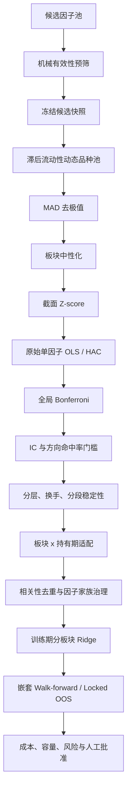

# 期货因子检验与准入流程

本文记录 `multi_factor` 当前实际执行的因子检验、筛选和准入顺序。内容以代码路径为准，
用于避免将挖掘诊断、历史显著性、Ridge 建模结果或组合回测误认为同一层级的证据。

## 完整流程



## 1. 候选池与正式因子库

自动挖掘、WorldQuant、GTJA、SPEC 和手工因子首先进入发现范围，不自动成为可交易
因子。默认配置保持 `factors: []`，只有审计后的训练产物才能向后续组合提供因子。

挖掘阶段的预筛只允许淘汰机械无效公式，默认检查：

- 表达式哈希、同周期重复公式、原始依赖字段和声明回看期；
- 时间覆盖率至少 50%；
- 至少 4 个品种形成有效截面；
- 至少 30 个时间观测；
- 至少 5% 的有效截面具有真实横截面变化；
- 计算异常、输出长期常数或依赖字段全空。

方向不稳定、成本调整收益非正、分段符号较弱、频繁截断和候选间高相关只记录为软
警告。预筛不按任意 quota 截断，也不构成正式有效性证据。机械通过集合保存为带
SHA-256 的不可变 JSON 快照，再由主框架加载。

候选目录使用以下状态，但任何状态都不会自动写入交易配置：

```text
mined_candidate
  -> development_candidate
  -> historical_candidate
  -> oos_validated
  -> 人工批准的部署包
```

## 2. 动态研究品种池

正式计算前，框架使用只依赖滞后信息的流动性品种池。默认每月更新，目标 32 个品种，
允许范围为 28 至 35 个。

流动性得分为：

```text
score = 70% x 成交额分位排名 + 30% x 持仓量分位排名
```

成交额、持仓量和上市覆盖均先执行 `shift(1)`，当天信息只能影响下一次决策。滚动
窗口为 60 个交易日，最短上市时间为 120 个交易日，数据覆盖率至少 95%。板块最低和
最高品种数保证小板块代表性，同时限制农业、能化等大板块支配全样本 IC。退出缓冲
用于降低品种在临界排名附近的频繁进出。

## 3. 因子预处理

默认顺序为：

```text
动态品种掩码
  -> 每日截面 MAD 3 倍去极值
  -> 板块中性化
  -> 每日截面 Z-score
  -> 再次应用动态品种掩码
```

板块中性化当前采用逐日、逐板块减均值：

```text
f_neutral(i,t) = f(i,t) - mean(f(j,t), j 属于同板块)
```

这等价于只对板块虚拟变量回归后取残差，但实现使用向量化分组去均值，不调用
`statsmodels.OLS`，也没有同时控制波动率、流动性等连续风险暴露。板块有效品种少于
2 个时结果置空；板块标签缺失时按默认配置失败关闭。

## 4. 全品种、多持有期统计检验

对每个预先声明的“因子 x 持有期”计算每日横截面 Pearson IC：

```text
IC_t = Corr_i(factor_i,t, forward_return_i,t->t+h)
```

同时计算未收缩单因子横截面 OLS 斜率：

```text
beta_t = Sum[(f_i,t-f_bar_t)(r_i,t-r_bar_t)]
         / Sum[(f_i,t-f_bar_t)^2]
```

每日最少需要 10 个有效品种。`beta_t` 构成 Fama-MacBeth 斜率时间序列，然后使用
Newey-West HAC 估计其均值 t 统计量。HAC 滞后阶数随持有期设置，使用 Bartlett 核
处理重叠前向收益导致的序列相关。

配置中的通用 `ICTest` 支持 Pearson 和 Spearman，但正式多周期准入主路径使用
Pearson IC 与原始单因子 OLS/HAC。Spearman 主要用于独立 IC 检验及后置分段稳健性。

该阶段没有使用 Ridge，也不允许从 Ridge 系数生成筛选 p 值。

## 5. 全局 Bonferroni 与经济门槛

全部“因子 x 持有期”构成一个全局假设族：

```text
m = 所有预声明因子与持有期组合数
alpha_adjusted = 0.05 / m
p_adjusted = min(raw_p x m, 1)
```

只有原始 OLS/HAC p 值通过 Bonferroni 的局部假设才有资格参与最佳持有期选择。最佳
持有期依次按更小的原始 p 值、更大的 `|t|` 和更短的持有期确定。未通过的因子保持
`best_period = 0`，防止诊断峰值被误解为获批周期。

Bonferroni 后还需满足：

- `|IC| >= 0.02`；
- 按实际因子方向修正后的 IC 命中率 `>= 52%`。

Newey-West IC-IR 会计算并保存，但当前不使用固定的 `|IR| >= 0.50` 硬门槛。该阈值
主要来自大股票池月频研究，不直接适合品种数量较少且前向收益重叠的期货截面。IR
在当前框架中是稳定性诊断和后续建模输入，而不是第一阶段准入 p 值。

## 6. 后置交易属性检验

通过统计与经济量级门槛的因子继续接受以下检验：

| 检验 | 当前定义 | 硬门槛 |
| --- | --- | --- |
| 五分组 | 每日按因子值分为 Q1 至 Q5，计算 Q5-Q1 | 用于单调性与收益诊断 |
| 单调性 | 五组年化收益与组号的 Spearman 相关 | `|monotonicity| >= 0.50` |
| 换手 | 排名转市场中性权重，`0.5 x Sum|w_t-w_t-1|` | 月换手 `< 50%` |
| 时间稳定性 | 全样本等分 4 段 | 至少 70% 分段与第一段同向 |
| 分段经济量级 | 每段 Spearman IC | 至少 80% 分段满足 `|IC| >= 0.01` |
| IR 稳定性 | 有效分段 IR 的标准差 | `< 0.30` |

框架还计算：

- Deflated Sharpe Ratio：使用选定持有期的非重叠多空收益、全部假设数和无风险利率 0；
- CSCV-PBO：将候选收益分为 8 个连续时间块，评估样本内最优候选在样本外落入后半区
  的概率。

目前 `DSR probability >= 95%` 和 PBO 均为诊断项，不属于 `final_factors` 的硬门槛。
最终硬门槛仍是单调性、月换手和分段稳健性。

## 7. 分板块、分周期适配

适配性研究在以下 8 个叶子板块独立执行：

```text
ferrous, nonferrous, precious, energy, agri, stock_index, bond, other
```

默认持有期为 `[1, 3, 5, 10, 20, 40]` 个周期。周期始终表示 bar 数：日频 5 周期是
5 个交易日，15 分钟频率 5 周期是 75 分钟。

板块内不少于 3 个品种时使用横截面 Fama-MacBeth OLS/HAC；只有 2 个品种时使用
品种固定效应 pooled OLS，并对时间维度使用 HAC。少于 2 个品种不执行板块检验。

局部门槛为：

- `|IC| >= 0.015`；
- `|OLS/HAC t| >= 1.96`；
- 因子方向命中率 `>= 52%`；
- 有效观测 `>= 50`；
- 前 60% 样本确定方向，后 40% 样本方向命中率 `>= 50%`。

默认对全部“因子 x 板块 x 周期”执行全局 Bonferroni。研究接口也支持全局 BH-FDR
以及“因子级 Simes + 因子内 BH”的层级 FDR，但它们不是当前默认。最佳板块和周期
只能从已经通过多重检验、经济门槛与 OOS 一致性门槛的局部假设中选择。

## 8. 相关性去重与因子家族治理

统计准入后才进行相关性处理：

- 将处理后的因子矩阵按日期和品种展平；
- 使用 Pearson 相关，至少需要 30 个共同观测；
- 按 OLS t 值方向统一因子正负；
- 默认以 `|corr| > 0.60` 聚类；
- 支持贪心聚类、平均链接层次聚类和轮廓系数自动选阈值。

Walk-forward 中每个相关性簇按“更小 q 值、更大 `|t|`、稳定因子名排序”保留代表。
随后应用经济家族数量上限，当前默认包括趋势 20、carry 12、风险分布 15、流动性流量
15、持仓参与 12、日内 12。家族治理只作用于已通过训练期检验的候选。

## 9. Ridge 的位置与用途

Ridge 严格位于 Bonferroni、经济门槛、稳定性、相关性去重和家族治理之后。当前默认
使用分板块 Ridge：

- 每个板块只使用训练产物批准的因子集合；
- 每板块最少 100 个训练样本；
- 默认不回退到全局模型；
- 候选强度为 `[0.01, 0.1, 1.0, 10.0]`；
- 使用 3 折、按时间有序的扩展窗口验证选择强度，不做随机交叉验证；
- 截距不参与 Ridge 惩罚。

Ridge 的职责是缓解已入选因子间共线性并生成收益预测，不参与统计准入，也不产生
有效性 p 值。正确顺序始终是：

```text
原始单因子 OLS/HAC -> Bonferroni -> 去重治理 -> 训练期 Ridge
```

## 10. 嵌套 Walk-forward 与最终准入

每个 Walk-forward 折只使用测试期之前的数据重新执行适配性、多重检验、相关性去重、
家族治理和 Ridge 训练。训练结果冻结为带配置哈希、数据哈希和文件哈希的不可变研究
产物，随后用于互不重叠的年度测试区间。

历史全样本通过仍只代表历史候选。进入正式因子库之前还必须检查：

- 冻结样本外表现与 DSR/PBO；
- 交易成本、换手、容量和流动性；
- 板块、品种和风险因子暴露；
- 组合增量贡献及与现有因子的相关性；
- 人工批准的部署包和交易状态。

研究代码不得把候选池或历史显著结果直接写入 `config/trading.yaml`。

## 11. 当前实现注意事项

1. 正式结果 JSON 的 `factor_preprocessing` 说明目前只列出 MAD 和 Z-score，但实际
   Pipeline 还执行了板块中性化；判断实际方法时应以处理器调用链为准。
2. 部分旧注释仍使用“IC+IR 显著”的表述，但当前正式硬门槛没有固定 IR 下限。
3. DSR 与 PBO 已计算但尚未进入最终硬门槛。
4. 正式后置分层检验主要通过换手代理控制可交易性，真实手续费、移仓管理费和组合
   净交易成本在后续组合回测中扣除，不应把分层多空收益直接视为净收益。
5. 风险模型中的 carry、momentum、volatility、skewness 和 liquidity 风格因子属于
   后续风险估计，不是当前单因子 OLS 准入回归中的控制变量。

## 代码索引

| 模块 | 位置 |
| --- | --- |
| 默认检验与处理配置 | `config/default.yaml` |
| 动态流动性品种池 | `data/universe_selection.py` |
| 正式多周期研究 | `workflows/research.py` |
| 板块与周期适配 | `workflows/factor_adaptivity.py` |
| IC/HAC | `testing/ic_test.py`, `testing/regression.py` |
| 分层、换手、稳健性 | `testing/layered.py`, `testing/turnover.py`, `testing/robustness.py` |
| DSR/PBO/FDR | `research/statistics.py` |
| 相关性聚类 | `factors/correlation_analysis.py` |
| 分板块 Ridge | `alpha/ols.py` |
| 嵌套 Walk-forward | `workflows/walkforward.py` |
| 挖掘预筛 | `factor_mining/screening.py` |
