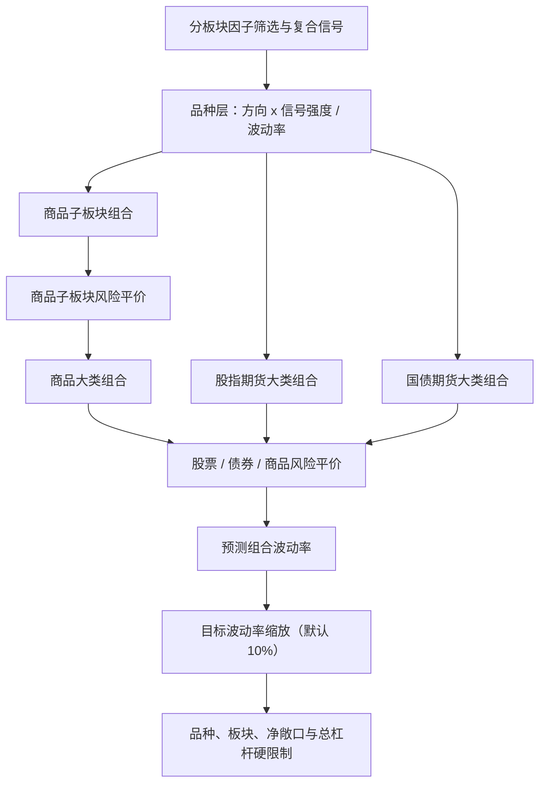

# 期货三层资产配置流程

本文记录多因子框架中面向交易研究的组合构建顺序。因子准入与组合构建保持分离：
只有通过研究流程的因子才能进入收益预测模型。

## 配置规则

1. 预测值是预期收益分数，其正负号决定多空方向。
2. 每个叶子组内的相对敞口正比于
   `forecast / annual_volatility`，品种层波动率只除一次。
3. 商品叶子组合通过协方差风险预算合成为商品大类组合。
4. 股指、国债与商品组合再通过一次协方差风险预算合成总组合。
5. 只有存在有效信号的组合参与配置；不会为了满足预算下限而凭空生成仓位。
6. 相对权重按预测组合波动率缩放。默认目标年化波动率为 10%，配置项为
   `optimization.hierarchical_asset_risk_parity.target_volatility`。
7. 硬限制最后执行且只能减仓，释放的敞口不会重新分配。

默认实现注册名为 `hierarchical_asset_risk_parity`，原有优化器仍保留用于对照研究。

## 优化器选择与流程隔离

| 优化器 | 使用场景 | Alpha 处理 | 风险配置 |
| --- | --- | --- | --- |
| `mean_variance`（`research_only`） | 预期收益幅度已可靠校准，需要直接比较品种的对照实验 | 联合优化预测收益与协方差风险；换手仅记录 | 一个全局二次规划 |
| `hierarchical_asset_risk_parity`（`formal_default`） | 所有正式研究、回测和实盘参考信号 | 预测值决定方向和底层信号强度 | 品种逆波动率、商品子板块风险平价、大类资产风险平价 |

两类优化器是品种配置层的替代方案，不能串联。多周期 `meta_optimizer` 位于其后，
负责组合完整策略子组合，与每个子组合采用哪一种品种优化器无关。三层优化器的专属参数
隔离在 `optimization.hierarchical_asset_risk_parity` 中，不读取 `risk_aversion`
或 `cost_penalty`。

运行时只根据 `optimization.type` 创建一个品种配置优化器：

- `mean_variance` 读取 `risk_aversion` 与通用 `cost_penalty`；当前期货成本模型的边际
  换手成本固定为零，因此只权衡收益和协方差风险，换手另行记录。
- `hierarchical_asset_risk_parity` 只读取同名配置块；适合期货板块结构优先、
  希望降低大协方差矩阵估计误差的默认配置。
- 两者不能串联。`meta_optimizer` 是完整子策略组合之后的可选上层配置，
  不属于上述二选一的品种优化步骤。
- 默认组合配置仍可用 30% 调仓上限控制仓位跳变，但这不是费用模型。研究账本只按持仓
  时间扣年化成本，不按实际权重变化、换手率或换手次数扣费。若旧仓已经违反品种、板块、
  净敞口或杠杆硬限制，硬风控优先，允许当期换手超过该软上限。

目标波动率的职责也按运行模式隔离：单组合回测以品种优化器的 10% 为最终目标；
多子组合回测先用同一目标统一各子组合风险尺度，启用 `meta_optimizer` 后再以其 10%
目标控制合并组合的最终资本尺度。两层都可能被后置硬限制进一步降低，但不会为追求目标
波动率而突破杠杆或集中度上限。

若旧仓已违反当日硬限制，硬限制优先于换手约束；系统会立即减仓至合法范围，
因此当期实际换手可能超过换手上限。释放的风险预算不会重新分配给其他品种。

## 迁移与遗留清理

旧 `hierarchical_sector` 仅做板块等权或静态预算，并可在板块内再次调用均值方差；
它既没有股指/国债/商品顶层风险平价，也没有商品子板块协方差风险预算，已被本流程
完整取代并从注册表删除。`risk_budgeting` 模块继续保留，因为三层优化器和
`meta_optimizer` 仍复用其中的 ERC 数值求解核心；它不属于过期文件。
