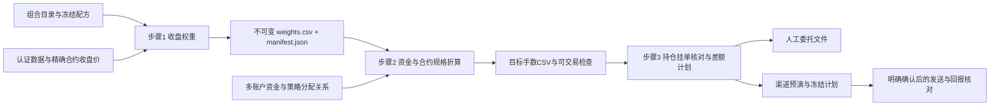

# 独立交易模块：设计、实施与验收

## 1. 核对后的框架边界

2026-09-15 基线：`intraday`/GP/SPEC → 同一正式因子准入 → `factor_library/library.json`
→ 有效库内搜索 → `config/strategy_library.yaml` → 同一 `production_portfolio` 组合算法。
当前唯一 `formal=true` 且 preferred 的策略为 `multi_source_resilient`（多源韧衡18）。
正式身份登记与生产发布/交易授权分别管理；已有发布门仍关闭。
同日另一任务已将其排名缓冲改为1；本模块读取最新目录覆盖值，不固定为0。
`strategies/combined.py` 是历史10因子兼容入口，不能作为当前首选组合的交易信号。
研究 cutoff 仍为 2026-05-15；冻结组合向前运行不会反向改写准入、选因子或优化参数。

全流程审阅覆盖：入口/配置、数据认证与选约、因子引擎与分块、准入/有效库、组合目录、
组合计算/风险/因果账本、监控归因、旧发布门和参考手数脚本，以及对应测试。
大数据只读元数据/模式/相关切片；不把全量审阅解释为重新计算所有研究或改变既有研究结果。

## 2. 唯一流程与独立运行



三个步骤分别调用；研究、日常观察、权重生成、手数折算均不会隐式发送订单。
每个账户可以接多个策略；同一策略可以分配给多个账户。执行渠道与策略计算解耦。
默认以模拟用途生成 CSV，不提升任何策略的生产资格。正式用途沿用
`target_publication.yaml` 的批准门，并将批准绑定到冻结部署包哈希。

### 步骤1：权重

- 引用目录的稳定 strategy_id；冻结因子顺序、方向、配方、计算分块起点、代码与数据指纹。
  同时绑定Python/数值库版本、现有factor_kernel_contract与原生二进制哈希，切换计算后端不复用旧产物。
- 复用 `FactorPanelRunner`、`PortfolioEvaluator` 和 `optimization` 下的相同算法。
- 权重 W[T] 表示 T 收盘后决定、供后续交易使用的目标名义敞口/基准资金；不是已成交持仓。
  因子已有 shift 不额外补移；不能把收盘后计算假装成在 T 的收盘价成交。
- 具体合约用认证数据的因果选约表；折算价用该实际合约原始收盘价，不用复权连续价。
- 最新日期必须来自完整发布数据；日期不完整、指定日缺失或收盘尚未结束时失败。
- 相同日期/全部输入指纹返回同一不可变产物，不重复计算、不覆盖文件；同日数据修订产出新版本。
  不能只用“价格没变”判断相同：因子依赖、代码、配方或状态变动均须使缓存失效。
- 固定全局400日分块起点；日常只计算覆盖IC历史的末段原分块（含原128日重叠），
  多策略共用因子并集。省略旧块不移动现有块边界；必须以完整面板尾段逐值对账验证。
- 正排名缓冲必须输入注明数据日、来源和持仓的JSON；复用原生账本的
  `PortfolioEvaluator.target_for_holdings`，未提供状态则拒绝生成。
  同一状态可共享权重；账户状态不一致时将 `strategy_ids` 配成
  `{instance_a: catalog_strategy_id, instance_b: catalog_strategy_id}`，输入各自的持仓，
  路由引用实例ID。公共因子面板仍只计算一次。源策略ID和实例ID分别记录。

### 步骤2：资金、规格与整数化

每条路由明确 strategy_id、account_id、capital_basis、amount（CNY）。禁止把权益、
总名义金额和保证金预算混用。令 g=Σ|w|，n_i=价格×计价乘数：

| 资金口径 | 名义目标 N_i |
|---|---|
| equity 基准权益 | w_i × amount；权重已含杠杆 |
| notional 总名义预算 | w_i × amount / g |
| margin 保证金预算 | w_i × amount / Σ(|w_i|×相应方向保证金率) |

同账户同实际合约先合并名义金额，再一次取整；策略归因仍保留合并前分配。
同次折算必须使用同一数据日，权重与规格的交易所必须一致；漏配账户路由直接拒绝，
不能把漏配误解释为清仓。CSV同时包含全品种零权重行，明确本版本的完整目标。
默认 `half_up`（绝对值四舍五入、符号还原），支持明确的向零取整；不采用 Python 银行家舍入。
不得把0手强行抬成1手。输出原始手数、整数手数、目标/实际名义金额、权重偏差和保证金。
逐品种至少1手是可配置验收条件；不满足时输出诊断并阻止执行，而不是隐藏遗漏品种。

单策略的两种最低资金不同：按比例完整买到1手需要 max(n_i/|w_i|)；
half_up 后至少1手需要 max(0.5×n_i/|w_i|)。保证金够用不代表比例与整数约束满足。
多策略互相抵消后0目标不等于缺失；仍另列各策略独立资金门槛。

规格必须包含合约、交易所、每价格点每手计价乘数、最小价位、多空保证金率、
日期和来源。静态 `CONTRACT_SPECS` 只允许指示性估算；历史最低保证金不能冒充账户当日保证金。
特别核对股指、国债和鸡蛋的报价单位。缺规格/非有限值/非正价格/非法连续合约均拒绝。
正式执行要求经过核实的当日规格；未知元数据不推断默认值。

取整后再次检查：总名义杠杆、净暴露、保证金比例与预留、可用资金、单合约数量限制。
`available`采用柜台已扣冻结资金的可用口径，不再重复扣减；总保证金上限仍计入冻结资金。
案例资金写在配置中，不会自动跟随浮动权益调整。每日使用新快照更新账户金额及所需路由预算；
执行核对发现权益变化时要求重新折算。单笔手数限制作用于差额委托，单合约持仓上限单独检查。
首版超限失败并输出原因，不自动改杠杆、不静默比例缩仓、不丢弃大合约。

### 步骤3：差额、执行与对账

- 账户身份由渠道认证结果绑定；别名不等于账户身份。路由必须与只读账户快照一致。
- 目标手数与真实持仓分开存储；挂单不等于持仓、queued/submitted不等于成交。
- 根据实际合约和多空分仓计算差额。反向先平再开；换月平旧合约后开新合约。
  上期所/能源中心显式区分今仓与昨仓；无可平量/今昨信息时拒绝猜测。
  当前Panda公开规则仅声明open/close，未验证close_today/close_yesterday映射时保留人工路径。
  这类Panda计划在生成阶段即标为BLOCKED。内部规范化合约与柜台原始合约分别保留，
  普通平仓发送柜台返回的实际合约，不能把郑商所三位别名的规范化代码直接冒充原码。
- 默认只管理声明的品种；完整专用账户模式需要显式选择。未管理持仓不被自动平掉。
- 有活动委托、未知回报或未完成平仓时阻止新开仓；撤单与再次计划是独立动作。
  计划的READY仅表示可开始当前阶段；依赖平仓回报的开仓行标为WAIT_CLOSE，
  必须平仓收口后重取快照并重新计划，不能按CSV行号连续发送整批。
- 计划包含输入文件哈希、身份、快照时间、有效期、方向/开平/数量/委托类型/价格、稳定幂等ID。
  启动执行前重新核对身份、快照/挂单、时效和计划哈希；修改任何参数须生成新计划。
- 本地执行日志在网络发送前持久化；崩溃/超时不盲重试。查询原operationId/clientOrderId收口。
- 手动文件可直接阅读，但只有满足全部元数据与账户检查的计划标记可交易。
  委托价独立于估值价：限价必须显式设置并符合tick/涨跌停；市价不自动填收盘价。
- 执行模式首版为 manual / paper / panda；paper只模拟本地回报。
  通用自动执行可在有明确渠道实现、账户与风控验收后接入，不建立空壳插件体系。

## 3. PandaAI 案例

官方能力版本1.1.3、交易规则0.6.3；实际安装版本以安装记录为准。
CLI用于安装、自检和人工排错；Python SDK适合结构化程序接入，两者能力/账户/交易规则一致。
SDK安装到独立环境，避免改变研究NumPy/Polars等依赖；程序通过独立Python进程调用渠道。

Panda只提供单品种最新快照，不提供历史K线或批量行情；本地认证DuckDB仍为信号数据源。
默认OAuth绑定账户，不能把任意 account_id 当成API参数选择账户；不同账户须独立凭证环境。
未确认多账户凭证隔离前，Panda案例只启用一个本机已授权身份。
Panda的无price单为市价IOC、有price为限价GFD，条件单不支持。
官方要求预演→冻结计划→用户确认→执行，首版不会宣称其支持无人确认自动交易。
仅执行安装、授权与只读自检；本次不提交任何赛事订单。

资料：
- https://www.pandaaiquant.com/openapi/v1/agent-install-guide/cli
- https://www.pandaaiquant.com/openapi/v1/agent-install-guide/python
- https://www.pandaaiquant.com/openapi/v1/skills/index.json
- https://www.pandaaiquant.com/openapi/v1/skills/trading/SKILL.md
- https://www.pandaaiquant.com/openapi/v1/meta/agent-spec

## 4. 冷启动、版本切换与保证金压力

账户是持仓、挂单、资金和执行日志的连续主体，策略名称及版本不是清仓指令。
每次调整比较“当前完整实际持仓”与“所有最新启用策略在该账户的汇总目标”。

| 情形 | 行为 |
|---|---|
| 首次启动且空仓 | 明确以空仓启动，按目标开仓；不补做历史交易 |
| 首次启动有仓 | 默认require_flat阻止接管；显式adopt_managed才纳入声明范围 |
| 同策略换版本/换策略，目标相同 | 零委托；代码或版本hash变化不会强制重建仓位 |
| 部分目标不同 | 同合约同方向保留重叠数量，新增/减仓只处理差额 |
| 大幅切换、反向、换月 | 先平应减部分；平仓回报全部收口后重新快照、折算与预演开仓 |
| 新策略删除旧品种 | 通过--previous-plan继承旧管理范围，旧仓目标为0；不漏平、不碰范围外仓位 |
| 半途成交、进程中断 | 以最新柜台持仓为准重算；未知委托先核对，不能把旧目标视作已成交 |
| 同策略多账户状态不同 | 分别生成权重实例；禁止将A账户实际持仓套给B账户 |

`previous_plan`只承接管理范围与版本沿革，不把该计划当作成交事实。
旧品种管理范围不会因换策略自动遗失；范围外已有仓位不自动平掉，首版在其风险未明确预算前阻止执行。
多策略同账户出现相反虚拟仓位时，真实账户净额不能反推出各策略持仓。
需要缓冲时必须提供经过核对的逐实例状态；首版不虚构成交分配，也不将上一日目标自动当成状态。

保证金占用率定义为柜台实际保证金/动态权益；大于100%可由亏损、提高保证金或权益下降导致，
不意味着允许再开仓。权益非正时不计算一个误导性的比率，直接标记严重资金风险。
达到配置上限、可用资金低于预留、权益非正，均进入 `reduce_only`：

1. 保留策略权重和目标诊断，移除本次所有开仓腿。
2. 允许经身份/时效/可平量核对的减仓腿；资金型不满足不反向阻止降低风险。
3. 身份错误、陈旧状态、挂单/未知回报、未知规格等非资金风险仍阻止执行。
4. 输出被抑制的开仓数量、当前占用率与降到上限所需释放的保证金估算。
5. 若策略本身没有减仓差额，默认不擅自选择清仓品种；报告仍需降风险，另做明确的紧急减仓计划。
6. 逐笔成交后以柜台保证金与可用资金重新核对，不能把估计释放资金当成已可使用。

因此“高占用时全平再开”不是默认恢复动作。涨跌停、停盘或无法平仓时保持阻断并报告，
不会靠反向开仓冒充平仓，也不会用拆单绕过渠道风控。

## 5. 自审后的收敛

1. 避免另造组合算法：接现有目录+原生组合函数，不接旧10因子信号或复制回测CSV当实时信号。
2. 价格未更新的幂等只对步骤1成立；步骤2若资金/规格变化、步骤3若成交/挂单变化必须重算。
3. 保留完整资金诊断，不能把500万元保证金充足等同20个品种均能按权重开仓。
4. 不把过时数据与未核实规格包装成可立即下单；实际结果同时列数据日期与验证级别。
5. 增量性能保持原分块边界，先有尾段对账再启用；不为省时更换因子预热或计算公式。
6. 只有实际需要的独立文件与函数，不新增无调用者的Manager/Factory/Registry层。

## 6. 实施与测试驱动验收

| 阶段 | 实施 | 先写的验收 |
|---|---|---|
| A | 安装CLI/SDK/skill与MCP；OAuth只读验证 | 版本最低门、导入、账户/持仓/挂单可读、无交易 |
| B | 发布接口与权重生成 | 关闭生产门、成员方向一致、缺价/缺日拒绝、幂等、篡改拒绝 |
| C | 纯函数资金折算与多对多 | 0.5/1.5对称舍入、双倍杠杆不重复、三种金额、先合并再取整 |
| D | 账户差额与渠道计划 | 平反向/换月/今昨仓、未管理持仓、挂单阻断、超时不重发 |
| E | 真实本地验证与回归 | 当前首选20持仓、500万元逐合约门槛、重复运行hash相同、全套回归 |
| F | 版本切换与资金压力 | 空仓启动/显式接管、部分差额、删除旧品种、>100%占用、非正权益仍可减仓 |

总调度负责接口、组合语义、集成与最终复核；luna max仅承担已冻结接口的安装与纯函数/测试子任务。
具体测试结果、实测性能及渠道限制见运行证据和验收报告。

## 7. 实际运行入口

配置入口 `config/trading.yaml`；所有步骤由 `run_trading_workflow.py` 单独调用。
Panda账户配置另存Git忽略的 `config/trading.local.yaml`，不把账号或机器路径放公共模板。

```powershell
$PY = 'E:\Python\Pythonvenv\Scripts\python.exe'
# 第1步：正缓冲策略必须给出经核对的状态；B0策略不需要该参数。
& $PY -X utf8 -B run_trading_workflow.py weights --holdings <持仓状态JSON>
# 第2步：使用第一步打印的完整目录；不提供specs时只产指示性估算并明确阻止执行。
& $PY -X utf8 -B run_trading_workflow.py size --weights <权重目录> --specs <当日核实规格JSON>
# 第3步：现仓核对、输出orders.csv；版本切换承接前一计划目录。
& $PY -X utf8 -B run_trading_workflow.py plan --sizing <折算目录> --snapshot <账户快照JSON或目录> --account <别名> --previous-plan <前次计划目录>
# 独立SDK只读获取柜台快照；环境变量不包含凭证。
$env:MF_PANDA_PYTHON = 'E:\Python\panda-trade-venv\Scripts\python.exe'
& $PY -X utf8 -B run_trading_workflow.py --config config/trading.local.yaml panda-snapshot --account <别名>
```

金额默认明确使用500万元模拟权益、70%保证金上限、10万元预留；这些是保守的案例参数，
不是交易所标准或策略最优值。`execute_enabled=false`，无后台运行、无自动更新监控、无自动下单。
Panda预演每次冻结一笔差额；`panda-execute`还要求账户开启执行并给出整个冻结结果的确认hash。
发送前持久化日志；queued/unknown不能重新发送。用 `panda-operation`查询一次，
`panda-reconcile`按原clientOrderId/operationId核对并登记收口；expired旧计划不能复用。
新意图须重新核对/预演，必要时显式更新策略执行配置中的 `intent_revision`，不自动滚动重试。
同账户串行发送，任何未收口尝试都会阻止新的意图。崩溃遗留的 `execute.lock` 不能按超时自动删掉；
先确认原进程已结束并用原委托号核对，再由操作者恢复本地锁状态。

股票/期货主连代码不会作为可交易合约；Panda非空持仓的字段映射与今昨仓语义须用真实样本核验后配置。
当前实际账户空仓，只证明空仓快照链路通过，不能据此声称非空柜台字段或真实成交已验证。
