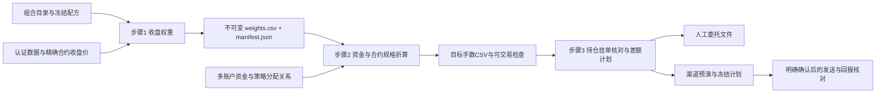

# 独立交易模块：设计、实施与验收

## 1. 核对后的框架边界

2026-09-15 基线：`intraday`/GP/SPEC → 同一正式因子准入 → `factor_library/library.json`
→ 有效库内搜索 → `config/strategy_library.yaml` → 同一 `production_portfolio` 组合算法。
当前唯一 `formal=true` 且 preferred 的策略为 `multi_source_resilient`（多源韧衡18）。
正式身份登记与生产发布/交易授权分别管理；已有发布门仍关闭。
同日另一任务已将其排名缓冲改为1；本模块读取最新目录覆盖值，不固定为0。
`strategies/combined.py` 是历史10因子兼容入口，不能作为当前首选组合的交易信号。
研究 cutoff 仍为 2026-05-15；冻结组合向前运行不会反向改写准入、选因子或优化参数。

全流程审阅覆盖：入口/配置、数据认证与选约、因子引擎与分块、准入/有效库、组合目录、
组合计算/风险/因果账本、监控归因、旧发布门和参考手数脚本，以及对应测试。
大数据只读元数据/模式/相关切片；不把全量审阅解释为重新计算所有研究或改变既有研究结果。

## 2. 唯一流程与独立运行



三个步骤分别调用；研究、日常观察、权重生成、手数折算均不会隐式发送订单。
每个账户可以接多个策略；同一策略可以分配给多个账户。执行渠道与策略计算解耦。
默认以模拟用途生成 CSV，不提升任何策略的生产资格。正式用途沿用
`target_publication.yaml` 的批准门，并将批准绑定到冻结部署包哈希。

### 步骤1：权重

- 引用目录的稳定 strategy_id；冻结因子顺序、方向、配方、计算分块起点、代码与数据指纹。
  同时绑定Python/数值库版本、现有factor_kernel_contract与原生二进制哈希，切换计算后端不复用旧产物。
- 复用 `FactorPanelRunner`、`PortfolioEvaluator` 和 `optimization` 下的相同算法。
- 权重 W[T] 表示 T 收盘后决定、供后续交易使用的目标名义敞口/基准资金；不是已成交持仓。
  因子已有 shift 不额外补移；不能把收盘后计算假装成在 T 的收盘价成交。
- 具体合约用认证数据的因果选约表；折算价用该实际合约原始收盘价，不用复权连续价。
- 最新日期必须来自完整发布数据；日期不完整、指定日缺失或收盘尚未结束时失败。
- 相同日期/全部输入指纹返回同一不可变产物，不重复计算、不覆盖文件；同日数据修订产出新版本。
  不能只用“价格没变”判断相同：因子依赖、代码、配方或状态变动均须使缓存失效。
- 固定全局400日分块起点；日常只计算覆盖IC历史的末段原分块（含原128日重叠），
  多策略共用因子并集。省略旧块不移动现有块边界；必须以完整面板尾段逐值对账验证。
- 正排名缓冲必须输入注明数据日、来源和持仓的JSON；复用原生账本的
  `PortfolioEvaluator.target_for_holdings`，未提供状态则拒绝生成。
  同一状态可共享权重；账户状态不一致时将 `strategy_ids` 配成
  `{instance_a: catalog_strategy_id, instance_b: catalog_strategy_id}`，输入各自的持仓，
  路由引用实例ID。公共因子面板仍只计算一次。源策略ID和实例ID分别记录。

### 步骤2：资金、规格与整数化

每条路由明确 strategy_id、account_id、capital_basis；金额模式使用amount（CNY），
完整组合模式使用units（正整数份数，不能同时填写amount）。禁止把账户实际权益、
折算基准金额、总名义金额和保证金预算混用。令 g=Σ|w|，n_i=价格×计价乘数：

| 资金口径 | 名义目标 N_i |
|---|---|
| equity 基准权益 | w_i × amount；权重已含杠杆 |
| notional 总名义预算 | w_i × amount / g |
| margin 保证金预算 | w_i × amount / Σ(|w_i|×相应方向保证金率) |
| reference 固定折算基准金额 | w_i × amount；amount不冒充实际账户权益，风险仍以accounts中的权益检查 |
| complete_unit 最小完整组合 | C_min=max(n_i/abs(w_i))，只对非零权重求最大值；C_min向上取到分，再乘units；N_i=w_i×该共同折算金额 |

“完整组合”指同一策略分配至一个账户的所有入选品种，**取整前**理论手数绝对值均≥1。
先等比例确定整体规模，再把60.3、1.8手分别取整为60、2手；0权重保留为0。
决定最小规模的品种是n_i/abs(w_i)最大的品种，不一定是权重最小的品种。
`complete_unit`用于首次或显式重估最小组合，支持一份或多份；不会改写源权重或账户权益。
份数作用于取整前的共同折算金额，例如60.3手的两份为120.6→121手，不把已经取整的60手直接乘2。
`reference`用于固定已选择的日常规模，从`route_sizing.csv`读取reference_capital填写amount。
固定规模日后不完整时报告缺口，不自动放大、抬高某行手数或删除品种。
`complete_unit`每次显式运行按当日价格/权重重估，不作为后台自动扩仓规则；
切换为固定规模由配置明确选择，不把上一日最低规模悄悄写回配置。

2026-09-15用户确认：交易模块现阶段保持现有20品种的一份最小完整组合，
即`complete_unit + units: 1 + require_one_lot: true`，不因资金规模研究自动缩仓。
逐步降低资金/持仓规模的测试在“中性策略”任务的独立研究分支进行；其结果不自动
替换正式策略或交易配置。该确认仅确定目标折算口径，不放宽既有风控或开启委托发送。

同账户同实际合约先合并名义金额，再一次取整；策略归因仍保留合并前分配。
同次折算必须使用同一数据日，权重与规格的交易所必须一致；漏配账户路由直接拒绝，
不能把漏配误解释为清仓。CSV同时包含全品种零权重行，明确本版本的完整目标。
默认 `half_up`（绝对值四舍五入、符号还原），支持明确的向零取整；不采用 Python 银行家舍入。
不得把0手强行抬成1手。输出原始手数、整数手数、目标/实际名义金额、权重偏差和保证金。
`require_one_lot=true`检查每个策略在账户中的取整前手数；同策略多条资金路由先合并，
不同策略不能靠互相叠加掩盖各自不完整。不同完整策略正常抵消时，账户净持仓可以少于
策略入选品种数，甚至为0；不会为凑齐账户净持仓品种而改变策略比例。
不满足时输出诊断并阻止执行，全部原目标仍然保留，不隐藏遗漏品种。

单策略的两种最低资金不同：按比例完整买到1手需要 max(n_i/|w_i|)；
half_up 后至少1手需要 max(0.5×n_i/|w_i|)，它仅保留作历史对照，不能通过完整组合验收。
`capital_requirements.csv`中旧字段`proportional_one_lot_equity`、`rounded_one_lot_equity`
保留兼容，含义均是对应的权重折算基准金额，不是必须存入账户的现金；新输出明确使用
`reference_capital`和`minimum_complete_reference_capital`。
保证金够用不代表比例、杠杆与整数约束满足。
多策略互相抵消后0目标不等于缺失；仍另列各策略独立资金门槛。

规格必须包含合约、交易所、每价格点每手计价乘数、最小价位、多空保证金率、
日期和来源。静态 `CONTRACT_SPECS` 只允许指示性估算；历史最低保证金不能冒充账户当日保证金。
特别核对股指、国债和鸡蛋的报价单位。缺规格/非有限值/非正价格/非法连续合约均拒绝。
正式执行要求经过核实的当日规格；未知元数据不推断默认值。

取整后再次检查：总名义杠杆、净暴露、保证金比例与预留、可用资金、单合约数量限制。
`available`采用柜台已扣冻结资金的可用口径，不再重复扣减；总保证金上限仍计入冻结资金。
案例实际权益仍为500万元，默认一份最小完整组合，计算出的折算金额可以大于500万元，
但原总敞口、净敞口及保证金风控仍全部执行，不能因“完整”而自动放宽限制。
实际权益写在配置中，不会自动跟随浮动权益调整。每日使用新快照更新账户金额及所需路由预算；
执行核对发现权益变化时要求重新折算。单笔手数限制作用于差额委托，单合约持仓上限单独检查。
首版超限失败并输出原因，不自动改杠杆、不静默比例缩仓、不丢弃大合约。

### 每日权重与仓位明细归档

上游提供正式策略目录及冻结配方；步骤1复用同一组合算法生成当日权重，并独立保存
`weights.csv`。步骤2直接读取指定的权重快照，不重新选择策略、不重新计算权重。
仅生成权重时也会留档，不依赖账户、折算或成交是否成功。

每次运行 `size`，同一折算目录同时保存原始 `weights.csv` 和中文表头的
`daily_positions.csv`，以及已有的 `targets.csv`、`attribution.csv`、`sizing.json`、
`capital_requirements.csv`；另有每账户一行的 `account_summary.csv` 汇总资金占用。新的目录为：

```text
runs/trading/sizing/数据日期/完整输入哈希/
    weights.csv             # 本次引用的原始权重，字节保持一致
    daily_positions.csv     # 每策略实例 × 账户分配 × 具体合约的每日明细
    account_summary.csv     # 按账户合并目标计算的预计保证金与占用率
    route_sizing.csv        # 每条分配的实际折算金额和最小完整组合金额
    targets.csv             # 每账户 × 具体合约的合并目标
    manifest.json           # 权重源、策略版本、资金/规格及全部文件校验信息
```

日期使用行情数据日，例如9月15日回查9月11日的权重，仍归档到 `2026-09-11`。
相同输入重复运行复用原目录；同日策略、权重、资金或规格变化保留不同哈希目录，
不覆盖旧版本，不默认为其中任何一版已经成交。旧版无日期层级的目录仍可作为下游输入。
全部CSV采用UTF-8 BOM，便于Excel直接读取；零权重、取整为零和被风控阻止的行也保留。

| 明细字段 | 定义 |
|---|---|
| 数据日期、策略实例、来源策略、策略版本、账户、分配序号 | 区分日期、策略版本和多对多资金分配；分配序号从0开始 |
| 品种、合约类型、主力滞后交易日、理论合约、交易所 | 理论合约为已解析的实际月份合约。当前认证数据使用滞后1交易日主力；不是当日最新主力，也不是可直接交易的主连代码 |
| 基准权重 | 原始无量纲权重，正数多头、负数空头；保留权重本身已有的杠杆 |
| 资金口径、基准资金_元 | 金额模式对应本路由amount；complete_unit对应计算得到的折算金额，不能视作账户权益 |
| 组合份数、折算基准金额_元 | complete_unit配置的份数，以及全部金额模式最终用于N_i=w_i×C的C |
| 基准仓位_元 | 按上表对应资金口径算出的带符号目标名义金额；不是已成交持仓或保证金占用 |
| 理论手数、理论手数取整、取整方法 | 基准仓位÷单手价值，以及本路由单独取整后的参考手数；多空保留正负号 |
| 取整后参考权重、取整权重偏差 | 路由整数手数×单手价值÷折算基准金额；偏差为此值减原始权重 |
| 组合完整、组合最小理论手数 | 该策略在账户中合并同策略路由后的完整性及最小绝对理论手数；区别于账户风控状态 |
| 参考价格、计价乘数、单手价值_元 | 本次权重快照的具体合约原始收盘价；单手价值=价格×计价乘数 |
| 保证金率、单手保证金_元 | 按本策略方向选择多/空保证金率；单手保证金=单手价值×保证金率，为正数估值 |
| 预计占用保证金_元 | abs(本路由理论手数取整)×单手保证金；按整数目标估算，空头也是正占用，0手为0 |
| 参数日期、参数来源、参数当日核实 | 标明规格来源及是否核实为数据日参数；静态参考规格如实标为False |
| 账户合并目标手数、账户状态 | 所有路由合并名义金额后一次取整的账户目标，及READY/BLOCKED状态 |
| 权重快照 | 完整源权重哈希；用于回查被冻结的配方、数据、代码和持仓状态 |

**各路由的“理论手数取整”用于归因查阅，不能相加后下单。** 例如两策略各需要0.4手，
分别取整均为0，账户合并后0.8手应取为1。明细中的“账户合并目标手数”会在相关路由行重复，
也不能重复求和；唯一账户目标查看 `targets.csv`。实际委托仍须步骤3对照真实持仓生成差额。

整体资金占用查看 **`account_summary.csv`**：先按账户与实际合约合并、取整，再汇总目标
保证金；预计保证金占用率=该总额÷配置的账户基准权益×100，百分数保留6位小数。
另列总名义杠杆、净敞口占权益、完整策略数、入选/实际目标品种数与拦截原因；
可以清楚区分“组合不完整”和“组合完整但风控不通过”。
明细的路由保证金不可直接相加替代此汇总，尤其是不同策略持仓抵消或合并取整时。
这是目标持仓的预计保证金占用，不含挂单冻结和预留现金，也不是柜台实际保证金回报；
现有风控仍另外计入冻结及预留。参考规格未核实时保留BLOCKED与原参数来源。

**仅展示不计减免的预计保证金与柜台实际保证金两个口径。** 当前预计占用按账户合并后的各具体合约
`abs(整数目标手数) × 参考价格 × 计价乘数 × 对应方向保证金率`相加，包含全部多头和空头，
不扣单向大边或套利组合优惠；同一具体合约的策略目标净额合并不属于保证金优惠。
日常明细保持逐合约毛额，按用户2026-09-15明确选择不增加优惠后估值栏目，避免第三套展示口径；
不能直接对全账户多空总额取较大一边。规则核查只用于解释柜台差异及评估调仓资金。
当前样例口头可概述为“约240万元”，CSV仍保留计算原值2,369,928.90元，不写死240万元。
不计优惠只在相同价格与有效费率下更审慎，历史最低费率或收盘价估算不是实盘资金上限；
期货公司加收、结算价变化、临近交割和临时提保仍须另行核实，现金预留继续独立配置。

2026-09-15核查依据与边界：
- [中金所结算细则第三十九条（官网2025-01-07版）](https://www.cffex.com.cn/ssxz/20250107/43078.html)：
  同客户号、同会员处符合条件的同品种或公告指定跨品种双向持仓可按较大边；实物交割有时间例外。
- [能源中心结算细则第二十八条（官网2026-06-22版）](https://www.ine.cn/regulation/ineregulation/rules/202606/t20260622_832189.html)：
  同客户、同会员处同品种双向持仓可按较大边，最后交易日前第五个交易日收盘后除外。
- [上期所结算管理办法公开历史版本](https://www.shfe.cn/regulation/exchangerules/historicalversion/202409/t20240903_802236.html)
  亦规定同品种大边与临近交割例外；本次未将该历史版本认定为最新可执行参数。
- [郑商所套利交易管理办法](https://www.czce.com.cn/cn/uploadfile/2018/08/10/20180810193655216.pdf)：
  适用经规则确认的套利组合，不能把任意多空持仓直接当作享惠组合。
- 大商所等其余交易所的完整适用表及Panda是否逐项实现上述优惠，本次尚未核实，不启用优惠计算。

柜台快照独立保留实际持仓、动态权益、已用保证金、冻结资金、可用资金和查询时间；
账户级实际保证金用于当前占用率，不能强行拆分成每策略的真实占用，也不要求持仓明细之和
等于账户实值。Panda已映射资金字段；此前只读验证为空仓，非空持仓字段仍需有仓样本核验。
成交、撤单和结算后重新查询再放行下一步开仓；目标毛额不代表换仓过程的峰值资金需求。
平掉组合的一条腿可能解除优惠，因此“减少手数”不保证释放保证金，不能预支预计释放资金。

展示排序采用每个“账户／策略实例／分配序号”组内非零权重数值降序：正权重在前，
负权重随后，零权重最后；同权重按品种代码、具体合约代码排序。不按权重绝对值排序。
这样更适合偶尔查看当天组合；原始 `weights.csv` 顺序和内容保持不变。
跨日比较按账户、策略实例、品种匹配，并检查分配资金与具体合约的变化，不能按CSV行号匹配。

归档是独立手动运行步骤的内置产物，不设置后台每日任务；没有运行的交易日不会凭空生成记录。
历史回查使用留存快照，回补历史则需显式提供对应日期的权重、资金及规格。

### 步骤3：差额、执行与对账

- 账户身份由渠道认证结果绑定；别名不等于账户身份。路由必须与只读账户快照一致。
- 目标手数与真实持仓分开存储；挂单不等于持仓、queued/submitted不等于成交。
- 根据实际合约和多空分仓计算差额。反向先平再开；换月平旧合约后开新合约。
  上期所/能源中心显式区分今仓与昨仓；无可平量/今昨信息时拒绝猜测。
  当前Panda公开规则仅声明open/close，未验证close_today/close_yesterday映射时保留人工路径。
  这类Panda计划在生成阶段即标为BLOCKED。内部规范化合约与柜台原始合约分别保留，
  普通平仓发送柜台返回的实际合约，不能把郑商所三位别名的规范化代码直接冒充原码。
- 默认只管理声明的品种；完整专用账户模式需要显式选择。未管理持仓不被自动平掉。
- 有活动委托、未知回报或未完成平仓时阻止新开仓；撤单与再次计划是独立动作。
  计划的READY仅表示可开始当前阶段；依赖平仓回报的开仓行标为WAIT_CLOSE，
  必须平仓收口后重取快照并重新计划，不能按CSV行号连续发送整批。
- 计划包含输入文件哈希、身份、快照时间、有效期、方向/开平/数量/委托类型/价格、稳定幂等ID。
  启动执行前重新核对身份、快照/挂单、时效和计划哈希；修改任何参数须生成新计划。
- 本地执行日志在网络发送前持久化；崩溃/超时不盲重试。查询原operationId/clientOrderId收口。
- 手动文件可直接阅读，但只有满足全部元数据与账户检查的计划标记可交易。
  委托价独立于估值价：限价必须显式设置并符合tick/涨跌停；市价不自动填收盘价。
- 执行模式首版为 manual / paper / panda；paper只模拟本地回报。
  通用自动执行可在有明确渠道实现、账户与风控验收后接入，不建立空壳插件体系。

## 3. PandaAI 案例

官方能力版本1.1.3、交易规则0.6.3；实际安装版本以安装记录为准。
CLI用于安装、自检和人工排错；Python SDK适合结构化程序接入，两者能力/账户/交易规则一致。
SDK安装到独立环境，避免改变研究NumPy/Polars等依赖；程序通过独立Python进程调用渠道。

Panda只提供单品种最新快照，不提供历史K线或批量行情；本地认证DuckDB仍为信号数据源。
默认OAuth绑定账户，不能把任意 account_id 当成API参数选择账户；不同账户须独立凭证环境。
未确认多账户凭证隔离前，Panda案例只启用一个本机已授权身份。
Panda的无price单为市价IOC、有price为限价GFD，条件单不支持。
官方要求预演→冻结计划→用户确认→执行，首版不会宣称其支持无人确认自动交易。
仅执行安装、授权与只读自检；本次不提交任何赛事订单。

资料：
- https://www.pandaaiquant.com/openapi/v1/agent-install-guide/cli
- https://www.pandaaiquant.com/openapi/v1/agent-install-guide/python
- https://www.pandaaiquant.com/openapi/v1/skills/index.json
- https://www.pandaaiquant.com/openapi/v1/skills/trading/SKILL.md
- https://www.pandaaiquant.com/openapi/v1/meta/agent-spec

## 4. 冷启动、版本切换与保证金压力

账户是持仓、挂单、资金和执行日志的连续主体，策略名称及版本不是清仓指令。
每次调整比较“当前完整实际持仓”与“所有最新启用策略在该账户的汇总目标”。

| 情形 | 行为 |
|---|---|
| 首次启动且空仓 | 明确以空仓启动，按目标开仓；不补做历史交易 |
| 首次启动有仓 | 默认require_flat阻止接管；显式adopt_managed才纳入声明范围 |
| 同策略换版本/换策略，目标相同 | 零委托；代码或版本hash变化不会强制重建仓位 |
| 部分目标不同 | 同合约同方向保留重叠数量，新增/减仓只处理差额 |
| 大幅切换、反向、换月 | 先平应减部分；平仓回报全部收口后重新快照、折算与预演开仓 |
| 新策略删除旧品种 | 通过--previous-plan继承旧管理范围，旧仓目标为0；不漏平、不碰范围外仓位 |
| 半途成交、进程中断 | 以最新柜台持仓为准重算；未知委托先核对，不能把旧目标视作已成交 |
| 同策略多账户状态不同 | 分别生成权重实例；禁止将A账户实际持仓套给B账户 |

`previous_plan`只承接管理范围与版本沿革，不把该计划当作成交事实。
旧品种管理范围不会因换策略自动遗失；范围外已有仓位不自动平掉，首版在其风险未明确预算前阻止执行。
多策略同账户出现相反虚拟仓位时，真实账户净额不能反推出各策略持仓。
需要缓冲时必须提供经过核对的逐实例状态；首版不虚构成交分配，也不将上一日目标自动当成状态。

保证金占用率定义为柜台实际保证金/动态权益；大于100%可由亏损、提高保证金或权益下降导致，
不意味着允许再开仓。权益非正时不计算一个误导性的比率，直接标记严重资金风险。
达到配置上限、可用资金低于预留、权益非正，均进入 `reduce_only`：

1. 保留策略权重和目标诊断，移除本次所有开仓腿。
2. 允许经身份/时效/可平量核对的减仓腿；资金型不满足不反向阻止降低风险。
3. 身份错误、陈旧状态、挂单/未知回报、未知规格等非资金风险仍阻止执行。
4. 输出被抑制的开仓数量、当前占用率与降到上限所需释放的保证金估算。
5. 若策略本身没有减仓差额，默认不擅自选择清仓品种；报告仍需降风险，另做明确的紧急减仓计划。
6. 逐笔成交后以柜台保证金与可用资金重新核对，不能把估计释放资金当成已可使用。

因此“高占用时全平再开”不是默认恢复动作。涨跌停、停盘或无法平仓时保持阻断并报告，
不会靠反向开仓冒充平仓，也不会用拆单绕过渠道风控。

## 5. 自审后的收敛

1. 避免另造组合算法：接现有目录+原生组合函数，不接旧10因子信号或复制回测CSV当实时信号。
2. 价格未更新的幂等只对步骤1成立；步骤2若资金/规格变化、步骤3若成交/挂单变化必须重算。
3. 保留完整资金诊断，不能把500万元保证金充足等同20个品种均能按权重开仓。
4. 不把过时数据与未核实规格包装成可立即下单；实际结果同时列数据日期与验证级别。
5. 增量性能保持原分块边界，先有尾段对账再启用；不为省时更换因子预热或计算公式。
6. 只有实际需要的独立文件与函数，不新增无调用者的Manager/Factory/Registry层。

## 6. 实施与测试驱动验收

| 阶段 | 实施 | 先写的验收 |
|---|---|---|
| A | 安装CLI/SDK/skill与MCP；OAuth只读验证 | 版本最低门、导入、账户/持仓/挂单可读、无交易 |
| B | 发布接口与权重生成 | 关闭生产门、成员方向一致、缺价/缺日拒绝、幂等、篡改拒绝 |
| C | 纯函数资金折算与多对多 | 先整体归一化、取整前至少1手、固定基准、对称舍入、多种金额、先合并再取整 |
| D | 账户差额与渠道计划 | 平反向/换月/今昨仓、未管理持仓、挂单阻断、超时不重发 |
| E | 真实本地验证与回归 | 当前首选20持仓、500万元逐合约门槛、重复运行hash相同、全套回归 |
| F | 版本切换与资金压力 | 空仓启动/显式接管、部分差额、删除旧品种、>100%占用、非正权益仍可减仓 |

总调度负责接口、组合语义、集成与最终复核；luna max仅承担已冻结接口的安装与纯函数/测试子任务。
具体测试结果、实测性能及渠道限制见运行证据和验收报告。

## 7. 实际运行入口

配置入口 `config/trading.yaml`；所有步骤由 `run_trading_workflow.py` 单独调用。
Panda账户配置另存Git忽略的 `config/trading.local.yaml`，不把账号或机器路径放公共模板。

```powershell
$PY = 'E:\Python\Pythonvenv\Scripts\python.exe'
# 第1步：正缓冲策略必须给出经核对的状态；B0策略不需要该参数。
& $PY -X utf8 -B run_trading_workflow.py weights --holdings <持仓状态JSON>
# 第2步：使用第一步打印的完整目录；不提供specs时只产指示性估算并明确阻止执行。
& $PY -X utf8 -B run_trading_workflow.py size --weights <权重目录> --specs <当日核实规格JSON>
# 第3步：现仓核对、输出orders.csv；版本切换承接前一计划目录。
& $PY -X utf8 -B run_trading_workflow.py plan --sizing <折算目录> --snapshot <账户快照JSON或目录> --account <别名> --previous-plan <前次计划目录>
# 独立SDK只读获取柜台快照；环境变量不包含凭证。
$env:MF_PANDA_PYTHON = 'E:\Python\panda-trade-venv\Scripts\python.exe'
& $PY -X utf8 -B run_trading_workflow.py --config config/trading.local.yaml panda-snapshot --account <别名>
```

金额默认明确使用500万元模拟权益、70%保证金上限、10万元预留；这些是保守的案例参数，
不是交易所标准或策略最优值。`execute_enabled=false`，无后台运行、无自动更新监控、无自动下单。
Panda预演每次冻结一笔差额；`panda-execute`还要求账户开启执行并给出整个冻结结果的确认hash。
发送前持久化日志；queued/unknown不能重新发送。用 `panda-operation`查询一次，
`panda-reconcile`按原clientOrderId/operationId核对并登记收口；expired旧计划不能复用。
新意图须重新核对/预演，必要时显式更新策略执行配置中的 `intent_revision`，不自动滚动重试。
同账户串行发送，任何未收口尝试都会阻止新的意图。崩溃遗留的 `execute.lock` 不能按超时自动删掉；
先确认原进程已结束并用原委托号核对，再由操作者恢复本地锁状态。

股票/期货主连代码不会作为可交易合约；Panda非空持仓的字段映射与今昨仓语义须用真实样本核验后配置。
当前实际账户空仓，只证明空仓快照链路通过，不能据此声称非空柜台字段或真实成交已验证。

## 8. T−1信号在T日尾盘执行：设计补充（2026-09-15）

本节包含已实现的每日准备、发送窗口与差额执行会话，尚未启用自动比赛下单。
沿用三个独立步骤；无参数入口仍只产生权重。另行启用的`auto`命令编排当日三个步骤，
由09:00自动任务启动本地进程，程序负责后续精确时间；研究更新和数据库更新本身不触发下单。

### 8.1 先固定信号与收益归属

T和T−1指交易所交易日。周一的前一交易日通常为周五，节假日、夜盘和特殊交易日另按日历核对。
权重必须来自T−1完整收盘数据；分别记录数据截止日、权重日期、生成时间、执行交易日和实际成交时间。
盘中生成的T−1信号，不能混入T日尚未完整的收盘数据；数据源更新后也不原地覆盖已冻结目标。
晚于执行窗口才就绪、交易日不符或行情不完整时，本次不补发，明确记录未执行原因。

已核对`backtest/engine.py`与`backtest/research_ledger.py`：现有日频研究就是
W[T−1]乘T日涨跌幅，没有再多滞后一交易日，也不修改既有研究的日期对齐。
若直到T日尾盘才成交，T日此前盈亏属于旧仓，新仓只能从实际成交后开始计盈亏。
这是实际成交时间与日频记账的差别，不是研究代码又多做了一次shift。
研究与实际账户对照使用冻结版本的实际合约分钟数据、
正确的分钟时间标签、换月、整数手数、手续费和成交假设。分钟收盘价只能是成交代理，不能证明真实可成交。
信号计算价、折算参考价、窗口到达价、实际成交价和最终估值价分列；现金盈亏按真实合约乘数与成交时间计算。


### 8.2 时间窗口：完成时间与发单时间分开

用户已选择统一窗口，并明确允许市价。按14:55统一启动主执行、14:58目标完成设计，
国债不另等15:10；准备工作在14:55前完成。14:58是完成目标，不是等到该时刻才首次发单。
未来不同渠道仍可配置不同窗口；本次比赛仅用统一窗口。

以下为待模拟验证的初始参数，不是交易所规定或成交保证：

| 阶段 | 统一窗口 |
|---|---|
| 初次读取真实持仓，计算T−1权重并保存CSV | 09:00；13:00、14:00补查数据与重试 |
| 冻结数据指纹、代码、策略版本、权重工件 | 14:30；此后不启动因子重算 |
| 更新权益、持仓、规格与资金检查 | 14:45；14:55发送前及各次差额计划再取新快照 |
| 市价IOC主执行；有减仓先核对减仓成交与资金，再开仓 | 14:55起 |
| 已确认撤余或部分成交后重新计算剩余量；有界补单 | 发送截止前，沿用本次明确的完整目标授权 |
| 正常发送截止 | 初始设14:56，为公开120秒队列超时留到14:58；实测后再调整 |
| 目标成交及核对收口 | 14:58 |
| 仍有未知回报或意外活动委托 | 不盲重发，核对原单；必要撤单单独预演并记录 |

执行窗口绑定明确日期和带时区时间，并校验开始、停止发单、完成目标与实际休市时间的先后关系。
每次网络发送前再检查时间；临近停止时，剩余时间不足以容纳渠道延迟预算就不再发单。
Panda公开规则中报单/撤单队列存在120秒超时，不能把本地点击时间当作柜台受理时间。
上述缓冲须由实际模拟盘的排队、回报和冻结计划核验耗时校准；队列超时不等于保证在120秒内成交。
撤单请求也可能失败或与成交交叉；目标时间到了仍未收口的订单必须保持UNKNOWN/待核对状态，不能记为已撤。
普通交易截止后的紧急减仓另走明确授权的应急流程，不借应急名义继续补仓或绕过普通截止时间。

按品种及实际合约查询时段，不按交易所名一刀切。
中金所[沪深300股指期货合约表](https://www.cffex.com.cn/hs300/)列下午至15:00，
[30年期国债期货合约表](https://www.cffex.com.cn/30tl/)列常规下午至15:15，最后交易日仅9:30—11:30。
其余品种的时段、节假日、临近交割限制和渠道可交易状态也须有有效依据；缺失或冲突则阻断对应执行。
不把合约表正常时段当成停盘日或特殊交易日的可下单许可。

### 8.3 账户差额、挂单与跨窗口资金

1. 同账户各策略、各时间组共用资金、锁与订单日志；先汇总具体合约目标，再与真实持仓比较。
   执行窗口仅改变何时执行，不改变策略选择、20品种完整单位或风控限额。
2. 窗口内冻结权重版本、具体合约和整数目标。实时行情用于价格与资金检查，
   不因逐笔价格变化反复扩大完整单位或变动目标；需要更换目标时，旧会话先收口再生成新计划。
3. 冷启动空仓按目标建立仓位；有仓接管、版本切换、删品种和换月继续复用第4节规则，
   只处理差额，不每日全平全开。平仓使用柜台真实合约；发送时不把主力别名重新解析成另一个月份。
4. 先完成减仓阶段，再查询柜台实际持仓、保证金、冻结资金及可用资金，资金满足才生成开仓阶段。
   不能把14:55前的开仓建立在15:10国债平仓预计释放的资金上；资金不足则提前安排必要减仓或阻断该开仓。
   平一条腿可能失去保证金优惠，不能假设所有平仓都释放资金。
5. 中间状态也检查账户总敞口、净敞口和资金限额；不仅核对最终目标。
   超限进入明确的减仓处置，不为维持20个品种继续开仓；目标完整与实际成交完整分开报告。
6. 同会话在途委托须逐笔归属并纳入剩余量；外来或无法归属的活动委托继续阻断执行。
   不能把“目标−已成交持仓”直接当作新委托量而忽略在途剩余手数。
   同时记录多空、开平与今昨仓，不能仅凭净持仓掩盖无法平仓或双向持仓问题。
7. 部分成交、撤单中、超时或断线时，用原委托号/operationId核对。
   未确认撤成之前不发替换单；回报矛盾时先阻断，不能推测剩余数量。
8. 同账户同交易日同执行会话只能有一个持有者；重复启动和恢复都要读取持久化日志与柜台状态。
   目标hash变化不能绕过旧会话未收口；崩溃重启不按CSV下一行继续发送。

### 8.4 委托方式、Panda边界与性能

通用渠道在确实支持时，可配置带价格上限/下限的可成交限价及有限次撤改单，
校验报价时效、买卖价、最小变动价位、涨跌停和最大偏离；这些仍不能保证成交。
只有目标差额超过渠道单笔限制且渠道允许时，才设计有总量约束的拆单；不能为绕过风控拆单。

Panda必须遵守其[交易技能规则](https://www.pandaaiquant.com/openapi/v1/skills/trading/SKILL.md)：
“最新行情是交易辅助展示，不是用户的限价。”无price为市价IOC，明确price为限价GFD；
不能自动把最新价加减若干跳当作用户指定限价。
用户在本轮已明确要求比赛模拟账户、现有正式20品种完整单位、统一窗口、市价及无感运行。
此持续授权范围应存入本地执行配置；不将OAuth本身当作策略授权，也不把每笔浏览器点击作为额外要求。
SDK支持程序调用`prepare_*`、核对冻结参数后`execute_plan(confirmed=True)`；没有要求每日交互登录的接口步骤。
先前逐笔人工确认的设计在本次明确授权范围内调整为程序核对，真实资金账户不承接此模拟比赛授权。
每个新剩余差额仍须重新预演、记录独立幂等ID；已尝试且状态未知的原单绝不换ID盲重发。
自动执行必须经过渠道验收，不能把接口接受confirmed参数等同服务端保证全部成交。

`prepare_target_position(targets)`公开语义是只调整列出品种、补当前主力；
具体月份与volume=0的精确语义没有公开保证。应先核对其预演输出与本地完整差额完全相符，
才可使用批次；不符则走具体合约逐笔`prepare_order`，删除品种用明确平仓腿，不能省略目标后误留旧仓。
大范围换仓可能因先平后开、排队和回报耗时无法装入3分钟；必须以实际批次耗时检验，
必要时提前执行开始时间，而不是压缩核对、丢弃品种或保证在14:58一键瞬时成交。

权重和资金折算在窗口前完成，临近发送才取新快照并生成短时计划。
现有快照60秒和计划120秒时效不得仅因提前启动而放宽；确认耗时过长则计划过期，重新预演。
重算因子、长时间占用DuckDB、客户端升级和全市场行情扫描均不放进执行窗口。
执行时由本地持续进程负责时钟和状态；绝对时间用Asia/Shanghai并检查时钟偏差，超时计时使用单调时钟。
优先回报驱动，缺少推送时按渠道允许速率有界轮询；只订阅/查询实际所需合约，
Panda公开能力仅有单品种最新快照，不假设存在批量行情接口或历史分钟行情。

会话归档复用每日权重和目标CSV，并另存执行明细：信号日、执行交易日、目标hash、
具体合约、调整前/目标/调整后手数、订单号、成交号、委托/成交时间、成交价、未完成差额及原因。
账户汇总保留真实权益、占用保证金、冻结资金、可用资金和查询时间；继续与不减免的目标保证金估算分列。
结束状态区分全部到位、部分到位、阻断和仍待核对；全部到位需要实际持仓匹配且无未收口订单。

### 8.5 最小实施顺序与先行验收

复用`trading/execution.py`、Panda持久化日志和独立CLI入口，不另造执行框架。
现有实现已有差额计划、短时校验、官方2026日盘日历、提前准备和持久化差额会话。
Panda单条具体合约市价IOC逐次预演、查询原单、确认持仓后再补差额已接入离线验收；
限价GFD撤改单循环、未知状态的自动恢复和批量目标接口未启用，不能用其替代当前通路。
当前交易开关保持关闭；已有规格、非空持仓映射与风控阻断项仍须分别通过。

| 步骤 | 最小实现 | 先写的验收案例 |
|---|---|---|
| 1 | 日期/品种窗口配置及纯校验函数，默认关闭 | 周末节假日、错误信号日、国债最后交易日上午结束、开始前/截止后绝不发单 |
| 2 | 复用本地paper执行，加入一次会话与假时钟 | 同会话重复启动零重复单；过期计划拒绝；截止后只核对原单 |
| 3 | 持久化在途量、分阶段资金检查和恢复 | 部分成交与撤单竞态不超量；未知回报不重发；断线重启依据柜台状态 |
| 4 | 账户跨品种/跨窗口验收 | 未到账平仓资金不可开仓；超100%保证金不补仓；撤单失败不能标完成 |
| 5 | 人工窗口试运行与Panda渠道样本核对 | 非空今昨仓字段、预演确认过期、实际订单成交号可对应、未完成差额如实留存 |
| 6 | 单独执行时点研究与有授权的渠道联调 | 成交前收益仍归旧仓；分钟标签无未来信息；计入整数手数、手续费、换月与滑点 |

先通过无外部委托的确定性测试，再依据模拟盘的实际延迟与成交反馈调整时间缓冲。
时间方案通过不代表组合本身满足开仓条件，也不自动改变当前正式策略及其规模。

### 8.6 本轮实测与尚待解除的接入阻点

- SDK 0.1.19版本检查通过；只读账户权益、可用资金均500万元，空仓，无活动委托。
- CU2610单合约行情读取成功；具体合约市价开仓预演在闭市时返回`market_closed`，未发送订单。
  市价兼容转换由账户监控服务内部完成，不能假设它是本地无条件全成撮合器。
- 公开SDK和quote没有合约乘数、当期保证金率、tick的规格查询接口；
  非空持仓虽有position/tdPosition/ydPosition/closable字段，但今昨可平分配与通用close处理仍需核验。
- 比赛本地配置已将目标总名义敞口上限设为12倍权益、绝对净敞口上限25%，
  对应已确定的完整单位示例11.240058倍、21.9054%；保证金上限仍70%，另留10万元资金。
  这些是本次模拟比赛的执行边界，不是历史风险最优结论；当日一完整单位超过边界就阻断，不缩水。
  通用示例账户配置不变。乘数、tick、当期保证金率仍须有效证据，不能通过放宽敞口跳过规格门禁。
- 已实现`policy.execution_window`字段：start_at、submit_until、completion_by均为带时区ISO时间，
  同一上海自然日，expected_signal_date早于该日期。窗口外计划标BLOCKED，窗内TTL截到发送截止。
  Panda读取远端冻结计划后、写发送日志后均重新核对截止；若尚未调用渠道则记录not_sent，而非虚构未知成交。
- 这组门禁只保证本地程序不在截止后开始调用发送；网络排队仍可能导致柜台更晚受理。
  公开API没有已核实的服务端deadline参数，因此不宣称可以强制所有成交时间早于14:58。

### 8.7 自动准备与执行入口（已实现，比赛发单仍关闭）

`scripts/start_trading_day.ps1`以隐藏窗口启动`run_trading_workflow.py --config config/trading.local.yaml auto --account panda_contest`。
每日任务提前至09:00，本地进程自行等待后续时间。计算子进程预算最多3600秒，并截到14:30；
本地调度需要电脑开机、应用保持运行，见[官方定时任务说明](https://learn.chatgpt.com/docs/automations?surface=app)。
超时终止计算子进程，失败覆盖旧准备状态，不回退旧日信号。查询账户单次子进程预算60秒。
主进程等待时不持有DuckDB；14:30复核源指纹后立即关闭连接，执行进程只加载轻量交易代码与隔离SDK。

原始因子面板接入现有FactorPanelRunner检查点，缓存绑定数据、代码、运行库、日期和计算区间。
真实持仓变化只改变组合目标输入，可以复用因子；源数据或代码变化使缓存失效。
9月15日以9月11日固定数据实测：首次尾段计算68.765秒；改变持仓输入记录、复用原始因子后2.045秒；
再次复用相同权重工件1.031秒，权重数值完全一致。此测试不代表新交易日一定命中缓存。
此前全历史冷路径约1259秒，因此每日预算按慢路径留余量，而非按1秒缓存命中安排。
权重与目标继续使用不可变manifest/CSV；T−1权重日期与T日合约参数核验日期分列，新增CSV“执行交易日”。
预计占用保证金保留逐腿不减免估算，真实margin/frozen/available/equity独立保存在账户快照。

每次仅允许一个未收口请求；按clientOrderId查询完整订单分页，operation completed不能替代成交证据。
终态的filledQuantity还须与随后真实持仓一致，再生成剩余差额；撤余零成交产生新意图ID，拒单或未知状态停止。
单笔100手的限制可拆成一次100手、确认后再算余量；默认人工计划仍在超单笔限制时阻断。
不因浮盈浮亏的几分钱持续重算因子：保持目标手数不变，发送前用最新权益和可用资金重新检查。

账户锁与人工执行共用，发送意图先持久化。同日重复会话不重放；之前未知会话或订单未核对则阻断下一日。
上一日已核对计划的账户身份与hash通过后传承管理范围，支持同账户版本、策略及合约切换。
首次启用非空账户仍需显式接管依据；不会自动把外来持仓当作本策略持仓。
本次B1自动准备只允许每账户一个策略实例，避免无法归属缓冲持仓；已有多对多权重/折算入口继续保留。

每日输出位于`runs/trading/automation/<账户hash>/<执行交易日>/`：准备状态、冻结权重与折算工件路径、计算日志、进程状态。
执行报告位于`runs/trading/execution_journal/<账户hash>/session_<交易日>.json`，记录快照、订单、原始回报、剩余差额；
正常结束另存不可变session工件与`remaining.csv`。中断和未知状态保留日志，不能删锁后直接重发。

尚未解除的比赛上线条件：当期规格来源；Panda真实非空持仓、平今平昨和终态回报语义；
开仓过程中敞口与保证金校验、20腿冷启动和大幅换仓的整段时延验收。
现有逐笔路径没有验证能把20腿冷启动装入14:55—14:56发送预算；不可据只读查询速度承诺完成。
需要继续核验精确批次或调整执行窗口，不能减少核对、丢品种或把IOC视为全成。
因此本地`automation.enabled=true`只启用每日准备，`execute_enabled=false`、`contest_execution_verified=false`保持发单关闭。

### 8.8 2026年9月16日预演安排与正式运行数据日期

9月16日为预演日，收盘窗口也不发单。`automation.preview_only_dates`包含该日，
即使两项发单开关为true，自动流程仍以`preview_day_no_submission`结束，不启动执行会话。
预演通过不会当天自动转换为实发；之后启用日须结合未完成的渠道验收明确安排。

| 内容 | 方法 | 目的及证据边界 |
|---|---|---|
| 最新策略与数据 | 读取当时的正式策略、T−1完整数据、真实持仓；产生权重与整数目标CSV | 验证数据日期、版本、20品种完整性、缓存和计算预算 |
| 账户与资金 | 只读查询身份、权益、持仓、挂单、保证金和可用资金 | 验证真实状态能映射到目标差额；空仓不能证明非空字段正确 |
| 合约及渠道 | 前置检查通过后仅调用prepare预演，保存冻结合约、方向、开平、手数、有效期与拒绝原因 | 验证平台如何理解计划；不调用execute_plan，不产生委托或成交 |
| 尾盘窗口与异常 | 14:45检查准备结果；14:55时段只读核对和本地假柜台演练部分成交、延迟、重复启动、截止 | 验证程序控制；合成回报不能证明真实成交速度、滑点或实际平今平昨语义 |
| 汇总 | 输出带信号日、执行日和策略版本的CSV与通过/未通过清单 | 明确下一阶段缺口，实际委托数为零 |

最新数据指最新应有的完整信号日，不能简单取数据库最大时间戳：
执行日9月16日的尾盘信号必须使用9月15日收盘；9月16日完整收盘数据供下一交易日使用。
日线与策略依赖的1/5/15分钟数据均须覆盖该信号日，并通过原有数据与工件校验。
9月15日21:06只读观察日线到9月15日、三个分钟周期到9月14日，此观察不是未来水位，明早重新核实。
数据维护任务21:09只读确认RDS、Parquet与DuckDB水位一致，上游RDS也尚无9月15日分钟，当前不是使用侧漏同步。
MAX日期或行数一致不足以认证整日完整性；预演须结合数据健康/发布验收明细检查，不能把日期推进本身当作通过。
数据不齐时13:00/14:00重试，14:30仍未满足就停止当天；不退回9月11日或其他旧日工件。
历史基准工件仅供性能、数值回归审计，生产入口没有写死9月11日；自动入口按官方日历生成`--as-of T−1`，
并核对权重manifest日期、数据指纹、策略和代码。缓存也须满足这些条件才能复用。

明日复用同一个定时任务，在09:00、09:45、14:00、14:45检查；健康的本地日进程不重复启动。
9月16日尾盘总结后恢复每日09:00准备任务。所有渠道条件未通过的项目保留阻点，不绕过门禁完成预演。

### 8.9 交易所参数来源与中金所开市时间

合约参数优先查交易所现行合约表和业务细则，不要求所有参数都由Panda SDK提供。
来源按字段保存URL、规则版本或生效日期、核验时间和适用合约；已核实乘数不代表保证金也已核实。

| 参数 | 使用依据 |
|---|---|
| 乘数、报价单位、最小变动价位、常规时段、交割规则 | 现行官网合约表及业务细则；计算金额前统一报价单位 |
| 当期交易所保证金、涨跌停、特殊时段与临近交割限制 | 现行规则加有效调整公告，落实到具体合约、日期和适用类别 |
| Panda账户采用的保证金率及实际权益/占用/冻结/可用资金 | 平台规则或经核验的账户/渠道返回；官网最低保证金不能替代账户口径 |

已找到官方静态参数实例：[IF](https://www.cffex.com.cn/hs300/)每点300元、最小变动0.2点；
[IM](https://www.cffex.com.cn/zz1000/)每点200元、最小变动0.2点；
[螺纹钢现行业务细则](https://www.shfe.com.cn/regulation/exchangerules/productrules/202512/t20251231_829962.html)
规定10吨/手、元/吨报价、最小变动1元/吨，因此金额计价乘数为10。
这些参考不直接生成verified=true的Panda账户规格文件；动态通知与账户保证金仍需核验。

中金所连续交易09:30开始；股指常规下午至15:00，国债常规下午至15:15，另检查最后交易日例外。
09:00保留权重计算及账户只读准备，09:45开市后开展首次渠道prepare预演，14:45尾盘复核。
中金所09:30前闭市导致的market_closed属于时段限制，不判为接入失败。明日仍只预演，不发送委托。

### 8.10 研究修改与已生成权重的边界

每次准备继续用独立子进程读取当前正式策略及最新完整T−1数据，生成权重和来源记录。
后续折算、持仓核对使用这一次的工件，不再将研究工作区后来修改的代码、策略或配置与其强制比较。
不新增按日代码副本或策略版本锁；再次准备时自然读取最新上游。

保留工件哈希、信号日期、原数据源指纹及真实账户/资金/规格/风控校验。
计算进行中发现代码变化仍拒绝该次计算，避免混用修改前后的实现。
14:30的数据核验使用工件记载的数据源配置，不用后来研究配置重新解释已生成权重。

### 8.11 9月16日单独授权的豆粕联通测试

用户另行明确授权市价开多1手再平多1手，独立于当日正式策略预演；两项自动发单开关仍关闭。
大商所M2701于11:28:04开多1手、成交3459，于11:29:18平多1手、成交3458。
两笔委托和成交均已逐一核对，随后持仓、挂单、占用及冻结保证金均为零。
手续费共3.02元，净损益-13.02元，账户权益4,999,986.98元。
证据保存在`runs/trading/20260916_roundtrip/`，此两笔历史测试单不属于正式策略自动发单。

实测回包显示：预演的ISO到期时间与计划查询的epoch时间需统一后比较；
实际持仓及委托合约带`.DCE`后缀。已仅针对这两处返回差异修补兼容，保留原参数、数量及交易所校验。
210项交易测试通过，并以本次实际计划、非空持仓回放验收；未再发单。
预演同时返回了豆粕合约乘数10、最小变动价位1、最后交易日2027-01-15；账户保证金仍以柜台为准。
此结果证明单笔豆粕开多/平多通路，不替代20品种组合、其他交易所及整段执行时延验收。

### 8.12 赛事开始日期（9月16日核实）

[官方赛事规则](https://www.pandaaiquant.com/contest/rules)明确：2026年9月14日至10月7日为报名与熟悉期，
报名后可测试交易，此阶段成绩不计入正式排名；正式比赛期为2026年10月8日至2027年4月7日。
目前的预演及豆粕联通测试属于赛前准备，不将平台已能成交或后台`running`状态视为正式开赛。
规则未说明开赛时如何重置权益及处理已有持仓；排名接口仍为`configuration_pending`且日期与公告不同，
不据此假定账户会自动恢复500万元。官方原文及接口核验保存在`runs/trading/20260916_contest_rules/`。
正式策略发单仍须满足现有接入验收和启动安排；比赛日期本身不自动打开交易开关。

### 8.13 9月16日预演后的最小修正

**等待进程退出：** 原PID15956未留下正常终态、异常日志或锁释放记录。现有可读日志没有发现对应的重启、休眠、
Python崩溃或主动终止记录；Windows Security进程退出审计无读取权限，不能断言不存在终止事件。
因此根因仍未确定，不归因于研究修改、数据库更新或Codex。取证见`runs/trading/20260916_preview/runner_exit_audit.json`。

启动脚本现在用同一文件内的隐藏PowerShell监督分支记录Python退出码和时间，并开启Python无缓冲输出及faulthandler。
日进程另存`runner.events.jsonl`阶段记录和每60秒更新的`runner.heartbeat.json`等待心跳。
隔离测试验证正常退出0、主动异常1、强制终止测试进程-1；监督分支不自动重启、不发单。
若整个进程树或电脑一起被终止，退出记录仍可能缺失，此时以心跳、实际进程和阶段记录判断，不能只看旧锁。
每日检查改为09:00准备、14:00健康核验；健康或当日已正常结束的进程不重复启动，恢复仍核对账户及未收口执行。

**组合取整（阶段一，算法已由8.14节替代）：** 通用默认仍为`half_up`，比赛本地配置启用`balanced`。
先逐腿四舍五入，仅当未取整目标满足净敞口限制、取整后超限时，才在理论手数的相邻整数间做一手校正。
保持原始权重、统一折算基准、方向及至少一手；按新增绝对名义取整误差从小到大选择，每腿最多校正一次。
同时约束总名义、净名义、保证金、可用资金及持仓限额；有限贪心无法得到合格向量时保留原向量并阻断。
这是对整数误差的小修正，不保证全局最优，也不把真实策略偏向当作取整误差消除。

使用今日已完成权重离线复算，仅AU2612由4手改为3手，其余19品种不变，净名义由1,537,585元降至605,285元，
净敞口由30.7518%降至12.1057%；统一折算基准仍为23,208,389.80元，20品种均保留。
CSV新增“独立取整手数”和“账户组合校正手数”；单一路由的最终手数、权重及预计保证金同步更新，
多路由仍区分独立归属与账户合并目标。旧预演工件不覆盖，复算证据见`balanced_acceptance.json`。

**规格检查：** 零目标且无需交易的品种不再仅因参数未核实阻断；实际目标、现仓需平仓的合约仍检查。
本日规格阻点从38个收敛到20个实际目标合约。平台公开SDK/文档尚未给出可核实的逐合约账户保证金率，
官方静态合约资料与账户保证金证据分开保存，不用基础保证金或单品种测试代替全账户当期规格。
当前只读账户仍空仓无挂单，本地差额计划为10多10空20条；渠道prepare及完整20腿执行时延尚未验收，发单开关保持关闭。

### 8.14 组合整数目标校正与委托前校验

用户确认此步骤位于交易折算阶段，流程为：上游权重 → 理论手数 → 组合整数目标校正 → 风控校验 → 保存目标 → 持仓差额 → 委托。
仍由现有`trading/sizing.py`完成，不新增独立服务、研究计算或柜台请求。

`balanced`在原理论净名义未超限的前提下，对各腿相邻整数做组合搜索；已在25%上限内也继续优化。
目标按顺序为：最小化实际与理论净名义之差、最小化各腿绝对名义取整误差之和、最小化相对独立四舍五入的改动手数。
同分按合约排序确定，避免输入顺序或重复运行引起变化。当前策略理论净名义为零；带方向策略不被强制改为中性。
保持原始权重、折算基准、方向和至少一手；完整性仍在取整前核实。接近整数的微小计算误差不产生另一手候选。
所有最终目标和委托数量均为整数。总名义、净名义、保证金、可用资金、持仓限额及元数据检查继续生效，无法满足则阻断。

搜索按小批量NumPy数组计算，最终金额和门禁仍使用Decimal。最多24个可变合约，超过时明确报错停止，避免指数级耗时；
不回退成未优化但被误称为最优的方案。通用默认仍为half_up，仅比赛本地配置使用balanced。

校正后的目标和原独立取整数量一起写入现有CSV/工件，后续持仓差额计算、部分成交和重试复用这份目标，不边发单边改变目标。
发单前的价格、账户及渠道检查继续运行；参考价格下接近零不保证实际成交价或行情变化后仍精确为零。

2026-09-15权重、2026-09-16执行日的历史预演验收：20品种全部至少一手整数持仓，统一折算基准23,208,389.80元不变。
相对独立四舍五入，FU20→19、I40→39、LH-9→-10、NI-14→-15、SR-36→-37、TF-4→-5，其余品种不变；净名义5元。
实际及理论各腿绝对名义偏差合计2,427,257.41元，此值不是亏损或费用。
折算及文件生成实测约0.07秒，重复输入得到同一工件；232项交易测试通过，含独立穷举对照、多空镜像、非零理论净目标、
整数差额委托以及到达目标后不再重复下单的本地纸面验证。参数20项阻点保留，本轮无交易账户请求、无发单。
证据见`runs/trading/20260916_preview/min_net_implementation_acceptance.json`及`min_net_tests.log`；旧工件保留。

### 8.15 模块交接复审与独立运行

| 阶段 | 输入与输出 | 独立性 |
|---|---|---|
| weights | 当前正式策略、完整T−1数据 → 不可变权重工件 | 仅本阶段加载研究计算；不自动折算或交易 |
| size | 指定权重工件、合约规格、资金与路由 → 整数目标和CSV | 不重算研究、不查询柜台；可重复运行 |
| plan | 指定整数目标、完整账户快照 → 持仓差额委托工件 | 不改变目标、不直接发单 |
| prepare / submit / reconcile | 指定计划 → 预演、明确提交、回报核对 | 预演不提交；提交与回报核对可分别调用 |
| auto | 显式启用的当日本地调度 | 只组织现有阶段；默认无参数入口仍只生成权重 |

复审修正了命令入口提前导入研究模块的耦合：路径解析复用轻量工件模块，研究导入移入weights分支。
独立新进程内禁止导入研究、数据与因子模块，size→plan→paper仍能完成，证明已生成信号的下游处理不依赖研究运行时。
权重阶段仍使用现有正式策略接口；不复制研究算法，不修改研究模块。
跨阶段读取核验manifest与文件哈希，日期、策略归属、账户标识和目标整数由各自阶段继续检查。
复审另补齐三处交接检查：外部目标/委托含小数手数时拒绝，不静默截断；市价平旧合约也要求旧合约自身规格；
Panda远端冻结计划的账户、合约、方向、开平、整数数量、价格及clientOrderId逐项匹配本地委托，准备和发送前均检查。
已留存豆粕开平与计划查询回包通过离线兼容验证，无新账户请求或发单；交易专项246项测试通过。
多策略、多账户在纯折算与计划层支持路由；带持仓缓冲的自动准备目前仅支持每账户单策略，不能从净持仓反推多策略状态。

### 8.16 2026-09-17预演方案

明日为明确预演日，两个自动发单开关保持false；本地preview_only_dates增加2026-09-17。
执行日2026-09-17使用完整2026-09-16数据。数据未齐、核验失败或超时则阻断，不回退9月15日或9月11日工件。

| 时间（上海） | 内容 | 验收目的 |
|---|---|---|
| 09:00 | 用指定研究Python启动本地日进程；查询账户，读取最新正式策略并计算T−1权重 | 日期正确、20品种完整、首次与缓存计算耗时可追溯 |
| 13:00 | 日进程按现有逻辑重试准备 | 新输入用新工件，相同输入复用；不以旧成功掩盖新失败 |
| 14:00 | 健康检查；核对实际PID、心跳、阶段、退出记录；必要时核对账户后恢复 | 发现等待期异常，避免重复进程和执行 |
| 14:30 | 核对工件所用T−1数据并冻结权重；之后停止重算研究 | 避免临近执行窗口长计算或目标漂移 |
| 14:45 | 最新账户快照、整数目标校正、保证金/规格/持仓检查；保存目标与阻点 | CSV与账户目标一致，全部目标及差额为整数 |
| 15:00 | 核对日进程正常预演终态；运行隔离纸面故障用例并汇总 | 用模拟时钟覆盖14:55—14:58窗口的部分成交、未知回报、重复调用、截止和只减仓 |

14:55—14:58不向Panda发送委托。15:00的窗口测试是本地模拟时钟测试，不声称验证真实柜台成交速度。
只有满足现有全部前置检查时才允许服务端prepare；规格未齐时保留真实阻点，不用临时置verified绕过。
最终验收分开报告：程序与工件通过情况、真实账户只读情况、尚未通过的渠道项目。
仍待核实当期账户保证金、完整20腿渠道/执行时延、其他交易所平今语义及正式开赛账户重置规则。

### 8.17 提交与忽略范围

- 提交：trading内相关实现、run_trading_workflow.py、通用trading.yaml、公开交易日历、启动脚本、交易专项测试及交易文档。
- 不纳入本次提交：研究代码、策略目录、其他策略实验与研究文档的未提交修改；混合文件只暂存交易相关部分。
- 忽略：config/trading.local.yaml、config/trading_specs.local.json、runs下CSV/账户快照/回报/日志/锁/缓存和隔离验收副本。
- OAuth凭证保存在CLI/SDK自己的本机目录，不复制入仓库；账号和个人运行路径不写入通用配置。
- 发布前按暂存内容导出独立目录并运行交易专项测试，防止依赖未提交的研究修改；通过后只推送该提交。
- 同步Gitee origin与GitHub github，分别核实refs/heads/main与本地提交完全一致，不强制覆盖远端。
