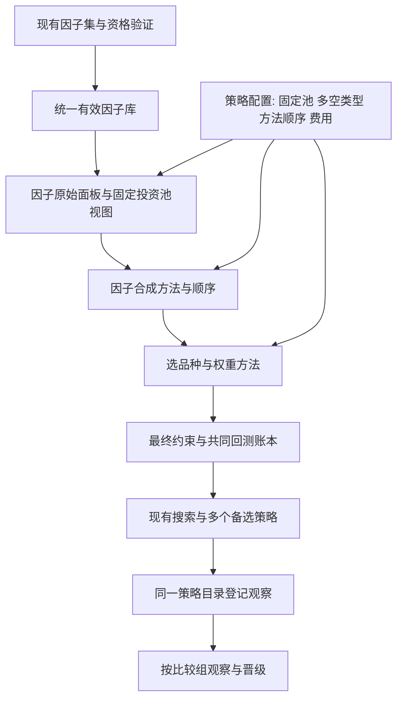

# 只做多趋势配置策略扩展方案

更新：2026-09-16。第九至十一节保留原方法的实施与搜索记录；第十二节为费用诊断，第十三节说明当前文档对齐方法与验收。历史搜索结果不代表新方法重新选出的候选。

## 本次实施计划与收口约定

首轮完成配置、组合构建、研究评价、回测入口与搜索调用的工程闭环，验证真实数据结果。原始指数未知因子不冒称已复原；全有效库搜索进入第十节，正式策略替代尚未授权。

1. 扩展现有ProductionPortfolioConfig和PortfolioRecipe，固定投资池，显式配置多空类型、合成顺序、选品种比例、风险方法、参数分组和绝对名义敞口上限。原默认行为保持不变。
2. 用现有load_config增加小范围配置继承，外挂配方只覆盖差异；不新建配置系统、策略注册器、适配器或独立回测引擎。默认投资池固定为IF/IC/T/TF/AU/CU/SC/RB/M。
3. 现有因子面板按计算母池共享原始输出；策略视图按固定投资池重新排名和计算IC。首版支持现有38品种内的合格固定子池；母池之外的新增品种须先完成数据及因子定义资格核验，入口显式拒绝。原始缓存绑定计算范围，组合缓存绑定投资范围和完整配方。
4. 组合方法放入现有optimization模块；PortfolioEvaluator作为搜索、冻结回测和逐日目标权重的共同调用点。显式不支持的组合在配置/调用时拒绝，不能静默退回旧方法。
5. 现有组合入口增加通用配置配方分支，现有预算搜索使用相同评价器。基准默认九选五、因子内参数平均再因子等权、相关性修正逆波动率、文档品种上限、零缓冲；因子身份未知，示例成员必须标为工程验证候选。
6. 验收包括固定池隔离、另一个池/空头类型、默认与覆盖、并列精度、独立风险窗口、两级均值、未来扰动、完整/逐日一致、缓存配方隔离、原生账本对账、真实数据回测以及现有10组逐日回归。修改前全套基线为1147项通过。

当前默认回测复用共享账本的`index_formula`方法，按文档公式收取2bp及单份年化0.1%固定费用；风险窗口截止决策日收盘。原`close_marked`和`prior_close`仍可通过同一配置选择，禁止隐含叠加费用。新增文件优先限制为一份策略配置和必要测试，其余在现有文件内局部扩展。

## 一 结论与实施边界

将趋势配置策略接入为现有框架的一种可选组合配方。认证数据、因子计算、有效库、组合搜索、回测账本、成本诊断和报告继续使用当前模块。策略统一登记在config/strategy_library.yaml；稀疏方法配置在config/strategy_trend_allocation.yaml，不增加独立外挂入口或策略池。

旧 `external_strategies/guosen_trend_index` 只作为历史参考。逐项核实其中的方法，能够成为通用方法的放入现有职责模块；重复实现和过时入口在新路线验收后退役，必要时直接重建目录。历史结果保留其原始口径和失效标记，不作为当前正确性或收益基准。

本次设计不改动现有10组策略的成员、默认缓冲、正式身份、有效库资格或交易设置。实施时以届时最新框架为基线，避开正在进行的交易模块修改，并冻结代码、配置和数据版本。

## 二 当前框架的核实结果

- 已读取关联任务“新增期货多因子策略因子”的近期研究进度，并与当前文件交叉核对。当前权威 `factor_library/library.json` 有188条有效记录，输出均为daily；输入为167条1min、15条5min、6条daily。库中记录的研究截止日均为2026-05-15。这是当前登记快照，不等于已对九品种只做多场景完成验证。
- 当前正式观察主策略为多源韧衡(18)，当前活跃池共10组。现有默认组合路径为 `lw_abs`、Top10/Bottom10、分组cap3、分侧ERC，各组按登记采用缓冲。
- `workflows/factor_selection.py::_run_budgeted_pool_search` 已具备全池种子覆盖、多起点、增删替换、精确净收益评价及预算停止机制，可继续作为主要搜索算法。
- `research/portfolio_experiment_support.py::FactorPanelRunner` 已具备批量计算、检查点和预热处理；当前对外主要保留排名面板。复现“原始因子值保留10位小数再排名”需要按需保留原始日度输出。
- `optimization/portfolio_construction.py` 已有单侧选池、逆波动率、ERC及约束处理；但 `allocate_sleeve` 固定把单侧归一为1，不能直接表达文档的目标波动率名义权重。
- `backtest/research_ledger.py` 已处理次期生效、权重漂移、具体合约切换及成本。应继续作为经济性研究的统一账本。
- 设计阶段运行旧外挂相关已有测试，24项通过。这只确认旧测试约定；实施阶段的真实验收另列，不将旧结果作为正确性或收益证据。

旧实现已发现的具体问题包括：自带64日分块重叠、与当前按因子声明补足预热的路线不同；先按波动窗口截断历史再估相关性，使较长相关窗口无法生效；默认要求最终每天持有九品种，而附件本身没有该硬性规定。新设计不继承这些假设。

## 三 先冻结复现规则

### 3.1 附件明确的策略结构

投资池为IF、IC、T、TF、AU、CU、SC、RB、M。按交易日计算目标，只持有非负期货名义敞口。每个因子及其参数独立排序，九选五，再分配风险权重，最后合成组合。

对一个因子参数组合，设入选品种数为N：

\[
\sigma_{i,t}=\operatorname{std}_{ddof=1}(r_{i,t-L_v+1:t})\sqrt{242}
\]

\[
CF_t=\min\left(\sqrt{\frac{N}{1+(N-1)\bar\rho_t}},cf_{cap}\right),\qquad
u_{i,t}=\frac{\sigma_{target}}{N\sigma_{i,t}}CF_t
\]

未入选品种权重为0。这里的N是该子组合的入选数量；正常完整九品种样本中为5。

它是相关性修正的逆波动率配置。普通协方差下，各品种的边际风险贡献通常不同，因此应作为独立方法加入，ERC保留为另一个可选方法。多个子组合平均、相关倍数封顶和最终品种截断后，总组合实际波动率仍需另外检验。

最终品种上限：IF/IC各20%，五个商品各30%，T/TF各100%。基准仅截断超限权重，释放的敞口不重新分配。总权重由公式决定，不默认归一为1。名义敞口、保证金占用和闲置现金收益分别记载；初版不额外假设现金利息收入。

### 3.2 文档差异及建议采用的解释

| 项目 | 核实到的差异 | 设计建议 |
|---|---|---|
| 相关性倍数上限 | 第一份写max，第二份写min，且称为上限 | 采用第二份min，登记为文档解释 |
| 相关系数公式 | 第二份原生公式的分母存在与前文标准差定义不一致的写法 | 使用现有标准样本相关系数，记录校正，不按错误量纲计算 |
| 交易成本 | 第一份遗漏绝对值，第二份明确有绝对值且费率0.02% | 采用非负绝对成交变化，费率2bp |
| 因子参数合成 | 第一份明确先因子内平均；第二份描述汇总所有因子参数组合 | 基准采用先参数平均、再因子等权；参数组数不同时另做平铺等权敏感性对照 |
| 年化0.1% | 第一份称管理费，第二份称移仓成本估计 | 文档口径只扣一份按净值计的固定费用；与框架显式移仓费用分开解释 |
| 因子集及参数 | 未披露，第一份说明以动量为主的量价因子 | 只能复现已披露规则；使用本项目因子构造透明代理 |
| 风险参数 | 目标波动率、窗口、倍数上限均未在附件明确给值 | 设计起点建议4%、20日波动、20日相关、倍数上限2；均标为待冻结假设，不作为原指数真值 |

第一版每个已登记因子先只使用其现有参数。增加参数变体属于增加研究假设，不能把大量近似版本当作独立因子提高其权重。

### 3.3 数据与时间口径

1. **两套品种范围分开。** 投资池固定九品种；因子计算的参考母池保留各因子当前定义所需范围。涉及板块比较或市场残差的因子，不能把计算母池无声缩成九品种。先计算原始输出，再截取投资池并排序。
2. **数据差异单列。** 附件使用Wind主连及其后复权规则。当前认证DuckDB及框架连续合约路线作为研究数据主线；未核对Wind选约、复权和日历之前，只称规则代理。当地已有参考净值文件，可在核实日期、来源及可用范围后作比较，不用于反推未知参数。
3. **上市与缺失。** 不为尚未上市的SC补造历史。主要比较建议从2019-01-01开始，正式执行前确认九品种及各候选的数据覆盖；2016-03-31起的曲线作为扩展诊断，明确可用资产变化。历史不足先影响该因子的可用范围，不能后见回填。
4. **时间戳沿用现有契约。** 先核对每个因子的真实信息截止时间。对已有shift(1)的日度输出，T行通常使用至T-1的信息，T收盘形成目标，账本从T+1收益生效。风险估计与选定信息截止时间一致。该路线相对文档可能更保守，明确披露；不通过全局shift(-1)追求曲线接近。
5. **波动和相关窗口独立取数。** 先准备足够覆盖两者的历史，再分别切窗；有效观察数、并列排序和缺失处理预先固定。
6. **零信号不自动消失。** 参数或因子完整有效但产生零仓位时，保留其合成预算；数据不可用与主动空仓分开记录。不能因剔除零仓位组合而自动提高其余组合敞口。
7. **九选五不意味着最终九个都持有。** 最终持仓数量、入选频率、单因子选择重合率作为诊断，不强制补满九品种。

## 四 模块改造方案

### 4.1 必要改动

| 现有位置 | 最小扩展 | 复用边界 |
|---|---|---|
| `core/config.py`及现有配方定义 | 增加显式组合构建方式及只做多配方参数，所有新增项默认保持原路线 | 不改变原10组的默认语义、命名或约束 |
| `research/portfolio_experiment_support.py` | 按需保留原始日度因子值；复用当前批量计算、预热、检查点 | 不复制旧外挂的计算循环；缓存指纹包括计算母池、投资池和原始/排名面板类型 |
| `optimization/portfolio_construction.py` | 增加单侧选池、文档风险权重和因子子组合合成的少量函数 | 现有ERC、逆波动、选池排序和数值工具继续复用；文档权重不经过强制单位总和投影 |
| `research/historical_portfolio_search.py::PortfolioEvaluator` | 增加显式权重构建分支，并继续使用共同的run/ledger路径 | 搜索、冻结回测和逐日决策使用同一权重函数；原多空路径保持原行为 |
| `workflows/factor_selection.py` | 复用预算搜索，增加可选的只做多候选排序输入；评价函数使用新配方 | IC可作辅助诊断，精确只做多净收益决定候选；不复制一套搜索算法 |
| `run_portfolio_workflow.py` | 增加显式外部配方入口，读取独立配置，结果进入现有报告格式 | 无参数运行仍按当前策略目录；旧快照审计入口不承担新策略研究 |
| 现有测试及一组新增针对性用例 | 检验新方法、时间语义和原组合回归 | 旧测试按新职责重写，不能只搬过来继续证明旧行为 |

配置名称为设计示意，实施前与现有schema统一：组合方式区分现有“合成分数后多空选池”、新增“因子先成组合再合成的只做多”、后续可选“合成分数后只做多”；资产权重增加 `inverse_vol_target_corr`。用有限方法选项表达，不建立新的Manager、Adapter或策略注册系统。

### 4.2 条件性改动

- `optimization/factor_weighting.py`：只有实际研究因子子组合的非等权合成时才增加方法；基准的两级均值放在组合构建函数内即可。对子组合收益作风险配置，与按IC给因子打权重分开定义。
- `optimization/costs.py`、`backtest/research_ledger.py`：原生研究继续复用；文档公式对账若需要新增功能，只增加明确的诊断口径和必要参数，不修改原生默认漂移语义。
- `optimization/risk_budgeting.py`及现有风险控制模块：风险增强阶段调用现有ERC求解和约束能力，不重写数值优化器。

共享方法的缓存和研究合同应包含新配方、参数、合成顺序、费用、年化口径和版本。不同方法或不同原始数据面板不得复用相同的候选结果缓存。

### 4.3 共享策略池与旧目录退役

不新建外部目录。现有StrategyLibraryEntry只增加recipe_source与comparison_group：默认shared_default沿用原方法，strategy_config加载策略自己的配置；preferred/observing/archived以及formal仍只有现有一套含义。登记为观察不等于正式交易或独立样本外资格。

默认比较只选择首选策略所在比较组。显式STRATEGY_IDS或RUN_AND_COMPARE_ALL可跨组并列观察，结果记录各自品种池、方法、成本和年化频率，不以全局Sharpe排序替代同组评价。将来风险预算或费用差异很大时应另设比较组。

框架方法模块不导入外部目录。旧目录只保留历史审计实现与证据，其三个命令入口明确停止并指向现有工作流，避免两套默认和生命周期并存。

## 五 复现与尝试超越的实验顺序

### 阶段一 建立可核对的规则基准

先完成公式、时序、成本及约束核对，再计算真实数据上的基准。设置三个比较对象：

1. 九品种被动配置基准：不使用择强因子，按明确风险配方持有，用于区分资产长期上涨与择强贡献。
2. 规则代理：冻结一组现有量价/趋势因子，独立九选五、两级等权、文档权重公式和品种上限。
3. 原始指数参考净值：仅在共同日期比较，并披露数据、未知因子、风险参数及会计差异。

基准因子名单在首次行情计算前从当前有效库单独冻结，旧6f/10f/13f名单不自动作为起点。初版不开排名缓冲，不优化目标波动率或杠杆。

费用同时输出两套清楚标识的结果：

- **文档公式对账**：按附件的 `tc*abs(w_t-w_{t-1}*(1+r_t))` 和每日 `0.001/242` 计算，说明其权重基准与原生NAV漂移的差别。该公式口径不再额外叠加一份框架默认年化移仓预留。
- **框架经济性研究**：使用当前原生账本的漂移、可交易性及实际换月腿，并显式选择费用政策。当前2bp、管理费0、按总敞口年化0.105%移仓预留只用于相应框架口径；不混称附件口径。

242为附件风险及费用年化基数；框架现有不少指标使用252。比较报告统一基数并记录转换，不能直接抄用旧策略报告中的夏普和年化值。

### 阶段二 固定配方进行只做多因子搜索

以当前188有效因子为候选上界、保持登记方向。分两层报告：量价/趋势相关子池最贴近文档描述；全部有效库用于增强候选，明确可能引入期限、持仓等额外信息。复用公共面板；新增参数和库外新因子另立正式研究，不混进本轮。

已有多空IC有效不代表只做多有效：正IC可能主要来自空头收益，也可能只在更宽品种截面成立。新增组合诊断包括九品种截面IC、入选多头收益、相对被动配置的增量收益、单品种贡献及风险调整后的表现。某因子在这个任务中不合适，只影响该策略候选，不更改其有效库资格。

主要搜索使用现有多起点增删替换方法。建议主池每个训练折最多512次精确回测；下文五折合计上限2560次，最终使用截止前完整历史选定观察版本另列512次预算。先以小批真实数据测量耗时，再冻结总预算；未用完的预算不要求补满。量价子池首轮只作固定配方对照，若另做选集搜索必须单列预算，避免把计算量与方法优势混为一谈。所有符合数据条件的候选都获得种子尝试机会；报告尝试覆盖和成功覆盖，预算有限不等于穷举。

候选提议优先使用训练段单因子只做多子组合的增量收益与互补性；原多空IC只作辅助。最终候选仍逐个调用完整组合构建及账本，不能把各子组合已扣费净值平均后当作合并组合回测。先合成目标权重，再按合约净额计算交易与费用。

保留少量收益路径和经济构成不同的候选，综合净收益、回撤、较弱阶段和复杂度取舍。允许小幅可解释的指标退步，不设置“所有数字必须改善”的替代条件。初始种子和因子规模由当前搜索机制控制，不固定照搬旧外挂14因子穷举，也不把现有正式18因子组合直接当只做多最优解。

### 阶段三 冻结因子后比较有限方法

按优先顺序进行，每次只改变一个主要环节：

| 顺序 | 方法变化 | 需要回答的问题 |
|---|---|---|
| 1 | 文档风险公式与现有收缩ERC，按统一风险尺度比较 | 精细协方差配置是否提高扣费后的稳定性 |
| 2 | 因子先成组合再等权，与因子分数先合成再只做多 | 改变合成顺序是否带来可重复增益 |
| 3 | 已保留组合的排名缓冲0/1 | 九选五中减少边界反复交易是否值得；不能直接移植38品种多空组合的B2 |
| 4 | 如存在明确防守需求，再研究简单绝对趋势过滤 | 当全部资产较弱时减少敞口是否改善下行风险；属于增强规则 |

绝对趋势过滤必须用有经济含义的价格趋势门槛；截面排名或标准化得分的正负不能代表预期收益正负。基准仍遵循相对排名选五，不自动增加空仓择时。

不同时搜索因子集合、每个因子参数、风险窗口、合成方式、缓冲和杠杆的全排列。已经选出的改进在同一训练/测试规则下检验交互影响，再冻结最终版本。

## 六 日期划分与研究证据

- 研究截止日沿用2026-05-15。其后已查看的行情仅作观察，不能重新命名为未见OOS，也不反向用于选择。
- 主研究样本建议2019-01-01至2026-05-15；2016起单列延伸诊断。最终起点以九品种及候选覆盖审计冻结，不自动为提高表现变更。
- 建议年度扩展窗口：2019—2021训练、2022测试；加入2022后测试2023；依次测试2024、2025和2026年截至截止日。每折独立完成候选排序、聚类、选集及方法选择，再冻结进入下一段。
- 使用H日未来收益作辅助统计时，训练末端去掉跨越测试边界的标签，按实际预测期处理；每日调仓不由best_period自动决定。
- 当前因子及188库资格已经参考后期历史，因此上述折只能称为历史时序检验。固定当前候选集合本身仍有选择偏差；不能把2019年的回放描述为当时已经存在的可交易策略。
- 真正新观察从最终策略冻结后的尚未查看日期开始，建议预先保留至少6个月，再根据样本量判断能否形成稳定结论。沿用框架已有批准流程，不把六个月本身设为自动通过条件。
- 搜索次数、完整失败记录、所有候选、方向、参数、数据和代码指纹保存为研究合同。反复选历史冠军会产生额外过拟合风险，单因子通过FDR不能替代组合级验证。参考：[The Probability of Backtest Overfitting](https://www.davidhbailey.com/dhbpapers/backtest-prob.pdf)。

## 七 如何判断是否值得替代或保留

同时看三个层次：

1. **超过透明规则基准**：共同品种、日期、数据、成本和风险尺度下，净收益与风险整体更好，改善分布于多个阶段且不过度依赖单品种。
2. **与原指数比较**：在可得参考净值的共同日期比较原始表现，同时列实际波动、敞口和费用差异。匹配风险的策略版本使用仅依赖过去数据的缩放并重新扣费；事后等波动曲线仅可作描述。
3. **与现有多空主策略互补**：比较净日收益相关性、共同回撤阶段及压力期表现。只做多本身带有资产方向暴露，不以未经风险匹配的年化收益排名决定替代多空主策略。

主要报告净年化、波动、夏普、最大回撤与修复时间、最差阶段、年换手、2/4/8bp压力、名义敞口、预测/实现波动偏差、资产贡献和风险贡献。若比较固定1倍总敞口，要明确这是独立研究配置，不能直接当作附件原规则。

“尝试超越”首先指在相同约束下形成更值得保留的组合；能否超过原始指数和改善幅度均由实验决定。本方案不预设收益目标或胜出结论。

## 八 验收与交付

### 实现正确性

- 手算小例核对九选五、10位精度、相关倍数、ddof=1、242年化、两级均值和最终截断；不同参数组数时检验两种合成方式的差别。
- 用波动窗口短于相关窗口的例子确认分别取数；零波动、数据不足、并列排名、未上市及主动零仓位按冻结规则处理。
- 修改未来输入不得影响既有决策；单日冲击核对信号、决策、持仓、收益各自的日期。
- 对相同因子、配方和数据，搜索、冻结回测及逐日调用的目标一致；完整运行与检查点恢复、分块与连续计算一致。
- 组合费用按合成后的实际交易核算；两套会计口径分别与定义对账，不要求本来不同的口径净值相等。

### 框架兼容性

- 在同一代码/数据快照内，对现有10组比较修改前后的逐日目标、实际持仓、换手、费用和净值；包括各自已登记缓冲，要求原路线不变。
- 默认配置不启用新策略；框架主体无外部策略实现依赖，旧目录退役前核对全部引用。
- 新策略的交易接入另按现有交易模块验证；本阶段交付研究候选和证据，不自动加入正式交易名单。

### 分阶段交付

1. 规则与数据差异表、冻结研究合同和最终改动清单。
2. 最小模块扩展、真实数据规则基准、原策略回归证据。
3. 全库只做多搜索报告、少量候选定义和分段比较。
4. 冻结因子后的风险方法、缓冲及成本压力报告。
5. 最终策略配置、标准净值/账本/归因报告和新观察安排。

优先完成第1—2项，再根据结果决定后续增强深度。以当前框架的方法能力承载策略，外部配置只负责选择和组合这些能力。

## 依据

- 用户提供：[趋势配置指数编制方案](E:/程明杰公司内容/指数编制方案/趋势配置指数编制方案.docx)、[趋势配置指数编制方案2](E:/程明杰公司内容/指数编制方案/趋势配置指数编制方案2.docx)。正文、表格和原生数学公式均已读取；未使用未经核实的页码。
- 当前权威文件：`factor_library/library.json`、`config/strategy_library.yaml`、`config/default.yaml`及文中列出的现有实现。
- 关联研究进度：任务“新增期货多因子策略因子”，结合当前文件核对；其中历史数字不自动转为本策略结论。

## 九 本次实施与实际验收（2026-09-15）

### 已落地的最小结构

只新增一个方法配置、一组针对性测试和本方案文档。其余均扩展现有文件，没有新建引擎、注册器、适配层或外挂策略池。

- `ProductionPortfolioConfig/PortfolioRecipe`承载固定投资池、多空类型、合成顺序、风险窗口、权重方法与最终绝对限额。
- `FactorPanelRunner`按需保留原值；计算母池保留38品种，策略视图截取固定池后重新排名与计算IC。不同数据源或计算母池不能共用面板。
- `allocate_ranked_portfolio`复用选池及已有分配器，仅补充附件的相关性修正逆波动方法。参数平均、因子合成与最终限额进入现有PortfolioEvaluator。
- 搜索、目录回测与逐日目标共用上述评价器及现有close-marked账本。成本诊断、指标和分段报告统一使用配置年化频率。
- 策略目录只增加`recipe_source`与`comparison_group`。原中性10组、首选身份和缓冲保持原值；同池增加3组只做多观察项，均formal=false。
- 旧外挂三个命令入口退役；保留旧代码仅供审计，不再承担当前运行或登记职责。

默认九选五、两级等权、目标风险公式、品种上限及2bp交易费已设置。4%目标、20/20日窗口和CF上限2属于公开材料未披露参数的显式假设。`position_limits`是最终净值名义上限，`asset_max_fraction`仍是已有单侧分配上限，两者不混用。

### 真实数据与搜索结果

冻结开发范围2019-01-01至2026-05-15，实际1784个交易日、1783个收益区间，年化频率242。此次工程搜索显式选取6个日线输入的有效因子，并非188个有效因子的全量选优。

其中`intraday_sector_upside_oi_confirmation_20d`在60个交易日不足九选五，被门禁拒绝。五个覆盖合格成员形成规则代理。6个因子总共57种至少两因子的组合均被尝试：26项通过、31项因缺覆盖被拒绝，随后保留4项候选，其中2项登记观察。选择及资格均为回顾性开发证据，不是独立样本外验证。

| 方案 | 年化净收益 | 夏普 | 最大回撤 | 年化换手（倍） |
|---|---:|---:|---:|---:|
| 五因子规则代理 | 4.04% | 0.97 | -6.21% | 59.82 |
| 稳健候选，两因子 | 5.01% | 1.18 | -5.47% | 67.64 |
| 较低换手候选，两因子 | 5.70% | 1.31 | -5.40% | 41.43 |
| 先合成分数备选，五因子 | 2.38% | 0.54 | -9.70% | 83.20 |
| 本地原指数参考净值 | 7.95% | 1.92 | -3.71% | 不可得 |

两组候选在本段开发样本中优于规则代理，仍未超过本地原指数参考净值。参考文件与策略有1784个共同日期；其供应商选约、复权和成本口径未独立复核，因此不以曲线差距推断某一个方法优劣。

规则代理目标全为非负且限额通过，平均总名义敞口1.014倍，范围0.199—2.381倍；这来自风险公式，并未强制归一到1倍。`ERC + portfolio_first`备选在2022-03-17触发现有ERC求解器ABNORMAL失败，已拒绝并记录，未修改求解器或回退为其他方法。

### 验收证据

- 新方法用例覆盖固定池隔离、配置继承与覆盖、另一固定池的三种多空类型、已有等权/逆波动/ERC分配调用、独立相关窗口、CF上限、10位并列、参数均值、最终限额、未来扰动、缺覆盖拒绝及缓存隔离。
- 三个已登记新策略的搜索与目录回测净收益逐日对账，最大绝对误差低于4e-16；逐日目标接口与整段目标也通过测试。
- 原中性10组在2025-01-01至2026-05-15的328个交易日，修改前后的目标及完整日账本逐值完全一致，包含当前登记缓冲。使用已记录的因子面板作为共同回归输入、当前行情作为收益输入；不将此称为因子重新认证。
- 文档成本公式另存诊断：它不含框架显式换月双边腿，漂移分母和扣费日期也与原生账本不同。因此诊断与统一经济账本分别标注，不伪称精确复制原指数会计。
- 交易模块的旧验收仍只属于其冻结版本。当前新增项不进入formal交易名单，交易模块继续拒绝未经核验的非默认配方。

主要证据（均保留原始运行边界）：

- [研究与比较图](../runs/strategy_extension/comparison/nav_comparison.png)
- [比较、敞口及对账明细](../runs/strategy_extension/comparison/acceptance.json)
- [原10组逐日回归](../runs/strategy_extension/neutral_regression.json)
- [受限搜索合同](../runs/factor_selection/20260915_trend_daily6_acceptance/run_contract.json)
- [候选及拒绝记录](../runs/factor_selection/20260915_trend_daily6_acceptance/portfolio_candidate_evaluations.csv)
- [文档成本诊断](../runs/strategy_extension/comparison/document_cost_diagnostic.csv)

### 上一轮使用与后续步骤（历史状态，以第十节为准）

1. 通过现有`run_portfolio_workflow.py`：选择`RUN_AND_COMPARE`，将`STRATEGY_IDS`设为`trend_allocation_daily_probe`、`trend_allocation_robust_pair`和`trend_allocation_low_turnover_pair`即可同组比较；留空仍比较中性10组。无参数首选仍是多源韧衡。
2. 修改`config/strategy_trend_allocation.yaml`中的方法、风险参数或日期后复用同一流程。当前观察区间固定到2026-05-15；延展时显式设定终点或`latest_available`，仍不得以截止后表现反向选因子。
3. 全量188因子研究使用现有`workflows.factor_selection.run_effective_factor_selection`，传入该配置、`selection_start='2019-01-01'`，不传`candidate_names`即使用完整有效库；`portfolio_search_budget`控制精确评价预算。首次全量运行前冻结库哈希、频率、日期、预算和方法；本轮未执行这一高预算阶段。
4. 方法备选直接使用策略配置，不套用原中性Top/Bottom网格。多参数因子组可以整组评价；当前子集搜索拒绝拆分参数组，不默默把参数变体当独立因子。
5. 将覆盖、历史阶段稳定性及成本通过的少量候选登记同一目录并按比较组观察。独立样本外验证、ERC失败样本的专门数值审阅、保证金/实盘接入和正式策略替代均尚未完成。

### 主工作区最终集成记录

以中性／交易冻结提交`ac3b1993cb11e5683f94193f36e4f0dc50e9e992`为基线，20个明确列出的文件合入主目录；仅3个新文件（方法配置、针对性测试、本方案），未引入新层次。保留原正式身份、缓冲、交易接口和文档入口。本次扩展没有提交或推送。

主目录全套回归 **1185 passed**；最终配置来源元数据修正后相关回归 **93 passed**，共享目录三策略重新实测完成，净值相对隔离工作区最大差异为0，配置路径与实际文件SHA256相符。

- [主目录共享策略回测与对账](../runs/strategy_extension/main_catalog_acceptance.json)
- [最终共享目录运行合同](../runs/portfolio_backtest/20260915_trend_shared_catalog_final/run_contract.json)
- [完整回归日志](../runs/strategy_extension/main_pytest_final.log)
- [最终相关回归日志](../runs/strategy_extension/main_targeted_final.log)
- [变更范围与回退依据](../runs/strategy_extension/integration_manifest.json)

## 十 默认权重下的全有效因子搜索（2026-09-15）

### 复审结论与必要修正

上一轮六个日线输入因子的试验属于工程验证，不能代表全有效库搜索。附件默认权重已经可以运行，无需等待ERC修复。本轮保持方法配置不变，修改现有搜索与目录回测入口，并扩充原测试文件。

1. 固定池搜索复用当前`FactorPanelRunner`及其逐因子长历史预热、38品种计算母池和严格断点合同。旧的重叠块直调入口没有承接显式长历史需求；六因子试验不含这类因子，但全库运行必须补齐。
2. 九品种IC诊断不再沿用至少10品种的阈值；预测标签按各因子的证据周期，在搜索边界处剔除跨界标签。原工程搜索的H1提案另有至少3品种设置，诊断为空不等于原搜索完全没有IC。
3. 先组合持仓、再等权的策略，使用单因子原生账本净收益均值作为组合提案近似。最终限额、交易净额和持仓漂移导致该近似不等于组合净收益，因此每个入选提案仍调用现有完整账本。
4. 多起点搜索保留已有较优路径，同时预留增长路径；按预算停止，不因临时退步或因子数量停止。修正实际宽度元数据和首条拒绝记录导致结果CSV缺列的问题。
5. 外挂策略的搜索、单策略回测及目录共享面板均使用配置中的日线预热起点（当前252个日历日），再由FactorPanelRunner补足逐因子历史需求。原中性路线仍保留365日配置外缓冲。原3个外挂观察项在两种起点下的完整账本对账通过，最大日净收益差异低于4.1e-16。
6. **因子资格还必须检查实际数值表示。** 188项中有11项原值不同，但保留10位小数后，在整个开发期都无法区分九个品种，等价于并列规则选出的固定AU/CU/IC/IF/M篮子。搜索资格现已拒绝这种情况；保持默认精度，不通过重定标改变方法。原始覆盖与表示资格合计排除19项（8项缺覆盖、11项完全并列），其余169项进入方法构造检查。
7. 恢复合同增加Python、NumPy、Pandas、SciPy、DuckDB、因子核模式/版本及原生二进制哈希，防止数值环境改变后沿用旧结果。

### 冻结设计

| 项目 | 本轮设置 |
|---|---|
| 因子入口 | 当前有效库188项；冻结成员、方向、输入频率、库及代码哈希 |
| 计算与投资池 | 计算母池38品种；投资池固定IF、IC、T、TF、AU、CU、SC、RB、M |
| 唯一搜索变量 | 因子成员组合；方向、参数、方法、窗口和风险尺度均固定 |
| 权重及成本 | `strategy_trend_allocation.yaml`原默认值；九选五、逐因子分配后等权、相关修正逆波动、最终限额、2bp交易费、242日年化 |
| 搜索样本 | 2019—2024年；分为2019、2020—2021、2022—2023、2024四段 |
| 条件验证 | 2025-01-01至2026-05-15；先锁定候选及排序，再评价，不回流提案、聚类或排序 |
| 精确预算 | 512次，包含188个单因子资格检查；相同合同可恢复，最终结果不可覆盖 |
| 探索方法 | 全成员单因子检查 → 跨簇配对及合格全池基准 → 6条路径、每轮最多16项增删替换及增长提案 |
| 保留规则 | 现有分段稳健性排序及Pareto候选规则，至多5项；不设固定因子数或数量惩罚 |

单因子阶段按数据、实际数值表示与可构造性排除：搜索区间每天必须满足固定选择数量，且经过默认精度处理后不能全期完全并列；失败原因均留档。单因子收益较差不会被永久剔除。跨簇配对辅助减少重复提案，不把聚类代表当成唯一可选成员。

当前有效库的准入已经使用过2025—2026年的数据，上一轮试验也查看过该区间。因此上述后段只能称为**当前有效库条件下的验证**，不能宣称独立样本外。2026-05-15之后的数据不用于本轮研究；真正独立的前瞻观察须在候选锁定后另外积累。

### 验收与实际运行

- 合同：改变因子、数据、代码、日期、成本或预算不得沿用旧搜索结果；完成的运行不可覆盖。
- 因子与因果性：固定池缺覆盖有明确拒绝记录；搜索期后的价格、因子及IC扰动不得改变搜索成员及精确结果；日线输出保持原框架时序。
- 组合：保持非负、固定九品种和逐品种绝对限额；相同成员在搜索与共享目录入口的逐日净收益必须一致。
- 结果：公开全部精确尝试和失败，先保存锁定名单，再出条件验证。原指数及上一轮代理只用于结果对照，不用于驱动本轮搜索。
- 观察资格：锁定候选通过后段可构造性检查、后段净收益与夏普均为正，且全段双倍交易成本下净收益为正，才可登记观察。条件验证失败不得通过重搜或重排掩盖；所有候选仍保留在研究报告中，不自动成为正式策略。

运行入口：`run_effective_factor_selection(run_id='20260915_trend_effective188_default_qualified', config_path='config/strategy_trend_allocation.yaml', selection_start='2019-01-01', search_end='2024-12-31', portfolio_search_budget=512)`。中断后仅在原合同完全一致时增加`resume=True`恢复。

冻结合同见`runs/factor_selection/20260915_trend_effective188_default_qualified/search_plan.json`；过程日志与测试证据见`runs/strategy_extension/20260915_factor_search_review/`。本次搜索、锁定后验证及五候选账本验收均已完成，详见本节末尾。

修正前的全库运行在263次尝试后暂停，当时尚未锁定候选或运行条件验证，记录保留在`20260915_trend_effective188_default/interrupted.json`。修正后的运行使用新ID和合同，复用同批已完成的188项原值面板；189个检查点文件逐一核对哈希，未修改检查点合同，详见新运行的`panel_reuse.json`。旧尝试仍计入本次研究的探索历史，不隐去它们，也不称新运行是首次接触这些历史数据。

### 修正前六因子流程复验（历史记录）

以下5项通过的是旧资格门，仅保留回测事实；包含恒定篮子的组合不满足当前因子资格。修正后的结果见下一节。

使用相同默认方法与新时间划分，预算64次，实际尝试31项（30项可评价、1项固定池缺覆盖拒绝），锁定5个候选。该启发式搜索未声明穷举，结束原因为当前搜索路径无新提案。5项均通过条件验证与双倍交易费检查，搜索与目录账本的日净收益差异均为0。

开发期排序第一的单因子为`intraday_oi_price_response_asymmetry_20d`（登记方向+1）。其2019—2026-05-15全段年化净收益6.17%、夏普1.34、最大回撤-4.89%；2025年起的条件验证段年化6.76%、夏普1.39。原五因子代理全段为4.04%/0.97/-6.21%，本地原指数参考为7.95%/1.92/-3.71%。此验收候选优于代理，尚未超越本地原指数参考，也不代表全188项搜索结论。

- [六因子搜索及锁定记录](../runs/factor_selection/20260915_trend_daily6_bounded_review/run_contract.json)
- [同一账本对账、成本压力及观察资格](../runs/strategy_extension/20260915_factor_search_review/acceptance_pilot/acceptance.json)
- [复验净值图](../runs/strategy_extension/20260915_factor_search_review/acceptance_pilot/nav_comparison.png)
- [目录预热起点前后逐日回归](../runs/strategy_extension/20260915_factor_search_review/panel_start_parity.json)

### 数值表示资格修正后的复验

六因子复验现有4项合格、2项拒绝（1项缺覆盖、1项保留10位后全期并列），17次尝试覆盖15个可评价子集，最终锁定2项：OI价格响应非对称单因子、该因子与量额绝对收益偏相关的双因子。其开发段年化净收益分别6.03%和4.80%，条件验证段分别6.76%和5.94%。两项均为真正含有品种区分信息的表示。

旧“日线对数非流动性”数值很小，保留10位后全为零；此前较低换手不能据此解释为这一因子的择品种能力。含该项的旧五项代理及旧低换手组合只作为历史工程对照，不进入本轮合格候选。

- [修正后的六因子资格与锁定结果](../runs/factor_selection/20260915_trend_daily6_representation_check/run_contract.json)
- [全库数值截断诊断](../runs/factor_selection/20260915_trend_effective188_default/rounding_diagnostics.json)
- [两项历史形态因子缺口与旧面板对账](../runs/strategy_extension/20260915_factor_search_review/historical_shape_coverage_audit.json)

### 全库搜索与锁定后验收结果

最终合同下完成512次尝试：188次单因子资格检查、168次跨簇配对、1次169项全池基准、56次增长、99次增删替换。493项可评价，19项资格拒绝；组合阶段没有新增构造失败。除全池基准外，实际探索了1—11因子的组合。预算耗尽后停止，这是预算内启发式搜索，不是穷举或全局最优证明。修正前263次全库尝试、31次旧六因子复验、17次新六因子复验另存，不从探索历史中删除。

以下顺序完全按开发期锁定名单，后段及原指数均未用于重新排序。年化采用242日，收益扣除配置中的成本；双倍交易费指2bp升至4bp，其他方法和费率不变。

| 锁定候选 | 因子数 | 全段年化净收益 | 全段夏普 | 全段最大回撤 | 条件验证年化 | 双倍交易费全段年化 |
|---|---:|---:|---:|---:|---:|---:|
| 1（登记） | 2 | 7.11% | 1.76 | -3.84% | 8.49% | 5.82% |
| 2（登记） | 3 | 6.95% | 1.75 | -3.57% | 8.80% | 5.84% |
| 3（研究保留） | 5 | 7.06% | 1.84 | -3.01% | 7.15% | 5.89% |
| 4（研究保留） | 4 | 7.04% | 1.80 | -3.03% | 7.99% | 6.04% |
| 5（研究保留） | 6 | 6.99% | 1.85 | -2.95% | 7.40% | 5.80% |
| 本地原指数参考 | — | 7.95% | 1.92 | -3.71% | 6.91% | — |

全段为2019—2026-05-15，条件验证为2025-01-01—2026-05-15。五项均通过原生账本、固定池/非负/绝对限额及观察资格检查；共享组合入口与搜索开发期日净收益差异为0，全段与锁定后账本的最大差异低于1e-16（CSV精度）。双倍费用均保持正收益。

本轮明显改善旧工程代理（全段年化4.04%、夏普0.97），但**全段年化收益及夏普尚未超过本地原指数参考**。五项条件验证段收益和夏普均高于该参考，部分候选全段回撤更小；这不构成独立样本外超越。原指数来自本地`GSIXTREND.WI_nav.csv`，1784个对齐日期完整，换月、复权及费用口径尚未独立核实。原指数因子与未披露风险参数仍属未知；本轮没有改变4%目标、20日窗口或CF上限2等既有复现假设。

### 当前登记与使用

只在现有`config/strategy_library.yaml`登记开发期排序前两项，不因验证段或全段表现改选其余三项：

- `trend_allocation_obv_vol_pair` / 趋势配置量能波动(2)：`intraday_obv_slope_20d`（+1）、`intraday_parkinson_vol_ratio_20d`（+1）。
- `trend_allocation_obv_vol_regime` / 趋势配置量能状态(3)：以上两项加`intraday_vol_volume_regime_20d`（-1）。

二者与保留的`trend_allocation_robust_pair`组成当前只做多观察组，均为observing、formal=false。旧五项代理和旧低换手组合的策略及因子集归档，原始结果保留。方法配置仍只有一份，成员、方向、来源合同和锁定名单哈希登记在已有因子集记录中。中性10项、首选及正式策略身份保持原值。

通过`run_portfolio_workflow.py`选择`RUN_AND_COMPARE`，将`STRATEGY_IDS`设为上述两项或该组3项即可比较；`RUN_AND_COMPARE_ALL`比较全部当前观察/首选项。默认入口仍遵循原首选策略。后续可在同一方法配置修改备选方法，但会形成新研究合同，不沿用本轮冻结结果；本轮没有继续搜索权重、风险尺度或因子方向。

- [最终搜索合同与全尝试清单](../runs/factor_selection/20260915_trend_effective188_default_qualified/run_contract.json)
- [锁定候选](../runs/factor_selection/20260915_trend_effective188_default_qualified/locked_candidates.json)
- [运行后代码、库及配置一致性](../runs/factor_selection/20260915_trend_effective188_default_qualified/post_search_integrity.json)
- [全部候选对账及成本压力](../runs/strategy_extension/20260915_factor_search_review/acceptance_full/acceptance.json)
- [完整净值与指标图](../runs/strategy_extension/20260915_factor_search_review/acceptance_full/nav_comparison.png)
- [正式目录绑定的逐日复验](../runs/strategy_extension/20260915_factor_search_review/registered_catalog_acceptance.json)

### 收尾验证记录

表示资格与恢复合同修正后，全套回归1223项通过。最终目录变更后，策略/搜索/目录相关161项再次通过，两项新登记策略的全段逐日账本误差均低于1e-16；非本组目录逐项保持相同，正式/首选仍只有`multi_source_resilient`。本轮没有提交或推送。

末次全回归为1222通过、1失败：`test_duckdb_month_update_is_exact_and_rolls_back_on_failure`依赖并行数据任务修改的外部`update_duckdb.py`，新接口读取旧清单时，原测试夹具未创建临时`market.json`。随后数据任务修复低层接口兼容性，本任务独立复跑`tests/test_duckdb_source.py`，9项全部通过，包含原失败项；未修改测试夹具。保留原失败日志，不将那一次完整运行改称全通过。研究与目录验收进程已正常退出并释放源库连接，数据任务随后完成同步；冻结研究使用同步前的已记录版本，未混用后续发布。

- [修正后完整回归（1223通过）](../runs/strategy_extension/20260915_factor_search_review/qualified_full_tests.log)
- [目录变更后完整回归（含外部依赖失败）](../runs/strategy_extension/20260915_factor_search_review/catalog_full_tests.log)
- [目录变更后相关回归（161通过）](../runs/strategy_extension/20260915_factor_search_review/catalog_related_tests.log)
- [数据依赖修复后独立复验（9通过）](../runs/strategy_extension/20260915_factor_search_review/data_dependency_recheck.log)
- [本轮最终范围、文件与证据哈希](../runs/strategy_extension/20260915_factor_search_review/review_acceptance.json)

## 十一 扩大因子数量覆盖（2026-09-15）

用户要求继续补齐较大组合搜索。本轮只增加现有`_run_budgeted_pool_search`的可选规模分层分支，复用单因子资格、提案净收益近似、精确账本、候选排序和锁定后验证；原默认搜索分支保留。仅修改现有搜索文件、针对性测试和本方案，不新增搜索引擎或策略池。

### 冻结计划

- 运行ID：`20260915_trend_effective188_expanded1536`，精确预算1536次。
- 有效库188项、方向、因子参数、九品种、九选五、风险权重、成本、调仓及所有日期沿用第十节；目标是扩大成员组合覆盖，不搜索方法参数。
- 开发期仍为2019—2024年，四个分段；2025—2026-05-15仍是已经接触过的条件验证，不作为独立样本外，也不回流组合提案或排序。
- 先完成188项单因子资格与账本检查，其余1348次分配到下表的12个规模区间。每区间112或113次，包含起点评价；大组合预算不被小组合耗尽。

| 起点因子数 | 搜索区间 | 精确预算 |
|---:|---:|---:|
| 2 | 2—3 | 113 |
| 4 | 4—6 | 113 |
| 8 | 7—10 | 113 |
| 12 | 11—14 | 113 |
| 16 | 15—20 | 112 |
| 24 | 21—28 | 112 |
| 32 | 29—40 | 112 |
| 48 | 41—56 | 112 |
| 64 | 57—80 | 112 |
| 96 | 81—112 | 112 |
| 128 | 113—148 | 112 |
| 169 | 149—169 | 112 |

区间按相邻起点的中点划分，边界相等时归较小起点；169为上一轮实际合格数量，若本轮资格改变则按实际合格池收缩并记录。区间用于分配搜索资源，不规定最终策略必须含多少因子。

每个区间先按单因子开发表现排序，为区间内**每一个因子数量**评价一个起点；再增加目标数量下的跨簇起点及两个随机起点。上一轮5项锁定候选重新评价，并分别补入跨簇成员扩展到各目标规模，后续搜索仍允许删除原成员。由此保证2—169各数量至少有一次精确评价，预算不足覆盖这些起点时明确拒绝。随机种子固定为20260915。每区间保留两条较优路径及一条探索路径；每条路径抽样64个增、删、替换邻居，并加入随机重启组合。每轮每区间最多精确评价4项：3项按开发期提案近似优先，另1项随机探索。最终保留仍由真实组合账本及原分段/Pareto规则决定，至多5项，先锁定再验证。

### 缓存与验收

历史数据相关分区指纹与上一轮一致，仅`core/config.py`在并行框架迭代中改变，导致严格原值检查点合同不匹配。本轮按当前框架重算188项原值，保留旧检查点及合同；完成后对照旧原值与旧候选账本，验证仅扩展搜索，没有改变原配方计算结果。新的代码/数据/运行时合同在正式搜索前另行冻结。

验收要求：

1. 当前代码重算的原值、历史分区及研究截止日可追溯；不通过修改旧检查点合同复用缓存。
2. 各规模预算、实际次数、种子及全部拒绝原因落盘；确实覆盖中大规模及向下删减路径，预算不得超支。
3. 相同合同恢复结果一致；搜索期之后的因子、价格和IC扰动不改变开发期搜索结果。
4. 上一轮5个候选在相同日期及方法下逐日账本一致；新候选固定池、非负、最终限额通过检查。
5. 锁定后检查条件验证及双倍交易费，仍复用共享目录入口核对；若结果没有改善，保留现有观察项，不为扩大数量重复登记相同策略。

相关自动测试113项通过；补齐逐数量起点与旧候选扩展后，完整回归1344项通过。六因子实际流程复验完成17次尝试（15个可构造子集及2项资格拒绝），覆盖4项合格因子的全部非空子集，仍锁定原单因子与双因子两项。全188项原值已重算并与旧面板逐值一致。

### 扩大搜索结果

1536次预算已全部完成：1517项成功评价，19项仍是既有的8项覆盖不足和11项数值表示全并列拒绝；组合阶段没有新增构造失败。1—169每个因子数量都有实际评价，各区间预算均用满。最终按同一开发期分段/Pareto/成员差异规则锁定的五项及顺序与第十节完全一致，因子数仍为2、3、5、4、6。现有两项主要观察策略没有被新组合替代，不重复登记相同成员和方法。

下表是各指定数量按既定稳健排序取出的开发期代表，不能把其中的最优值解释为该数量的全局最优。全局候选还要经过Pareto与成员差异筛选，因此逐数量代表与最终锁定名单不一定相同。

| 因子数 | 开发期最差段夏普 | 开发期年化净收益 | 开发期整体夏普 | 年化换手 |
|---:|---:|---:|---:|---:|
| 2 | 1.444 | 6.81% | 1.74 | 58.21 |
| 5 | 1.435 | 7.04% | 1.90 | 51.50 |
| 8 | 1.400 | 6.65% | 1.81 | 50.17 |
| 12 | 1.299 | 6.20% | 1.70 | 44.51 |
| 16 | 1.214 | 6.11% | 1.68 | 41.57 |
| 32 | 0.934 | 6.11% | 1.69 | 35.29 |
| 64 | 0.708 | 5.52% | 1.53 | 28.29 |
| 128 | 0.305 | 4.85% | 1.30 | 23.08 |
| 169 | 0.156 | 4.60% | 1.22 | 23.91 |

本轮较大组合总体降低了换手，但没有改善最弱历史分段。这里没有施加因子数量惩罚；结果来自固定的等权因子合成和其他冻结方法，不能推断所有较大组合都无效，也没有穷举169个因子的全部子集。

用户随后追加原中性10组因子集作为固定候选输入，继续共用现有因子面板、`PortfolioEvaluator`、`_run_production_portfolio`和账本。只迁移成员及冻结方向，不继承中性配方的权重、持仓数量或排名缓冲；只做多方法仍完全相同。10组共29个不同成员，全部通过本轮九品种资格。它们在原1536次冻结搜索之外追加评价，输入先冻结；没有新建业务模块、方法YAML或策略池，也没有改写已完成搜索的合同。

### 追加10组结果与最终验收

全部10组完成既有流程评价。下表全段为2019—2026-05-15；条件验证为2025—2026-05-15。表内名称仅表示原因子集套用只做多方法的研究结果，不改变原中性策略定义或正式身份。

| 原因子集 | 因子数 | 全段年化净收益 | 夏普 | 最大回撤 | 条件验证年化 | 双倍交易费年化 |
|---|---:|---:|---:|---:|---:|---:|
| 精简板块 | 10 | 5.35% | 1.40 | -3.59% | 6.45% | 4.23% |
| 多源韧衡 | 18 | 5.40% | 1.44 | -4.13% | 6.85% | 4.48% |
| 量价稳衡 | 16 | 5.36% | 1.42 | -3.95% | 6.91% | 4.39% |
| 曲线精萃 | 9 | 5.79% | 1.53 | -3.68% | 7.49% | 4.95% |
| 曲线量衡 | 8 | 5.77% | 1.53 | -3.86% | 7.45% | 4.91% |
| 曲线持仓 | 11 | 5.41% | 1.42 | -3.75% | 6.33% | 4.30% |
| 板块质衡 | 16 | 5.56% | 1.46 | -4.02% | 6.94% | 4.58% |
| 结构质衡 | 21 | 5.51% | 1.46 | -4.01% | 7.13% | 4.62% |
| 精简质衡 | 11 | 5.24% | 1.39 | -4.25% | 7.04% | 4.27% |
| 精简流稳 | 10 | 5.39% | 1.43 | -4.32% | 7.05% | 4.41% |
| 搜索第一候选：量能波动 | 2 | 7.11% | 1.76 | -3.84% | 8.49% | 5.82% |
| 搜索第二候选：量能状态 | 3 | 6.95% | 1.75 | -3.57% | 8.80% | 5.84% |
| 本地原指数参考 | 未知 | 7.95% | 1.92 | -3.71% | 6.91% | 未核实 |

十组均保持正收益，但未在全段年化及夏普上超过原两项主要搜索候选。十组开发期最差段夏普为0.347—0.624，最高为曲线量衡；原搜索第一项为1.444。曲线精萃的全段收益及夏普在这十组中较高，但这只是固定名单的事后描述，没有据条件验证重新选择成员、重排搜索候选或自动登记新策略。

扩大搜索相对上一轮新增1242个不同成员组合，两轮合计1754个不同尝试。五项旧锁定候选的开发期逐日净收益误差均为0，成员与排序全部复现。追加十组分别用截止2024年的独立评价器对照全段账本开发部分，误差均为0；五项锁定候选全段账本对账差异不超过1e-16。15项候选均通过固定九品种、非负权重、最终限额、条件验证正收益及双倍交易费正收益检查。原值检查点没有重新计算或换源，运行前后的73项冻结代码/配置一致。

方法参数、因子库与方向、共享策略目录均保持本轮冻结值；本轮只保留研究候选证据，观察组仍为原3项。新增十组没有单独业务模块，运行目录中的脚本只是调用现有流程的冻结实验入口。全回归1344项通过，真实18项共享组合运行（3项既有观察＋5项锁定候选＋10项追加因子集）验收完成。搜索及验收进程正常退出并释放行情库连接，后续行情同步不回写本轮研究证据。

本次没有得到对原指数的全段收益与夏普超越。原指数换月、复权及费用口径尚未独立核实；所有候选的2025年后区间均已见，不能称独立样本外。冻结预算下的搜索覆盖不等于穷举；今后若更改因子合成权重或风险参数，需要另立研究合同，不能回写本轮默认方法结果。

- [冻结请求及原始起点](../runs/strategy_extension/20260915_expanded_search/request.json)
- [扩大搜索相关测试](../runs/strategy_extension/20260915_expanded_search/search_tests.log)
- [完整回归](../runs/strategy_extension/20260915_expanded_search/final_search_tests.log)
- [188项原值逐值对账](../runs/strategy_extension/20260915_expanded_search/raw_panel_parity.json)
- [扩大搜索冻结合同](../runs/factor_selection/20260915_trend_effective188_expanded1536/search_plan.json)
- [最终搜索合同](../runs/factor_selection/20260915_trend_effective188_expanded1536/run_contract.json)
- [各因子数量的开发期代表](../runs/factor_selection/20260915_trend_effective188_expanded1536/size_candidate_path.csv)
- [追加10组的冻结成员与方向](../runs/strategy_extension/20260915_expanded_search/neutral_factor_sets_request.json)
- [最终共享账本、成本与覆盖验收](../runs/strategy_extension/20260915_expanded_search/acceptance/acceptance.json)
- [十组因子集净值对照](../runs/strategy_extension/20260915_expanded_search/acceptance/neutral_factor_sets.png)
- [因子数量覆盖与开发表现](../runs/strategy_extension/20260915_expanded_search/acceptance/size_coverage.png)
- [全部19项指标（含原指数参考）](../runs/strategy_extension/20260915_expanded_search/acceptance/comparison.csv)

## 十二 波动率与费用口径复核（2026-09-16）

用户指出DOCX已披露费率，经重新核对，交易0.02%和固定年化0.1%均为已知值，此前将费用笼统描述为未知不准确。但原生账本显式计入换月两腿，NAV漂移和费用记账时点也不同于DOCX，因此此前净值图不是完全相同费用算法的比较。原方案计划的DOCX公式对账未随此前五项候选结果完整交付，本次补齐同价格、同冻结权重的逐日公式诊断。

共同截至2026-09-14，按DOCX公式五项候选年化为7.1151%、6.8983%、7.0084%、7.0044%、6.9626%，较原生账本提高约0.22—0.26个百分点；夏普为1.7655、1.7433、1.8275、1.7973、1.8407。参考年化7.7370%、夏普1.8829，差距缩小但仍未实现全段超越。此诊断没有替换当前方法或旧合同，也没有把框架价格源标作Wind主连后复权数据。

原参考波动率实际为4.000921%，显示的4.00%不是精确常数；60日滚动年化波动率为2.59%—6.25%。当前4%作用于各因子子组合，相关倍数封顶、子组合平均及最终限额后，没有再做整体控波。五项平均事前估计波动率约3.29%—3.45%，实现波动率约3.69%—3.94%；过去窗口估计不保证未来实现值。附件未给出目标、窗口或倍数上限具体数值，4%/20/20/2仍是复现假设，不能由原指数实现波动率反推其内部参数。

[完整审计与逐项证据](../runs/strategy_extension/20260916_volatility_audit/report.md)。本次只做诊断，代码、权重及登记均保持原值；不把事后按全样本缩放至4%冒称可执行控波或因子改进。

## 十三 文档口径对齐（2026-09-16）

再次逐段读取两份原始DOCX（含表格和公式文本），结论如下。原文不是改动框架的指令；实现仍按项目的既有模块顺序执行。

| 项目 | 采用规则及依据 |
|---|---|
| 固定范围 | IF、IC、T、TF、AU、CU、SC、RB、M；不改变框架因子参考总体 |
| 排序 | 每个因子参数独立计算，保留10位小数，前51%，九选五，仅做多 |
| 子组合权重 | `target_vol / (N * std_i) * CF`；标准差ddof=1、年化242 |
| 相关性倍数 | `CF=min(sqrt(N/(1+(N-1)*rho)), cf_cap)`，采用第二份明确的上限公式；第一份max与上限含义冲突 |
| 风险日期 | T日收盘数据估计风险，T日决策、下一日持仓；新增`decision_close`选项，原`prior_close`仍可选 |
| 参数与因子合成 | 同因子参数先平均，各因子再等权；前者依第一份，因子等权为未披露时的显式假设 |
| 最终限额 | 股指单品种20%、商品30%、国债100%；仅截断超限部分，不重新分配 |
| 收益及费用 | 上一日权重乘当日涨跌幅；交易成本`0.0002 * sum(abs(w_T-w_(T-1)*(1+r_T)))`当日扣除；再扣`0.001/242` |
| 换月 | 第二份的固定0.1%作为一次性年化估计，不再额外按具体合约收取换月两腿；字段复用`annual_fee`，不是另加0.1%管理费 |
| 最终控波 | 两份未规定合成后再控波；不添加最终4%缩放或只减仓控波层 |
| 未披露数值 | 4%目标、20日标准差/相关窗口、倍数上限2均仍是冻结假设，并非原指数已知参数；窗口关闭`None`等已有备选继续保留 |

文档公式确实使用目标波动率按比例分配子组合敞口，不能解读为完全不缩放、只约束最终组合上限。倍数封顶、平均多个子组合和最终品种限额之后，合成组合不必具有4%波动率；也不据参考指数事后显示4.00%反推一个未披露的最终控波算法。

本次只在`ProductionPortfolioConfig/PortfolioRecipe`增加风险日期选项，在`SimpleFuturesCost`及共享日账本增加`index_formula`选项，由现有配置加载函数传递。只有趋势配置默认启用这两项。原生`close_marked`仍保留NAV归一化漂移、下一日费用及具体合约换月核算。收益缓存区分费用方法和参数，风险日期进入原配方及搜索合同；禁止把不同方法的结果混用。

验收要求：独立公式逐日对账；首日净值基点不扣费、末日按公式扣费；交易费压力不放大固定年费；具体合约变化不重复扣费；活动持仓缺价或不支持的规则明确失败；只用截至T的数据且权重T+1生效；原方法逐日收益复现；固定九品种、非负及最终限额；共享配置、搜索缓存与输出账本一致。所有运行使用新目录，不回写原搜索或净值文件。

实际复跑固定原五项候选成员与方向，拆分原口径、仅费用对齐及两项同时对齐的影响。没有重新进行1536次搜索、按新收益重排名单、添加观察策略或调整正式中性策略。历史选择已使用后段数据；本次新增观察仍不能称独立样本外。框架主连数据尚未证实与Wind主连切换/后复权逐值一致；原因子集未知，不能声称完全复制原指数。

[本轮冻结配置及验收条件](../runs/strategy_extension/20260916_document_alignment/request.json)；
[最终全回归日志](../runs/strategy_extension/20260916_document_alignment/final_tests.log)。

### 文档对齐验收结果

最终全回归1352项通过，针对性87项通过；六个原始因子与前版逐值一致。五项候选全部通过共享入口、固定品种池、非负、最终限额及账本恒等式验收；每项另抽21个日期独立计算权重，最大误差3.33e-16。文档日收益公式最大误差3.47e-18，原生真实历史收益复现误差1.06e-16以内。最终复跑代码快照一致。

共同截至2026-09-14，新口径五项年化依次为7.0836%、6.8211%、6.9185%、6.9365%、6.8749%，夏普1.7766、1.7413、1.8191、1.7974、1.8330；实现年化波动3.6644%—3.8955%。参考年化7.7370%、夏普1.8829、波动4.0009%。费用对齐提高收益，风险窗口日期对齐带来小幅回落；采用文档日期口径，不按事后收益择优。全段年化与夏普仍未超越参考。

[完整验收与费用/风险日期分解](../runs/strategy_extension/20260916_document_alignment/report.md)；[新净值图](../runs/strategy_extension/20260916_document_alignment/nav_comparison.png)。

## 十四 控制变量研究（2026-09-16）

本轮实验和证据保留在运行目录，默认配置及策略目录不修改。正式入口验收发现因子搜索费用工厂未传递文档费用选项，因此仅将该现有函数改为复用共享费用加载函数，补2项入口一致性回归；相关56项测试通过。原研究合同保留，修复形成可审计的合同修订，选择规则及参数未改变。先固定原五组成员比较12组风险参数设置，再在既定文档方法（4%/20日/20日/CF上限2）下重新搜索因子；不以参数实验结果更改第二阶段方法。研究范围仍为现有188项有效因子，冻结方向，2019—2024四段开发，2025—2026-05-15条件验证。该验证段已参与有效库准入，不能称独立样本外。

参数阶段60/60组完成并通过逐日文档公式、固定池、非负、最终限额与基线对账。按预先定义的跨五组开发期稳健性规则，选出60日标准差及60日相关窗口。全段五因子/六因子夏普由1.891/1.897提高至1.983/1.995，同期参考1.922；五项年化、夏普均改善且波动均降低，年化收益仍低于参考。仅改变未披露风险参数就能改变点估计排序，因此现有证据不支持把差距主要归因于因子集，也不能据此认定原指数采用60日窗口。

目标从4%提高到5%可提高收益，但实际波动也升至约4.55%—4.80%，不能称同风险超越或因子改进。关闭相关修正与CF上限1在五项上产生完全相同的逐日收益；12组设置对应11种不同输出，五组成员高度重叠，不能视为60个独立证据。

因子阶段1536次预算全部完成，1517组成功评价、19项资格拒绝（8项覆盖不足、11项十位舍入后横截面恒定），成功评价数量覆盖1—169；这不是枚举全部子集。旧五组和此前十组因子集作为15个强制起点，只迁移成员和方向。188项当前版本重算后与封存原值逐值完全一致。预计算已使用正确文档费用；费用入口修复后保留旧数据库、排除18次错误费用前缀，并核实搜索逻辑除费用加载外的AST及其余签名完全一致，仅更新该文件来源哈希。修复后的标准工作流命中全部1536条正确评分，不改旧原值检查点合同。

新五项依次为5、4、6、5、4因子，前两项分别对应原候选3和4，其余三项为新成员集合；新第一候选为原五因子组合，按开发期最差分段夏普等规则锁定，并非按全段收益重排。新五项全段年化7.04%—7.36%、夏普1.856—1.918，同期参考7.95%、1.922。追加十组年化5.37%—5.94%、夏普1.438—1.586，未超过搜索候选。前五仍为4—6因子是评价结果，不是数量上限。

全部20个策略角色、18个不同成员集合经共享生产组合入口和双倍交易费回放验收；搜索到生产逐日收益最大误差2.17e-18，独立文档公式最大误差3.47e-18。固定九品种、非负、最终限额及费用压力恒等式通过。研究结束，未登记或替换默认策略，默认配置、有效库及策略目录指纹未变。

- [冻结研究合同](../runs/strategy_extension/20260916_controlled_research/contract.json)
- [已完成的参数研究报告](../runs/strategy_extension/20260916_controlled_research/parameter_report.md)
- [参数敏感性图](../runs/strategy_extension/20260916_controlled_research/parameter_sensitivity.png)
- [完整结果与验收报告](../runs/strategy_extension/20260916_controlled_research/report.md)
- [新候选净值图](../runs/strategy_extension/20260916_controlled_research/nav_comparison.png)
- [费用入口修复与缓存延续依据](../runs/strategy_extension/20260916_controlled_research/cost_fix_cache_acceptance.json)

## 十五 仅扩展因子组合（2026-09-16）

用户要求先保持权重方法与费用，只在因子层面继续尝试。成员组合搜索阶段进一步冻结风险参数为原4%/20日/20日/CF上限2，九品种、九选五、因子等权、方向、每日调仓、限额和文档费用全部不变；不切换60日窗口，不增加最终控波，不修改正式配置、有效库或策略目录。成员搜索结束后的小范围研究用方向实验独立冻结，见下文；有效库默认方向不变。

仍使用既有188项有效库（169项可构造），在现有因子搜索工作流内运行2048次预算。强制起点包括：前后候选涉及的8个核心因子的所有2—8因子子集（单因子由资格阶段覆盖）；对上轮前五逐一加入全部其余合格因子、逐一删除成员；原五组、上轮五组和追加十组。去重后1062个强制起点，再使用原有增删替换及随机重启。分配预算的两个桶为2—5和6—169因子，目标标签8不构成最大因子数限制；继续验收全部1—169数量覆盖。复用已通过严格一致性验收的当前版本原值检查点和正确费用缓存，不改其来源合同。

开发期为2019—2024；验证截止2026-05-15，仍非独立样本外。保留框架原五项稳健性候选，同时预先规定额外对照：开发期四段均正收益且波动不高于参考的候选中，分别取开发年化、开发夏普前二，与原五项去重；必须先冻结名单再读取其验证收益。分别报告收益超过参考，以及收益/夏普更高且波动/回撤不劣于参考两种结果，不能以提高风险暴露冒充同风险超越。

验收：255个核心非空子集、全部声明的加入/删除邻域均成功评价；1—169数量覆盖；方法/参数/费用/方向及代码指纹一致；新成员组合通过共享生产入口、搜索日收益对账、独立费用公式、非负和最终限额；双倍交易费仅作压力验收，不用于选择或替换实际费用。旧组合仅在完整方法、代码和产物指纹一致时复用已验收的生产回放，保留明确来源。

本轮2048次预算完成，2029组成功评价、19项原有资格拒绝；其中1554个成员组合此前未测，两轮累计3090个不同成员组合（含19项资格拒绝）。255个核心非空子集、1062个声明起点及全部指定加入/删除邻域均成功覆盖，实际数量覆盖1—169。原稳健性前五及顺序未变；开发期额外规则锁定3个收益/夏普对照，合计8项共享回放和压力验收通过。搜索到生产逐日收益最大误差1.00e-16，独立费用公式最大误差3.47e-18；缓存复用产生的CSV浮点误差在验收容差内。

新增的开发期夏普对照1为五因子：`intraday_liquidity_vol_ratio_20d`、`intraday_obv_slope_20d`、`intraday_parkinson_vol_ratio_20d`、`intraday_roll_spread_20d`、`intraday_term_roll_yield_20d`，方向沿用有效库。全段年化7.4868%、夏普1.9394、波动3.7597%、最大回撤2.9459%；同期参考7.9492%、1.9217、4.0231%、3.7062%。夏普和回撤点估计改善，收益仍未超过参考。该对照最差开发分段夏普1.342，低于原第一候选1.505，因此不是原稳健性规则的新第一候选，不自动替换默认策略。

成员搜索未全面超越后，进一步对开发期稳健性、收益、夏普三个第一项测试原方向、逐个反向和全部反向，共18种设定（3基线、15变化）。所有组合仍只做多，权重、风险参数及费用完全不变，方向仅为研究用覆盖，不变更有效库准入及默认方向。开发期没有反向设定同时提高对应基线年化与夏普；按冻结规则入选的仍是三项原方向，完整区间共享回放与逐日对账通过。这一小范围结果不等于穷尽所有方向。

研究结束，没有修改业务代码、默认配置、有效库和策略目录。因子层面获得了改进，尚未获得全段收益与风险指标全面超越参考的候选；仍需保留条件验证及数据口径不完全同源的限制。

- [冻结成员搜索合同](../runs/strategy_extension/20260916_factor_only_expansion/contract.json)
- [完整结果、因子名单与验收](../runs/strategy_extension/20260916_factor_only_expansion/report.md)
- [新增对照净值图](../runs/strategy_extension/20260916_factor_only_expansion/controls/nav_comparison.png)
- [18种方向实验合同](../runs/strategy_extension/20260916_factor_only_expansion/direction_probe/contract.json)

## 16. 固定候选回测延伸与品种上限复核（2026-09-16）

按用户补充，固定候选的观察回测可延伸到执行时最新完整交易日，实际截止日不超过执行日期；参考比较采用双方完整数据的共同区间。因子搜索与准入的冻结日期单独保留，不能随观察回测延伸而自动扩大或重新挑选。

本次复用共享生产入口重放第15节锁定的5项主候选和3项补充对照。正式数据最新为2026-09-15，下载目录参考净值最新为2026-09-14，因此策略净值延伸到09-15、共同指标截至09-14。所有因子成员、方向、权重方法、费用及品种上限保持不变。

两份DOCX与当前配置的单品种上限一致：IF、IC各20%，AU、CU、SC、RB、M各30%，T、TF各100%。执行顺序为每因子/参数九选五及风险配置、参数/因子合成、最终单品种权重截断、收益费用账本。超限部分不重新分配；约束每日收盘调仓目标权重。

8项实际回放全部通过非负和最终限额检查。原始因子历史值最大差异为0，延伸前日收益最大差异1.00e-16，独立文档费用公式误差3.47e-18。现有“参数平均→因子平均→限额”测试通过。没有修改业务代码、默认配置、有效库或候选目录。

共同区间2019-01-02—2026-09-14：新增五因子夏普对照年化7.2195%、波动3.7569%、夏普1.8745、最大回撤2.9459%；参考7.7370%、4.0009%、1.8829%、3.7062%。截至05-15的夏普小幅领先未在延伸后保持，8项候选均未超过参考的全段年化或夏普。延伸观察仍非独立样本外。

- [延伸结果、逐品种限额统计及净值图](../runs/strategy_extension/20260916_factor_only_latest/report.md)
- [冻结执行请求](../runs/strategy_extension/20260916_factor_only_latest/request.json)
- [实际验收](../runs/strategy_extension/20260916_factor_only_latest/acceptance.json)

## 17. 第五因子归因与九品种独立准入（2026-09-16）

固定名称：核心四因子（4个，原new_5）、量波五因子（5个，原new_1）、价差五因子（5个，原efficiency_1）。复用已有链式净值归因、PortfolioEvaluator与移动分块重采样，检查各年份、品种、费用及最终限额。复算权重与已验收结果一致；逐品种贡献加费用严格等于区间总收益。无上限重算仅为诊断，不是备选策略。

共同区间截至2026-09-14，价差五因子相对核心四因子的年化日均净收益增加0.1238个百分点，拆成毛收益减少0.0272个百分点、交易费节约0.1510个百分点；费率没有改变，年换手从47.55倍降至40.01倍。全段CAGR增量0.1319个百分点。年化日均差的97.5%分块区间为[-0.2503,+0.5753]个百分点，仍跨零；剔除贡献最大的2024年后，开发期年化日均差为-0.1635个百分点。该区间仅处理当前两个比较，不消除前期大规模搜索偏差。

量波五因子的年化日均净收益差为-0.1589个百分点，其区间同样跨零。当前继续以核心四因子作为研究基准，两个五因子为对照，没有替换默认策略。

在既有正式准入流程中增加两个可选政策字段：`admission_universe`默认空（全框架参考池），`admission_min_cross_section`默认10。自定义检验只在IC/OLS、分层/换手/年度稳健性及后续OOS评价时取指定截面，因子原值计算与预处理仍使用原38品种参考池。研究配置显式设九品种及最少9个有效截面；重复、未知及数量不足的集合被拒绝。恢复已完成筛选时校验政策指纹，防止将旧截面证据套用到新政策。原正式默认值不变，没有改变权重、风险、费用或因子公式。

本轮冻结12项尚未进入原有效库的已注册因子，覆盖动量、量持变化、期限结构变化和波动缩放；包含日内动量与尾盘动量的5日/20日版本对照。2019—2024用于准入，注册预测期5/10/20日不变。36个假设均有有效估计，但分层FDR通过0项，最小因子层q约0.683。按事前规则停止这一分支，没有下调门槛、读取其2025年后表现选优、加入组合或写入正式有效库。该结果只覆盖这12项，不代表所有因子或所有参数均无效。

全项目回归1400项通过；随后完善恢复入口的政策校验并补充范围测试，最终相关93项通过。首次研究配置初始化的数据路径错误发生在计算前，已留存失败记录；正式计算使用原认证DuckDB数据源。

- [完整归因与本轮结论](../runs/strategy_extension/20260916_factor_diagnostics/report.md)
- [第五因子增量图](../runs/strategy_extension/20260916_factor_diagnostics/increment_diagnostics.png)
- [12项正式准入合同](../runs/strategy_extension/20260916_long_only_admission/contract.json)
- [正式准入结果](../runs/factor_validation/20260916_trend_nine_admission12_v2/validation_summary.json)

## 18. 相对核心四因子的残差化与PCA诊断（2026-09-18）

在现有 `factors/synthesizer.py` 增加显式调用的 `residualize_against_factors`，默认合成行为不变。输入是已经按冻结方向处理的因子面板；先复用横截面标准化，再只用指定训练日期联合回归到参考因子及截距。返回残差信号与系数、剩余方差、正交误差；输出方向为+1，不再反转或放大小残差。参考矩阵秩不足或严重病态时拒绝计算。没有自动登记新的有效因子或策略。

冻结三组：核心四因子；核心四因子+原候选；核心四因子+同名单残差。后两组通过既有分组等权配置核心组50%、候选组50%，各组内等权。过去36个月拟合与筛选，下一年度冻结；沿用九选五、原4%参数、20日风险窗口、相关修正倍数上限2、242日年化、文档费用及最终品种上限。扩展组合按年份含61—115项信号，2026年为105项。PCA仅分析训练期共同结构，不作为交易信号或选参依据。

共同区间2022-01-04—2026-09-14：核心四因子年化5.83%、夏普1.494、最大回撤2.94%；核心加原信号4.71%、1.233、3.70%；核心加残差信号4.59%、1.207、3.62%。残差相对原信号在3/5期夏普占优，但全期收益、夏普及压力门槛未通过；两个扩展均未超越核心基线。2026年训练期第一主成分解释率从41.56%升至42.85%，说明剥离核心暴露并不保证候选之间的冗余下降。

170项相关测试通过；93,220个有效残差信号日核对五持仓与4%权重公式，最终目标零超限、共享无缓存路径及费用账本一致。训练正交误差最大3.67e-15。此为使用已筛选有效库的历史诊断，不是独立样本外证明；不替换正式策略。策略数据至2026-09-17，参考至09-14。

- [冻结合同](../runs/strategy_extension/20260918_orthogonal_increment/contract.json)
- [完整结果与PCA解释](../runs/strategy_extension/20260918_orthogonal_increment/report.md)
- [实数据验收](../runs/strategy_extension/20260918_orthogonal_increment/acceptance.json)

## 19. 九品种重复行为与PCA信息诊断（2026-09-18）

188个公式均通过注册表定位计算入口和继承参数；按过去36个月的实际目标权重相同（容差1e-12）、持仓掩码相同且至少126个活跃日分组，年度冻结。188个成员全部保留，组间等权、组内等权，2022—2026分别为173、171、167、168、168个行为组。公式、排序、目标权重一致分别记录；由原10位精度压平形成的常数篮子不视为经济机制相同。

保持原4%参数、权重公式、九选五、费用和最终限额。共同期2022-01-04—2026-09-14，去重预算年化3.7614%、夏普0.964797、最大回撤4.6947%；原全188为3.7805%、0.964658、4.7794%。相对原全188虽4/5期夏普更高，但改善极小且成本压力/去最佳年门槛未通过，仍弱于核心四因子。

PCA仅训练期拟合，固定检查前四个主成分和平均剩余分值，未生成交易组合。平均剩余分值五期IC均正（0.0543、0.0247、0.0567、0.0801、0.0099），是后续有限交易对照的线索，不是已扣费盈利或正式准入证据。87项框架测试、5类去重专项案例及实数据验收通过；未改框架代码或正式策略。

- [冻结合同及过程状态](../runs/strategy_extension/20260918_deduplication/contract.json)
- [报告、公式追踪与PCA结论](../runs/strategy_extension/20260918_deduplication/report.md)
- [交付验收](../runs/strategy_extension/20260918_deduplication/delivery_audit.json)

## 20. 核心四因子与价差五因子的有限改进（2026-09-18）

收敛到核心四因子、价差五因子两个原版，以及去共性四因子、去共性五因子、正交价差五因子三个固定变换版。仅在现有 `factors/synthesizer.py` 增加显式调用的 `remove_common_components`；PCA固定剥离第一成分，OLS仅将第五价差信号对核心四个联合残差化。过去36个月训练、逐年冻结，无维数或方向搜索；每个因子仍按原规则配置，四个各25%、五个各20%。第五个价差因子原方向为-1，方向只处理一次。

沿用原九品种、九选五、4%风险参数、20日估计、相关修正倍数上限2、242日年化、0.02%换手费及0.1%年固定费；最终IF/IC各20%、T/TF各100%、其余各30%，截断后不再分配。未改变正式策略、有效库或默认配置。

共同区间2022-01-04—2026-09-14，核心四因子年化5.83%、夏普1.494、最大回撤2.94%；价差五因子5.99%、1.527、2.95%；去共性四因子3.48%、0.905、4.75%；去共性五因子3.74%、1.012、4.24%；正交价差五因子5.52%、1.415、3.07%。原参考为6.60%、1.584、3.71%。策略净值延伸至09-17，参考不填充；本表起点晚于此前2019年起的全段结果。

价差五因子4/5年度夏普更高，双倍换手费和额外延迟一个收盘仍略占优；年化日均毛收益差-0.0404个百分点、交易费节约+0.1896个百分点，净差+0.1492个百分点。98.75%移动分块区间[-0.3441,+0.8394]个百分点跨零，严格回撤门槛亦未通过。三个变换版均未改善，保留两个原版观察，不追加变换参数搜索或替换正式策略。

175项相关测试通过，26,381个有效因子日验证五持仓及风险公式，75个策略日无缓存原生重放一致；两个原版权重/收益与先前验收一致，费用公式、未来扰动和最终限额检查通过。PCA版本保留4/5个分值，但线性维数各减1；数学正交不代表新增预测信息。本轮仍为已选择因子集上的历史稳定性诊断，非独立样本外证明。

- [事先冻结合同](../runs/strategy_extension/20260918_core_spread_focus/contract.json)
- [完整结果、压力测试及增量归因](../runs/strategy_extension/20260918_core_spread_focus/report.md)
- [实际回测验收](../runs/strategy_extension/20260918_core_spread_focus/acceptance.json)
- [交付验收](../runs/strategy_extension/20260918_core_spread_focus/delivery_audit.json)
