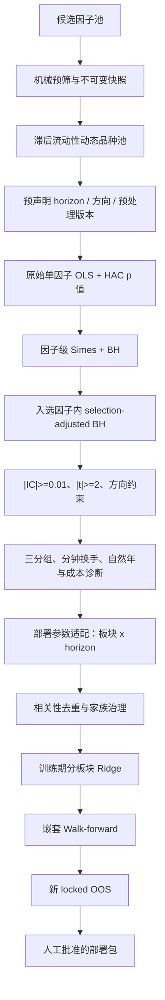

# 期货因子检验与准入流程（Validation Policy v2）

本文记录 `multi_factor` 当前正式因子发现、部署参数适配、Walk-forward 与人工准入顺序。
代码与配置的唯一基线是 `config/default.yaml::validation_policy`；每次正式研究会保存配置
内容、SHA-256、taxonomy SHA-256 和完整漏斗。GP 搜索期指标、SQLite 状态、历史显著性、
Ridge 系数和生产批准属于不同证据层，不能相互替代。

## 完整流程



Bonferroni/FWER 仍随每条假设输出，但只是证据等级标签，不再是硬闸门。

## 1. 候选池、预筛和正式研究边界

自动挖掘、WorldQuant、GTJA、spec 与手工因子先进入候选范围，不自动成为可交易因子。
挖掘模块 SQLite 保存可变候选目录和血缘；主框架只加载带哈希的不可变 JSON 快照，并
通过 `Factor` 桥接器运行。两者可以共存，不会与 spec 注册冲突。

机械预筛只淘汰表达式无效、字段缺失、输出全常数、覆盖不足或截面不足等不可研究候选。
合成数据调试、表达式编码和单元测试不要求执行正式流程；一旦查看真实历史 IC、t 值、
收益或最优周期，就必须冻结候选、频率、日期、horizon、预处理版本和假设数，并使用新的
只写一次输出目录。

## 2. 品种池与预处理假设

正式研究使用只依赖滞后信息的动态流动性品种池。成交额、持仓量和上市覆盖先 `shift(1)`，
避免当天信息决定当天可交易集合。

默认预处理为：

```text
动态品种掩码 -> 每日截面 MAD -> 板块中性化 -> 每日截面 Z-score -> 再应用掩码
```

对 `carry`、`trend` 和 `macro_trend` 家族，验证层同时测试 `raw` 与 `neutralized`；二者作为同一因子内
的两个预声明假设进入多重检验。最终只能部署实际通过的版本。其他家族默认只测试中性化
版本。组合构建层是否中性化仍是独立风控选择，不因验证层的 raw 版本而取消。

## 3. horizon 预声明与周期语义

周期始终表示 bar 数：1 分钟频率的 H=1/5/15 分别是 1/5/15 分钟，而不是交易日；日频
H=5 才表示 5 个交易日。每个因子在注册时冻结 `frequency` 和
`validation_horizons`；GP 因子直接继承挖掘目标 horizon，旧普通因子把既有窗口映射固化
为显式契约。正式研究的数据频率、家族覆盖或命令行周期必须与该契约完全相同，否则在
读取行情前失败。全部预声明周期作为因子内假设接受 BH，不能事后只报告峰值周期。
原始输入频率与输出契约可以不同：`intraday.py`主要读取分钟数据，但当前588个注册类
均输出日频，因此其horizon按交易日解释。

## 3.1 样本长度硬下限

样本数按每个品种自身的有效 bar 时钟计算，不用全市场拼接后的行数冒充。正式下限为：

| 频率 | 训练下限 | 独立验证/测试下限 | 最低训练:测试 |
| --- | ---: | ---: | ---: |
| 日频 | 750 bar | 250 bar | 3:1 |
| 日频输出的日内因子 | 63 bar | 42 bar | 3:1 |
| 1分钟 | 6,000 bar | 1,000 bar | 3:1 |
| 5/15/30/60分钟 | 2,880/960/480/240 bar | 960/320/160/80 bar | 3:1 |

GP 挖掘时冻结每个候选的训练 bar 数和区间；桥接到正式研究后再次对测试 bar 数和比例复核。
普通部署适配采用 75% 训练、25% 测试。样本不足仍保留统计记录并标为“数据观察中”，但
不得进入 WF 资金分配。若另设最终 locked OOS，其样本下限单独计算，不能与验证集复用。

## 4. 正式统计量

每个“因子 × horizon × 预处理版本”计算每日横截面 IC 和未收缩单因子横截面 OLS 斜率。
每日最少 10 个有效品种；斜率时间序列使用 Newey-West HAC，滞后阶数随 horizon 调整，
处理重叠前向收益的序列相关。Ridge 不参与此处的 p 值计算。

## 5. 层级 FDR 与经济量级

正式发现使用两层控制：

1. 每个经济因子的所有局部 p 值通过 Simes 聚合；全部因子的 Simes p 值执行 BH，
   `q=0.10`。
2. 若总计 `M` 个可估计因子家族、第一层选中 `R` 个，则入选因子内使用
   Benjamini–Bogomolov selection-adjusted 水平 `q_local = q × R / M` 执行 BH。

局部假设必须同时通过因子层和因子内层。此工程实现比“入选后仍直接用 q=0.10”更保守，
避免把选择后的局部 FDR 当作未经选择的普通 BH。所有假设同时输出 `fwer_significant`：

- `FWER`：也通过报告用 Bonferroni；
- `FDR`：通过层级 FDR，但未达 FWER；
- `not_discovered`：未发现。

FWER 标签不得反过来成为部署硬闸门。

层级 FDR 后的汇总门槛为：

- `|IC| >= 0.01`；
- `|OLS/HAC t| >= 2.0`；
- 若配置了因子方向先验，观测方向必须一致；
- 未预声明方向的显著结果保留为探索性观察候选，不能靠事后故事直接转正。

方向先验必须在看结果前写入 `validation_policy.expected_directions`。反向显著若与先验冲突
会被拒绝；没有先验的方向不会被伪装成确认性结论。

## 6. 后置交易属性与自然年诊断

正式路径使用三分组，降低小板块五分组的噪声。高因子组减低因子组的年化毛利差用于经济
量级和成本覆盖；单调性、DSR 与 PBO 保留为诊断，不再是生产硬闸门。

换手定义固定为：

```text
half_turnover = 0.5 × sum(abs(w_t - w_t-1))
```

分钟数据先按实际调仓 schedule 计算 bar 换手，再按交易日聚合；不得把一分钟换手直接
乘 21 冒充月换手。当前月换手 `< 50%` 只保留为诊断参考，不是 fitness、成本金额或
准入门槛。筛选期的成本口径固定为：

```text
annual validation cost = 0.02% × gross exposure
```

成本覆盖要求：

```text
gross annual alpha >= 1.5 × annual validation cost
```

连续价格在每次换月时使用截至换月日最近一个新旧合约共同交易日的收盘价做比例调整，等价
于同一时点平旧开新。找不到共同报价时失败关闭，不允许用比例 1.0、当前新合约价或全区间
单一合约静默兜底。成交量、持仓量始终取选定合约，不在换月窗口隐式汇总多个合约。

筛选期暂不扣移仓成本。因子筛选成功后的研究回测在年化 0.02% 交易成本之外，再按持仓
暴露加入年化 0.105% 移仓成本；两项均按实际 bar 数摊销。账本仍按具体合约记录开平与
非调仓日换月，但默认成本金额不再乘一次显式换月换手，避免双计。该统一成本假设仍不等同
于逐笔成交滑点或真实换月价差；交由外部执行系统或人工下单前仍需另行校准。

稳定性按自然年，而非全样本机械四等分：

- 至少 60% 年份与训练方向一致；
- 至少 65% 年份的定向 IC `>= 0.01`；
- 至少 5 个有效自然年，否则自动进入观察期；
- 输出最长连续失效年数、最差年份 IC、moving-block bootstrap IC 置信区间；
- 命中率、方向年份比例、经济量级年份比例、IR 稳定性形成等权记分卡。

## 7. 记分卡冻结纪律

记分卡默认四项等权、阈值 0.75，但当前 `calibrated=false`、`enforced=false`。在此状态下
只报告分数，候选进入观察期，不能将当前待审因子的结果用于调权。

启用硬门槛前必须：

1. 使用与当前候选完全隔离的已知有效/已知失效旧因子集或模拟因子集；
2. 保存 pilot 数据来源和 SHA-256；
3. 冻结权重、组件阈值和总分阈值；
4. 在新的时间区间验证后才设置 `calibrated=true` 与 `enforced=true`。

配置校验会拒绝没有 pilot 来源与合法 SHA-256 的强制记分卡。完整验证策略自身也会生成
SHA-256，任何权重或阈值变化都会使旧研究 bundle 失效。

## 8. 板块 × horizon 适配的角色

适配阶段只接收发现阶段冻结的因子和已通过的预处理版本，角色是部署参数选择，不再对同一
发现集执行第二次全局 Bonferroni。局部约束保留：

- `|effect| >= 0.01`；
- `|t| >= 1.96`；
- 命中率 `>= 52%`；
- 前 75% 定方向，后 25% 合并 IC 同号且命中率 `>= 50%`；
- 同时满足对应频率的训练、测试 bar 下限和至少 3:1 比例。

这些是部署参数适配的独立约束，必须先全部满足，局部板块/horizon 才能进入可选集合；
它们没有并入自然年记分卡，也不能靠记分卡高分抵消。自然年记分卡属于全市场发现后的
跨年份稳定性诊断/治理层，两者作用范围和失败含义不同。

三种板块推断通道：

| 板块品种数 | 推断 |
| --- | --- |
| `>=3` | 横截面 Fama-MacBeth OLS/HAC |
| `=2` | pooled instrument fixed effects + time-HAC |
| `=1` | 单品种 TS OLS + HAC 与按交易日 wild score bootstrap，p 值取较保守者 |

单品种日频最低历史是 750 个唯一交易日；分钟频率按训练 bar 下限折算，当前相当于至少
60 个有效交易日。历史不足时该局部假设保留、`p=1` 并标为观察期，且不得进入 WF 资金
路径。其转正还要求连续两个 WF 折存活且冻结OOS合并方向为正。

## 9. 观察期、Walk-forward 与 locked OOS

以下任一条件会加入观察期原因：训练/测试 bar 或比例不足、历史不足 5 年、经济方向未预声明、
记分卡未用隔离 pilot 校准、单品种板块历史不足，或尚未通过冻结OOS。筛选期
固定年化成本金额不由移仓次数决定；正式组合回测仍必须保留真实移仓账本，移仓成本在筛选
成功后的研究回测中按统一年化率加入。观察候选
除“样本不足”外的观察候选可继续进入 WF 积累证据，并受 Alpha 贡献上限约束；样本不足
候选不得进入 WF 资金路径。其他观察候选的上限为正式因子的 50%，在分板块 OLS/Ridge
预测层实际生效，不只是报告字段。

WF 每折严格按以下顺序：训练期全市场发现 → 冻结发现集的部署参数适配 → 相关性去重与
家族治理 → 训练期 Ridge → 未触碰测试折。输出逐因子 OOS IC、同方向折比例和最长连续
存活折数。WF 汇总门同时要求按有效观测数加权的合并定向 OOS IC 为正，以及至少 60%
fold 与训练方向同号；两者不能互相替代。locked OOS 还必须与训练期同号。

冻结协议将最终OOS固定为`2025-01-01`至`2026-05-14`；`2026-05-15`起全部标为
`simulated_live`并随本地数据库更新延长。2026-08-20全历史筛选已经使用其中一部分日期，
但这不改变阶段边界，也不得把程序运行日写成OOS终点。连续两个WF折、冻结OOS和
`simulated_live`表现均只形成准入证据；`production_approved`仍需人工批准。该字段只表示
目标权重部署包的治理状态，不表示本框架会连接实盘或自动下单。

## 10. Taxonomy 与全量回溯

`core/sectors.py` 是全框架唯一 taxonomy。`SI`、`LC`、`PS` 当前已属于 `nonferrous`；
本次没有为追求表面变化而机械改板块。任何未来分类变更都会同时影响动态品种池、板块
中性化、板块 IC 和组合约束。

正式产物保存 `taxonomy_version` 与 `taxonomy_sha256`。主框架加载 bundle 时同时校验
taxonomy 和验证策略哈希；不一致即失败并要求全量重跑 P0。`taxonomy_diff()` 输出逐品种
旧/新分类和 `requires_full_p0_replay`。重跑报告必须保留旧、新 taxonomy 下的通过状态、
中性化基准与板块 IC 差异，禁止静默通过或静默淘汰；`compare_taxonomy_replay()` 可直接
比较两份 `ic_by_window_period.json` 并列出新增/移除因子及周期、版本、IC 变化。

## 11. 漏斗、敏感性与 P0/P1/P2 状态

每次研究输出：

- `ic_by_window_period.json`：逐假设统计量、FDR/FWER 标签、最终候选；
- `validation_funnel.json`：从可估计假设到 WF 候选的完整漏斗；
- `factor_correlation.json/.png`：方向修正后的完整相关矩阵、固定阈值聚类和可视化；
- `threshold_sensitivity`：q、IC、t、换手参考值、年度比例和成本安全边际的 `-20%/基线/+20%`
  报告，并保存各场景因子名单及相对基线的 Jaccard。敏感性只作报告，基线选择不会随
  结果改变。

政策升级前的P0数字与本地bundle已清除。当前冻结历史对照为
`runs/factor_research/20260820_intraday599_rebuild/`：599个历史定义中588个可估计，
1,797个预声明假设中1,764个可估计；层级FDR和经济门得到20个观察发现，按
`|corr|>=0.5`去重为13簇，生产批准数为0。结果保存代码、配置、数据和候选名哈希；
任何边界变化均须新目录重跑。

| 阶段 | 当前状态 |
| --- | --- |
| P0 | 更新前同区间重放已形成H20对照；数据更新后的重跑待执行 |
| P1 | 自然年、三分组、双轨预处理、冻结记分卡框架已接入；pilot 尚未提供 |
| P2 | 单品种观察通道、固定年化成本覆盖、±20% 敏感性、taxonomy 哈希与回溯闸门已接入 |

后续必须遵守以下硬治理纪律：

- 若 P0 重跑后漏斗仍接近零产出，答案只能在扩大品种池（如纳入境外指数或更多新能源
  品种）、拉长历史，或对适合的因子家族使用更高频数据；绝不继续放松 q。
- 若因子涌入过多并超过组合容量，优先将 q 从 0.10 收紧至 0.05；绝不恢复 Bonferroni
  硬门槛。

## 12. 数据管道更新完成后的重检 handoff

本节是唯一执行清单；不再为每次重检新建方法文档或一次性脚本。数据更新期间不运行
因子检验。更新完成后按以下顺序执行，期间不得修改因子公式、频率/horizon契约、品种池、
预处理、验证阈值、成本或阶段日期；若确需修改，必须另立研究版本，不能与本轮直接比较。

### 12.1 先区分四种日期，禁止混称

| 名称 | 当前定义 | 是否随数据库更新 | 用途 |
| --- | --- | --- | --- |
| 数据最新日 | 本地Parquet实际最后交易日 | 是 | 说明可用数据覆盖，不是研究边界 |
| 全历史同口径重放 | 2016-03-31~2026-08-20 | 否 | 与旧H20逐项比较，只是长期统计对照 |
| 冻结扩展窗口/OOS | 四折；最终OOS为2025-01-01~2026-05-14 | 否 | 选择和样本外评价 |
| simulated_live | 2026-05-15~本地最新日 | 只延长终点 | 只评价已冻结方案，不反向选择 |

因此，2026-08-06、2026-08-14、2026-08-20可以分别是历史运行、冒烟或全历史重放日期，
但都不能成为OOS边界。研究产物必须保存`research_role`和`period_protocol`；仅凭目录日期
或Codex对话文字不得重新解释样本角色。

### 12.2 冻结目标和阶段

- **同口径重放**：2016-03-31至2026-08-20，仅用于隔离数据管道更新对旧H20的影响；
- **扩展窗口**：四折日期以`research/validation.py::expanding_window_folds()`为唯一来源；
- **最终OOS**：2025-01-01至2026-05-14；
- **simulated_live**：2026-05-15至本地最新数据，只评价冻结方案，不参与因子、方法或参数选择；
- **旧对照**：`runs/factor_research/20260820_intraday599_rebuild/`和
  `docs/有效因子库.md::全历史统计发现H20`必须保留且不得覆盖。

旧运行提交599个历史类、声明1,797个假设，其中11个无消费者的退化/错误粒度定义已从
源码清理；因此现行同口径重放的结构预期是588个因子、1,764个可估计假设，而不是重新
制造599。旧运行的20个FDR发现、13个相关簇代表和完整统计以原JSON为准。

旧对照身份必须同时核对：config SHA-256=`69bc2002380878e372b3b2f0b62fffcd7c4f38e45bfeca419d17512b3a4850d7`，
code=`51b1d60abdca3fdc72561bfec9a502dbfb917b0e704d2a3300f0d51fe0e70472`，
data=`35d6a1bd4c59269dc59a0136505db13b9f924e7611243c6a36d6b8fcf0f854c6`，
policy=`31b2f6c96c02e3fa519d4e7b45e5a1cc53fe580f3769c5c380a76b988846ef5d`，
taxonomy=`b0b5cd79cc0302bc087729007e8a0996ef630f230cf70a7cfb6939ce6a001740`。
这些哈希只识别旧对照；更新后的code/data哈希预期不同，不能强求相等。

### 12.3 对照组与新结果分层

| 组 | 内容 | 比较作用 |
| --- | --- | --- |
| C0-H20 | 旧全历史20个FDR发现，见`docs/有效因子库.md`及旧run | 数据更新前长期统计对照 |
| C0-C13 | H20按`|corr|>=0.5`去重后的13个代表 | 相关簇结构对照，不要求代表名完全不变 |
| C0-10f | 当前固定10f定义和生产方法 | 只作组合结构基准；旧绩效失效，不作为收益对照真值 |
| N0-H* | 更新后按相同日期和规则得到的全历史发现 | 与H20做交集、差集和漂移诊断 |
| N1-OOS | 四折训练选择后在测试期存活的因子成员及组合记录 | 正式候选的主要历史证据 |
| N2-LIVE | 2026-05-15后冻结方案表现 | 模拟实盘观察，不参与回选 |

最终**因子**观察集合为`C0-H20 ∪ N1-OOS中的因子成员`，组合记录另行比较，不能与因子名
直接求并集。所有因子必须保留来源标签：两者交集是优先核心候选；仅H20入选者属于长期
有效但OOS不足观察组；仅OOS入选者属于近期/市场结构挑战组。并集不等于全部通过，任何
生产替换仍需组合验证和人工批准。

### 12.4 开始前失败关闭门

1. 确认数据发布更新已经结束，同一运行期间不再改写Parquet；
2. 使用`pwsh`和`E:\Python\Pythonvenv\Scripts\python.exe`；记录Git提交、配置哈希、
   taxonomy哈希和研究目录名；
3. `main.py data-health --config config/parquet_research.yaml --strict`必须通过四种行情频率、
   日线全历史和六张席位表；任一重复键、非规范合约、缺失或频率路由错误均停止；
4. 聚焦测试和完整测试先通过；已知环境依赖失败必须逐项列出，不能笼统忽略；
5. 新输出目录必须不存在；不得复用旧结果、旧检查点或旧因子面板缓存。

```powershell
$PY = 'E:\Python\Pythonvenv\Scripts\python.exe'
& $PY -X utf8 -B main.py data-health --config config/parquet_research.yaml --strict
& $PY -B -m pytest -q -p no:cacheprovider
& $PY -B -m compileall -q alpha backtest core data factor_mining factors `
  optimization pipeline processing research risk strategies testing workflows tests main.py
```

任一命令失败即停止，不进入P0；不得由Codex对话绕过同一命令入口。
规范化研究启用`--refuse-existing-output`时，程序会拒绝缺少`--research-role`的运行；
探索性运行可以使用`exploratory`，但其结果不能冒充同区间重放或OOS证据。

### 12.5 P0同区间重放

```powershell
$P0 = 'runs/factor_research/<new_replay_id>'
if (Test-Path -LiteralPath $P0) { throw "output exists: $P0" }

& $PY -X utf8 -B main.py research `
  --config config/intraday_backtest.yaml `
  --all --multi-period --frequency daily `
  --module-prefix factors.library.intraday `
  --start 2016-03-31 --end 2026-08-20 `
  --research-role long_history_replay `
  --output-dir $P0 --refuse-existing-output

& $PY -X utf8 -B main.py research `
  --config config/intraday_backtest.yaml `
  --correlation --corr-method hierarchical --corr-threshold 0.5 `
  --start 2016-03-31 --end 2026-08-20 `
  --research-role long_history_replay `
  --output-dir $P0 `
  --screening-file "$P0/ic_by_window_period.json"
```

必须得到`ic_by_window_period.json`、`validation_funnel.json`和
`factor_correlation.json/.png`。成功后检查点应自动删除；若仍存在，只能先判断运行是否
真正完成，不得直接把半成品当结果。

### 12.6 冻结四折方法与因子集搜索

```powershell
$WF = 'runs/historical_portfolio_search/<new_walkforward_id>'
if (Test-Path -LiteralPath $WF) { throw "output exists: $WF" }

& $PY -X utf8 -B -m workflows.experiments.historical_portfolio_search `
  --factor-manifest "$P0/ic_by_window_period.json" `
  --output $WF
```

脚本必须从P0 manifest加载全部可估计因子；不得恢复旧74因子常量，也不得把H20预先当作
唯一候选。每折只允许训练期执行统计、聚类、方法和因子集选择，再冻结到该折测试期。
第四折训练期选出的因子集与方法直接冻结；OOS只决定它是否通过，不在OOS结束后重新择优。
脚本随后自动用同一`PortfolioEvaluator`生成`simulated_live_weights.csv`、ledger和metrics，
覆盖2026-05-15至本地最新日，不需要也不得另写一次性脚本。

固定8f/10f/13f与国信对照可另运行现有`current_core_compare`；其`--end`默认读取本地最新
日期，图和指标会自动把OOS与`simulated_live`分开，不能手工把最新日改成OOS终点。

### 12.7 通过标准

工程门为硬条件：数据健康、研究契约/哈希、频率与horizon、因果选约、T+1收益、换手、
移仓、停牌和成本账本任何一项失败，整轮无效。统计与经济门沿用本文件既有定义：层级FDR
`q=0.10`、`|IC|>=0.01`、`|HAC t|>=2`、方向约束、自然年稳定性、样本下限及成本覆盖；
不得根据结果临时放宽。

WF候选还必须同时满足：合并定向OOS IC为正、至少60%测试折与训练方向同号、至少两个
连续存活折。`simulated_live`只检查冻结方向、滚动IC、收益、夏普、最大回撤、换手、
品种/板块集中度和成本后表现，不参与回选。组合候选按正夏普训练分段比例、最差分段
夏普、分段夏普中位数、分段收益中位数和最差回撤的既定顺序评价，不事后改成只看终值。
任何进入目标权重发布仍需人工批准。

### 12.8 与旧H20的漂移审查

新P0首先与旧JSON逐假设对齐，再报告：可估计数、FDR发现数、H20交集/差集、Jaccard、
共同因子方向、IC/t/q变化、13簇代表变化和阈值敏感性。以下是调查线而非放宽后的准入线：

- 当前定义未变时，应为588个可估计因子、1,764个可估计假设；不一致先查注册或路由；
- FDR发现数若离开旧敏感性范围18~26，需要解释；
- 新发现与H20交集少于16个，或共同因子出现方向翻转，必须停止策略比较并定位数据差异；
- 相关簇代表可能因微小相关变化替换，必须同时比较整簇，不能只比较13个名称；
- 差异确由修复后的权威数据产生可以接受，但必须列出受影响日期、品种、因子和统计量，
  不能用“市场变化”概括。

最终只保留一个P0目录、一个WF目录及必要比较图；调试缓存和中间文件成功后清理，不为
每次分析新增脚本或同义文档。正式结论同步更新本文件、`docs/有效因子库.md`和README，
其余文档只引用，不复制另一套阈值或阶段日期。

## 13. Ridge 和人工批准

Ridge 只在统计发现、交易属性检查、部署适配、相关性去重与家族治理之后缓解共线性并
生成收益预测，不产生准入 p 值。研究代码不得自动写入 `config/target_publication.yaml`。历史候选、
观察候选、WF 存活与人工批准的部署包是四个不同状态。

## 代码索引

| 内容 | 位置 |
| --- | --- |
| 验证策略配置 | `core/config.py`, `config/default.yaml` |
| 层级 FDR、策略哈希、locked OOS gate | `research/validation.py` |
| 正式全市场发现与漏斗 | `workflows/research.py` |
| 部署参数适配、单品种 TS | `workflows/factor_adaptivity.py` |
| 三分组、换手、自然年 | `testing/layered.py`, `testing/turnover.py`, `testing/robustness.py` |
| 成本覆盖 | `optimization/costs.py` |
| Taxonomy 与差异审计 | `core/sectors.py` |
| WF 因子存活 | `workflows/walkforward.py` |
| 观察期 Alpha 上限 | `alpha/ols.py`, `pipeline/runner.py` |
