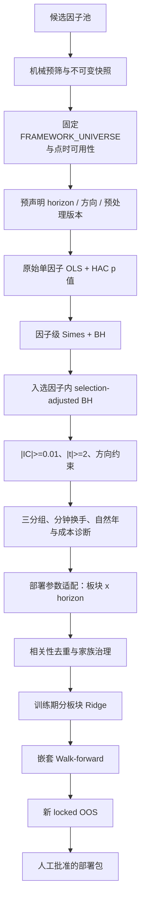

# 期货因子检验与准入流程（Validation Policy v2）

本文记录 `multi_factor` 当前正式因子发现、部署参数适配、Walk-forward 与人工准入顺序。
代码与配置的唯一基线是 `config/default.yaml::validation_policy`；每次正式研究会保存配置
内容、SHA-256、taxonomy SHA-256 和完整漏斗。GP 搜索期指标、SQLite 状态、历史显著性、
Ridge 系数和生产批准属于不同证据层，不能相互替代。

## 完整流程



Bonferroni/FWER 仍随每条假设输出，但只是证据等级标签，不再是硬闸门。

## 1. 候选池、预筛和正式研究边界

自动挖掘、WorldQuant、GTJA、spec 与手工因子先进入候选范围，不自动成为可交易因子。
挖掘模块 SQLite 保存可变候选目录和血缘；主框架只加载带哈希的不可变 JSON 快照，并
通过 `Factor` 桥接器运行。两者可以共存，不会与 spec 注册冲突。

机械预筛只淘汰表达式无效、字段缺失、输出全常数、覆盖不足或截面不足等不可研究候选。
合成数据调试、表达式编码和单元测试不要求执行正式流程；一旦查看真实历史 IC、t 值、
收益或最优周期，就必须冻结候选、频率、日期、horizon、预处理版本和假设数，并使用新的
只写一次输出目录。

## 2. 品种池与预处理假设

正式研究使用唯一有序`FRAMEWORK_UNIVERSE`（当前38品种）。未上市、停牌或当日缺少必要
数据的品种仍按点时可用性形成NaN/不可交易掩码，但不会在另一个配置中维护第二套母池。

默认预处理为：

```text
固定38品种与点时可用性 -> 每日截面 MAD -> 每日截面 Z-score -> 再应用掩码
```

当前唯一配置未声明`neutralize`步骤，因此正式结果只记录`raw`预处理版本，不能把它误标为
`neutralized`。若未来在同一个主框架契约中经审阅加入中性化，`carry`、`trend`和
`macro_trend`才同时测试`raw`与`neutralized`，其他家族只测试配置声明的主版本；该修改
必须触发完整重验。组合构建层是否中性化仍是独立风控选择。

## 3. horizon 预声明与周期语义

周期始终表示 bar 数：1 分钟频率的 H=1/5/15 分别是 1/5/15 分钟，而不是交易日；日频
H=5 才表示 5 个交易日。每个因子在注册时冻结 `frequency` 和
`validation_horizons`；GP 因子直接继承挖掘目标 horizon，旧普通因子把既有窗口映射固化
为显式契约。正式研究的数据频率、家族覆盖或命令行周期必须与该契约完全相同，否则在
读取行情前失败。全部预声明周期作为因子内假设接受 BH，不能事后只报告峰值周期。
原始输入频率与输出契约可以不同：`intraday.py`主要读取分钟数据，但当前588个注册类
均输出日频，因此其horizon按交易日解释。

## 3.1 样本长度硬下限

样本数按每个品种自身的有效 bar 时钟计算，不用全市场拼接后的行数冒充。正式下限为：

| 频率 | 训练下限 | 独立验证/测试下限 | 最低训练:测试 |
| --- | ---: | ---: | ---: |
| 日频 | 750 bar | 250 bar | 3:1 |
| 日频输出的日内因子 | 63 bar | 42 bar | 3:1 |
| 1分钟 | 6,000 bar | 1,000 bar | 3:1 |
| 5/15/30/60分钟 | 2,880/960/480/240 bar | 960/320/160/80 bar | 3:1 |

GP 挖掘时冻结每个候选的训练 bar 数和区间；桥接到正式研究后再次对测试 bar 数和比例复核。
普通部署适配采用 75% 训练、25% 测试。样本不足仍保留统计记录并标为“数据观察中”，但
不得进入 WF 资金分配。若另设最终 locked OOS，其样本下限单独计算，不能与验证集复用。

## 4. 正式统计量

每个“因子 × horizon × 预处理版本”计算每日横截面 IC 和未收缩单因子横截面 OLS 斜率。
每日最少 10 个有效品种；斜率时间序列使用 Newey-West HAC，滞后阶数随 horizon 调整，
处理重叠前向收益的序列相关。Ridge 不参与此处的 p 值计算。

## 5. 层级 FDR 与经济量级

正式发现使用两层控制：

1. 每个经济因子的所有局部 p 值通过 Simes 聚合；全部因子的 Simes p 值执行 BH，
   `q=0.10`。
2. 若总计 `M` 个可估计因子家族、第一层选中 `R` 个，则入选因子内使用
   Benjamini–Bogomolov selection-adjusted 水平 `q_local = q × R / M` 执行 BH。

局部假设必须同时通过因子层和因子内层。此工程实现比“入选后仍直接用 q=0.10”更保守，
避免把选择后的局部 FDR 当作未经选择的普通 BH。所有假设同时输出 `fwer_significant`：

- `FWER`：也通过报告用 Bonferroni；
- `FDR`：通过层级 FDR，但未达 FWER；
- `not_discovered`：未发现。

FWER 标签不得反过来成为部署硬闸门。

层级 FDR 后的汇总门槛为：

- `|IC| >= 0.01`；
- `|OLS/HAC t| >= 2.0`；
- 若配置了因子方向先验，观测方向必须一致；
- 未预声明方向的显著结果保留为探索性观察候选，不能靠事后故事直接转正。

方向先验必须在看结果前写入 `validation_policy.expected_directions`。反向显著若与先验冲突
会被拒绝；没有先验的方向不会被伪装成确认性结论。

## 6. 后置交易属性与自然年诊断

正式路径使用三分组，降低小板块五分组的噪声。高因子组减低因子组的年化毛利差用于经济
量级和成本覆盖；单调性、DSR 与 PBO 保留为诊断，不再是生产硬闸门。

换手定义固定为：

```text
half_turnover = 0.5 × sum(abs(w_t - w_t-1))
```

分钟数据先按实际调仓 schedule 计算 bar 换手，再按交易日聚合；不得把一分钟换手直接
乘 21 冒充月换手。当前月换手 `< 50%` 只保留为诊断参考，不是 fitness、成本金额或
准入门槛。筛选期的成本口径固定为：

```text
annual validation cost = 0.02% × gross exposure
```

成本覆盖要求：

```text
gross annual alpha >= 1.5 × annual validation cost
```

连续价格在每次换月时使用截至换月日最近一个新旧合约共同交易日的收盘价做比例调整，等价
于同一时点平旧开新。找不到共同报价时失败关闭，不允许用比例 1.0、当前新合约价或全区间
单一合约静默兜底。成交量、持仓量始终取选定合约，不在换月窗口隐式汇总多个合约。

筛选期暂不扣移仓成本。因子筛选成功后的研究回测在年化 0.02% 交易成本之外，再按持仓
暴露加入年化 0.105% 移仓成本；两项均按实际 bar 数摊销。账本仍按具体合约记录开平与
非调仓日换月，但默认成本金额不再乘一次显式换月换手，避免双计。该统一成本假设仍不等同
于逐笔成交滑点或真实换月价差；交由外部执行系统或人工下单前仍需另行校准。

稳定性按自然年，而非全样本机械四等分：

- 至少 60% 年份与训练方向一致；
- 至少 65% 年份的定向 IC `>= 0.01`；
- 至少 5 个有效自然年，否则自动进入观察期；
- 输出最长连续失效年数、最差年份 IC、moving-block bootstrap IC 置信区间；
- 命中率、方向年份比例、经济量级年份比例、IR 稳定性形成等权记分卡。

## 7. 记分卡冻结纪律

记分卡默认四项等权、阈值 0.75，但当前 `calibrated=false`、`enforced=false`。在此状态下
只报告分数，候选进入观察期，不能将当前待审因子的结果用于调权。

启用硬门槛前必须：

1. 使用与当前候选完全隔离的已知有效/已知失效旧因子集或模拟因子集；
2. 保存 pilot 数据来源和 SHA-256；
3. 冻结权重、组件阈值和总分阈值；
4. 在新的时间区间验证后才设置 `calibrated=true` 与 `enforced=true`。

配置校验会拒绝没有 pilot 来源与合法 SHA-256 的强制记分卡。完整验证策略自身也会生成
SHA-256，任何权重或阈值变化都会使旧研究 bundle 失效。

## 8. 板块 × horizon 适配的角色

适配阶段只接收发现阶段冻结的因子和已通过的预处理版本，角色是部署参数选择，不再对同一
发现集执行第二次全局 Bonferroni。局部约束保留：

- `|effect| >= 0.01`；
- `|t| >= 1.96`；
- 命中率 `>= 52%`；
- 前 75% 定方向，后 25% 合并 IC 同号且命中率 `>= 50%`；
- 同时满足对应频率的训练、测试 bar 下限和至少 3:1 比例。

这些是部署参数适配的独立约束，必须先全部满足，局部板块/horizon 才能进入可选集合；
它们没有并入自然年记分卡，也不能靠记分卡高分抵消。自然年记分卡属于全市场发现后的
跨年份稳定性诊断/治理层，两者作用范围和失败含义不同。

三种板块推断通道：

| 板块品种数 | 推断 |
| --- | --- |
| `>=3` | 横截面 Fama-MacBeth OLS/HAC |
| `=2` | pooled instrument fixed effects + time-HAC |
| `=1` | 单品种 TS OLS + HAC 与按交易日 wild score bootstrap，p 值取较保守者 |

单品种日频最低历史是 750 个唯一交易日；分钟频率按训练 bar 下限折算，当前相当于至少
60 个有效交易日。历史不足时该局部假设保留、`p=1` 并标为观察期，且不得进入 WF 资金
路径。其转正还要求连续两个滚动 WF 测试折存活且合并方向为正。

## 9. 观察期、滚动 Walk-forward 与最终 locked OOS

以下任一条件会加入观察期原因：训练/测试 bar 或比例不足、历史不足 5 年、经济方向未预声明、
记分卡未用隔离 pilot 校准、单品种板块历史不足，或尚未通过滚动样本外检验。筛选期
固定年化成本金额不由移仓次数决定；正式组合回测仍必须保留真实移仓账本，移仓成本在筛选
成功后的研究回测中按统一年化率加入。观察候选
除“样本不足”外的观察候选可继续进入 WF 积累证据，并受 Alpha 贡献上限约束；样本不足
候选不得进入 WF 资金路径。其他观察候选的上限为正式因子的 50%，在分板块 OLS/Ridge
预测层实际生效，不只是报告字段。

WF 每折严格按以下顺序：训练期全市场发现 → 冻结发现集的部署参数适配 → 相关性去重与
家族治理 → 训练期 Ridge → 未触碰测试折。输出逐因子 OOS IC、同方向折比例和最长连续
存活折数。WF 汇总门同时要求按有效观测数加权的合并定向 OOS IC 为正，以及至少 60%
测试折与训练方向同号；两者不能互相替代。

正式窗口只由`config/default.yaml::validation_policy`定义。当前日内因子日度输出使用
`daily_intraday`：126个交易日训练、42个交易日测试、42个交易日步长，因子计算另取
90个日历日预热，并只保留最近5个完整滚动折（总覆盖约17个月）。每一折只用训练段选择
因子、周期、预处理和组合参数，随后冻结到紧邻的测试段；前四折累计近期跨阶段样本外
稳健性证据，最新已完成训练折才定义当前候选。不得再用固定年份四折或十年扩展训练代替
该契约。

真正的最终 locked OOS 只能在因子集、信号合成、权重方法和参数全部冻结后，从尚未参与
任何选择的新数据开始。已经被全历史统计、滚动WF或实验查看过的日期不能追溯声明为
“未见样本”；`simulated_live`也只能从冻结之后开始记录，不能用历史日期回填。滚动WF、
最终locked OOS和后续观察均只形成准入证据；`production_approved`仍需人工批准。

## 10. Taxonomy 与全量回溯

`core/sectors.py` 是全框架唯一 taxonomy。`SI`、`LC`、`PS` 当前已属于 `nonferrous`；
本次没有为追求表面变化而机械改板块。任何未来分类变更都会同时影响中性化变体、板块
IC 和组合约束。

正式产物保存 `taxonomy_version` 与 `taxonomy_sha256`。主框架加载 bundle 时同时校验
taxonomy 和验证策略哈希；不一致即失败并要求受影响的正式滚动WF全量重跑。`taxonomy_diff()` 输出逐品种
旧/新分类和 `requires_full_p0_replay`。重跑报告必须保留旧、新 taxonomy 下的通过状态、
中性化基准与板块 IC 差异，禁止静默通过或静默淘汰；`compare_taxonomy_replay()` 可直接
比较两份 `ic_by_window_period.json` 并列出新增/移除因子及周期、版本、IC 变化。

## 11. 漏斗、敏感性与当前状态

每次研究输出：

- `ic_by_window_period.json`：逐假设统计量、FDR/FWER 标签、最终候选；
- `validation_funnel.json`：从可估计假设到 WF 候选的完整漏斗；
- `factor_correlation.json/.png`：方向修正后的完整相关矩阵、固定阈值聚类和可视化；
- `threshold_sensitivity`：q、IC、t、换手参考值、年度比例和成本安全边际的 `-20%/基线/+20%`
  报告，并保存各场景因子名单及相对基线的 Jaccard。敏感性只作报告，基线选择不会随
  结果改变。

政策升级前的旧数字与本地bundle已清除。当前长历史迁移对照为
`runs/factor_research/20260820_intraday599_rebuild/`：599个历史定义中588个可估计，
1,797个预声明假设中1,764个可估计；层级FDR和经济门得到20个观察发现，按
`|corr|>=0.5`去重为13簇，生产批准数为0。结果保存代码、配置、数据和候选名哈希；
任何边界变化均须新目录重跑。

| 阶段 | 当前状态 |
| --- | --- |
| 迁移对照 | 2026-08-20数据更新后全历史重建与599个历史定义重跑已完成；H20/C13仅作观察对照 |
| 统计与稳健性门 | 自然年、三分组、双轨预处理、冻结记分卡框架已接入；pilot 尚未提供 |
| 观察与治理门 | 单品种观察通道、固定年化成本覆盖、±20% 敏感性、taxonomy 哈希与回溯闸门已接入 |

后续必须遵守以下硬治理纪律：

- 若正式滚动训练折发现长期接近零产出，当前主框架只能调整统一研究契约、扩展经济假设来源或对适合的
  因子家族使用更高频数据；绝不继续放松q或另建品种配置。扩大品种范围必须由用户明确
  要求并形成新的版本化研究契约。
- 若因子涌入过多并超过组合容量，优先将 q 从 0.10 收紧至 0.05；绝不恢复 Bonferroni
  硬门槛。
