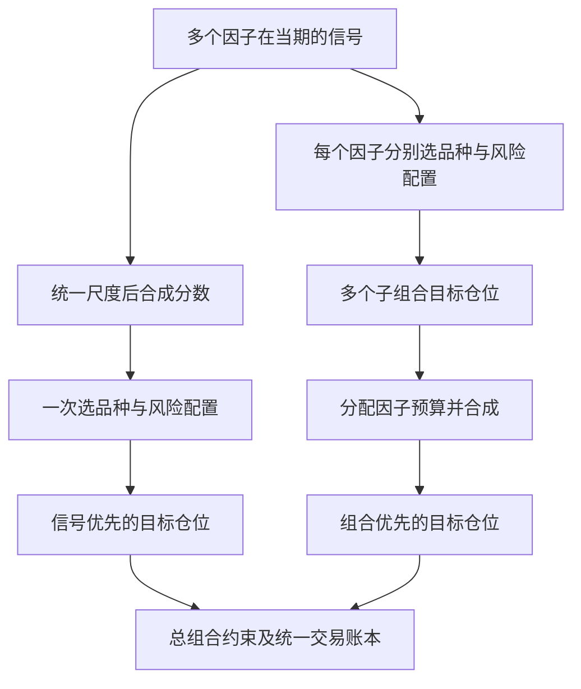

# 多因子方法论比较：先合成信号、先合成组合，以及滚动适应

日期：2026-09-15。讨论稿；不构成对当前任一路线表现的重新认证。

## 摘要

两条路线的核心区别是把多个判断合并在哪一层：信号层，还是已经形成仓位的组合层。它与多空方向、资产池、等权或LW加权、滚动或固定的选择相互独立。

**主要结论：**

1. 先合成信号更适合把预测同一目标、同一持有期的因子变成一个统一判断；先合成组合更适合保留不同风格、周期和风险预算的独立性。
2. 排名截断、选前N、独立风险配置和最终上限都是非线性步骤，导致两种顺序通常不等价；理想线性条件下则可以等价。
3. 学术实证没有支持一种顺序跨市场、跨约束普遍占优。股票文献本身存在分歧；不能把某篇“等权优于动态加权”的期货论文误读为“组合优先优于信号优先”。
4. 当前中性路线已有滚动信号、重新选品种，以及历史IC窗口下的动态因子权重。只做多的逐期品种排名并不自动等于滚动优选因子或参数。
5. 对框架最值得优先研究的是：匹配风险的顺序对照、因子家族预算、IC与真实组合贡献的区别、温和动态权重，以及最终合并仓位下的风险和费用归因。

## 研究范围与证据边界

通过Exa Search进行了20组查询，覆盖直接方法比较、股票与债券、四类期货、估计误差、交易成本、滚动择时和论坛讨论。共返回122条候选来源，按URL去重为115个页面；其中仍包含同一论文的不同版本，并非115篇独立论文或全部全文精读。重点核读原作者、期刊、大学论文库及机构研究页面；论坛只用于发现实务问题。

已调用两个任务的read_thread。“只做多策略”提供了实际讨论内容；“中性策略”接口返回任务信息，但所读取近期页的消息条目为空。因此，中性流程以当前本地配置、共享构建函数和策略说明交叉核对，不声称完整恢复了该任务全部历史。只做多任务仍在工作，以下代码状态为本次读取时点的快照。

本轮只做资料研究、代码只读核对与合成数字示例验证，没有重跑历史策略，没有修改策略代码、配置或原有数据。文献结果、数学推导和本人的研究建议在下文分别说明。

## 一、先校准两条实际路线

### 1.1 当前中性路线

按当前默认配置及共享评价函数：

> 已选因子集 → 当期因子截面排名 → 用历史IC窗口估计因子权重 → 加权合成排名分数 → Top10/Bottom10及板块数量约束 → 多空两侧分别配置ERC权重 → 合成最终仓位。

默认涉及`lw_abs`、`ic_window: 60`、每侧10个品种、板块数量上限3、分侧ERC。具体登记策略还可能覆盖默认设置，不能以default.yaml替代每个策略的冻结配方。

这属于**signal blending / score-first**。注意现有实现合成的是截面排名分数，并非直接把原始因子幅度相加，也不是已经校准为收益单位的预期收益模型。

“中性”还应区分名义金额中性与经济风险中性。多空名义敞口相等，不自动保证对股市、久期、商品周期或某个行业的beta为零。

### 1.2 当前只做多路线

> 固定九品种 → 每个因子／参数独立按当期信号排名 → 各选5个品种 → 各自做相关性修正逆波动率配置 → 参数层平均、因子层等权 → 最终逐品种名义敞口上限。

九品种为IF、IC、T、TF、AU、CU、SC、RB、M。这是股指、国债、商品期货组成的跨资产池，不是纯商品池。

这属于**portfolio blending / portfolio-first**。几点细化：

- 选的是“按因子／参数信号排名靠前的品种”，不是每天选出历史表现最好的因子参数。
- 配置选择比例0.51，经九品种取整得到5个；实际持有比例为5/9，不能把最终持仓数量理解为严格51%。
- 每个子组合选五个，合并后的不同品种数可以大于五个、最多九个。
- 配置支持因子内参数平均，但当前`factor_groups: {}`为空；没有显式分组时，每个登记因子作为独立成员。不能把支持分层聚合说成已自动识别所有经济上同源的参数。
- 最终上限是合成后按品种截断，并不自动把被截掉的名义敞口补给其他品种；因而会改变总体风险规模。
- 4%目标波动、20日窗口等是已有复现配置中的显式假设，不能认为它们是原指数已披露真实参数。

代码依据（链接指向当前实现，正文描述为上述日期的快照）：[默认配方](../config/default.yaml)、[只做多配方](../config/strategy_trend_allocation.yaml)、[因子权重](../optimization/factor_weighting.py)、[组合配置](../optimization/portfolio_construction.py)、[共享评价器](../research/historical_portfolio_search.py)、[扩展方案](只做多趋势配置策略扩展方案.md)。

## 二、本质差异：信息在哪一步被压缩

设第k个因子的信号向量为s_k，合成权重为a_k，P为选仓和风险配置，C为最终约束：

\[
w_A=C\left[P\left(\sum_k a_k s_k\right)\right],\qquad
w_B=C\left[\sum_k b_k P_k(s_k)\right].
\]

权重a和b分别是在“信号判断”和“组合预算”上分配权重，经济含义不必相同。

### 2.1 一个能看出差别的例子

五个品种、两个因子，每个因子从1到5排名，5最好；为展示机制，各取一个品种且等权。

| 品种 | 因子1排名 | 因子2排名 | 平均排名 |
|---|---:|---:|---:|
| A | 5 | 1 | 3 |
| B | 1 | 5 | 3 |
| C | 4 | 4 | 4 |
| D | 3 | 3 | 3 |
| E | 2 | 2 | 2 |

- 信号优先：选择C。
- 组合优先：因子1买A，因子2买B，最终A、B各50%。

前者偏好综合评价较好的资产；后者保留各因子最强烈的独立偏好。两者可以完全没有持仓交集。这个数字示例已用脚本核验；它证明不等价，不证明哪一边未来赚钱。

如果A虽然动量最强却估值很差，综合打分可能避开它；但如果该段市场主要由动量驱动，保留A也可能更有利。需要识别预测模型在哪些情形可信。

**信号相加不等于显式学习了因子交互。**真正的“动量仅在流动性充足时有效”需要条件规则或交互模型；普通加权平均仍是加法模型，最终选仓只是对这个模型做非线性转换。

### 2.2 什么情况下两者相同

若所有因子预测同一未来收益、使用同一资产池和风险模型，没有Top-N、独立归一化、仓位截断等非线性步骤，且

\[
P(s)=\gamma^{-1}\Sigma_r^{-1}s,
\]

那么P是线性的，P(Σa_k s_k)=Σa_kP(s_k)。使用一致的风险厌恶系数与合成权重时，两种顺序等价。

实际策略的Top-N、long-only、风险目标、板块数量约束、逐品种上限和交易缓冲会破坏这类等价性。因此，顺序差异很大一部分来自**信号如何被非线性地转成可交易仓位**。

### 2.3 两者的信息损失不同

信号优先在合成前保留每个因子对每个品种的评分，再共同决定是否入选。但若像当前框架一样先排名，也已舍弃原始幅度差异：第一名领先第二名一点还是很多，在简单排名中不再体现。

组合优先先把每个因子的意见转为“入选／未入选”和风险仓位。纯Top-N加风险权重情况下，第1名与第5名的相对信号强弱未必影响资金，只要都入选；第6名的正面评价则可能完全不进入该因子的仓位。

只做多子组合中，一个因子的强烈负面判断通常表现为“不持有”；另一个因子仍能买入该品种。信号优先更容易让这种负面判断抵消正面判断，但这只有在负面判断本身可信时才是优势。

## 三、主要优劣对比

| 维度 | 信号优先 | 组合优先 |
|---|---|---|
| 基本组织单位 | 预测信息 | 可交易子策略 |
| 更自然的使用场景 | 同一投资池、同一预测目标、相近持有期 | 不同风格、持有期、投资池或风险规则 |
| 风格冲突 | 在资产评分阶段处理 | 可以保留冲突，直到最终仓位合并 |
| 风格预算 | 信号权重不等于真实风险或收益贡献 | 组合预算较容易解释，但也不等于独立因子暴露 |
| 信息利用 | 可以使用每个因子的完整评分 | 容易损失入选边界以外及组内强弱信息 |
| 可解释性 | 单资产为何入选较直观；因子贡献分解较难 | 单因子子组合归因较直观；最终约束会造成偏离 |
| 同质因子 | 大量同源信号可能重复投票 | 大量相似子组合也可能重复占预算 |
| 估计误差 | 动态权重或收益校准可能不稳定；等权也可用 | 等权子组合较简单；动态优化同样有估计误差 |
| 持仓集中 | 可能集中到少数综合高分资产 | 可能覆盖更多资产，也可能大家买同一批资产 |
| 换手 | 信号平滑可能减少换手，边界抖动也可能增加 | 多个子组合平滑可能降低净换手，独立边界也可能增加 |
| 约束处理 | 容易统一考虑总组合限制 | 可保留局部约束，但需明确总组合约束 |
| 主要失效方式 | 错误统一尺度、错误抵消、单一权重模型失灵 | 信号钝化、持仓重叠、共同beta掩盖低增量收益 |

表中是机制推断与适用条件，不是跨市场胜率统计。任何“信号优先必然更省费用”“组合优先必然更分散”的绝对结论都不成立。

尤其是：**组合优先不要求真的用多个独立账户分别成交。**若先合成目标仓位、再按同一可净额处理的合约执行，它同样能够抵消买卖需求。不能把一个方法按独立账户收双边成本、另一个按净额成本比较。

若每个子组合都满足同一凸约束，且用非负、和为1的预算合成，合成结果仍满足该凸约束；但持仓数量约束不是凸约束，而且杠杆重标定、不同局部约束会改变结论。须准确识别究竟是哪项约束导致差别。

## 四、文献结论：有分歧，且比较的问题并不相同

### 4.1 直接比较合成顺序的研究

| 研究 | 对象与结论 | 对我们的含义 |
|---|---|---|
| Fitzgibbons等，2016工作稿／2017发表，AQR | 股票long-only中支持integration，强调避免不同风格的负面暴露相互抵消，保留多项适度正面暴露 | 支持检验“综合评价”价值；不证明任意期货池都会胜出 |
| Clarke、de Silva、Thorley，2016 | 在其均值—方差框架和美国股票检验中，直接使用证券构建比受限单因子组合混合更有效率 | 说明把选择空间限制在少数已构建子组合内可能损失效率；不等于我们的排名+ERC就是全局最优 |
| Ghayur、Heaney、Platt，2018，FAJ | 用暴露匹配框架比较全球股票：低到中等主动风险下组合混合通常有较高信息比率，高主动风险下信号混合更优 | 强调必须匹配暴露／主动风险，不能仅比较原始夏普 |
| Leippold、Rueegg，2017工作稿 | 扩大历史范围与组合、采用多重检验后，未发现足够证据支持integration普遍提高风险调整表现 | “没检出显著差异”不等于证明两者相同；避免挑选单段结果定论 |
| Blonk、Messow，2025修订稿 | 在投资级和高收益公司债中，integration通常有更好风险调整表现，部分原因是避开单项因子很差的债券 | 债券的负面特征过滤可能有价值；国内国债期货并无相同公司信用风险，不能照搬 |

原始来源：[AQR论文](https://www.aqr.com/Insights/Research/White-Papers/Long-Only-Style-Investing)、[Clarke等](https://doi.org/10.2469/faj.v72.n6.3)、[Ghayur等](https://papers.ssrn.com/sol3/papers.cfm?abstract_id=2895101)、[Leippold与Rueegg工作稿](http://www.efmaefm.org/0EFMAMEETINGS/EFMA%20ANNUAL%20MEETINGS/2017-Athens/papers/EFMA2017_0186_fullpaper.pdf)、[公司债论文](https://papers.ssrn.com/sol3/papers.cfm?abstract_id=4775767)。

机构论文有产品背景，应同时看支持和反对结果。Robeco提出一个有用的中间方案：先构建考虑其他因子负面暴露的“增强单因子组合”，再混合。它兼顾可归因性和避免互相拖累，但需要额外规则和验证。[原作者讨论](https://www.robeco.com/en-int/insights/2017/10/mixed-versus-integrated-multi-factor-portfolios)

### 4.2 与期货更直接相关的研究

Fernandez-Perez、Fuertes、Miffre（2019，Journal of Banking & Finance）比较股指、债券、货币和商品期货的多种风格加权方案。在其检验中，简单等权没有被基于历史数据的复杂动态方案战胜，且换手较低。**其主框架是用标准化特征矩阵乘以风格权重，再对总仓位缩放；研究重点是权重估计方式，不是九选五的两种顺序之争。**[大学论文库及全文](https://openaccess.city.ac.uk/id/eprint/22246/)

Asness、Moskowitz、Pedersen（2013）的跨资产研究说明：价值与动量可以在不同资产类别中形成共同因子结构，不同资产标签也可能承载同一风格风险。这支持“既看资产分散，也看策略分散”，并不直接判定合成顺序。[Value and Momentum Everywhere](https://onlinelibrary.wiley.com/doi/10.1111/jofi.12021)

Moskowitz、Ooi、Pedersen（2012）研究股指、外汇、商品、债券期货的时间序列动量。它提醒我们把“自身趋势是否值得持仓”与“同截面谁排名更高”区分开；固定挑前N者即使在普遍下跌时仍会选出赢家。[Time Series Momentum](https://www.sciencedirect.com/science/article/pii/S0304405X11002613)

Hammerschmid、Lohre（2020工作稿）把商品的时间序列择时与截面配置联合建模，报告其设定中的样本外、扣费改善。这是将“何时承担风险”和“风险投向谁”分开研究的依据，不能直接当作国内九品种已有效。[论文](https://papers.ssrn.com/sol3/papers.cfm?abstract_id=3504394)

### 4.3 论坛和实践材料的作用

Quantitative Finance Stack Exchange的讨论直接提出三个实际问题：多个信号是否同一尺度、优化约束是否让不同信号有不同实现效率、独立策略合并后怎样管理总敞口和净额交易。回答质量不一，不能把论坛建议当作优越性证明。[信号与优化器讨论](https://quant.stackexchange.com/questions/79899/combining-alphas-for-mean-variance-optimizer)、[多策略回测讨论](https://quant.stackexchange.com/questions/57017/how-to-combine-different-strategies-in-a-backtest-and-irl)

Rob Carver的实务文章将预测权重、品种权重、分散化倍数和权重平滑分别处理，并讨论跨市场共享估计信息。它支持分层思考，但具体窗口和参数只是作者系统的经验，不应直接移植。[原文](https://qoppac.blogspot.com/2016/01/correlations-weights-multipliers.html)

中文社区检索也发现多因子排名案例，但多数为演示或单次回测，缺少同口径对照、费用和选择偏差控制，因此没有将其收益数字用于判断两类方法孰优。

## 五、为什么不能把“LW对等权”等同于“两种顺序之争”

### 5.1 至少有四种不同的相关性

| 对象 | 回答的问题 | 不能替代什么 |
|---|---|---|
| 同一天不同因子的截面信号相关 | 因子对品种的排序是否相似 | 不等于实际组合收益相关 |
| 因子IC时间序列相关 | 因子预测成功与失败是否同步 | 不等于投资组合风险相关 |
| 子组合收益相关 | 可交易策略的损益是否同步 | 可能被共同beta主导 |
| 最终持仓及交易重合 | 是否买了同一批资产、是否反复交易同一合约 | 不能单独说明预测能力 |

当前`factor_weights`根据IC均值和IC协方差求权重；`_score_matrix`将其用于因子排名合成。这种方法意图改善预测层组合，而不是直接求最终组合夏普最大值。Top-N、行业约束、风险配置、费用会改变预测优势到利润的传递。

而且当前portfolio-first分支如果改用非等权方法，代码仍会调用组IC历史加权；**切换组合顺序，并不会自动把优化对象换成子组合收益。**

### 5.2 `lw_abs`还有一个需要单独理解的步骤

按当前实现，其核心近似写作：

\[
a\propto\left|\widehat\Sigma_{IC}^{-1}\overline{IC}\right|.
\]

LW是协方差收缩估计思想；取绝对值是本框架额外的方向处理，不是LW定义，也不等于求解带非负约束的均值—方差最优组合。

例如协方差为[[1,0.9],[0.9,1]]，均值为[0.1,0.02]，线性求解约为[0.4316,-0.3684]。取绝对值归一化后为[53.95%,46.05%]。原本需要负权来抵消的相关分量，变为正向增加。这是代数上的变化；并不据此认定当前策略无效。`lw_positive`的截负再限权也不应被称为精确的非负二次规划解。

Ledoit与Wolf的研究支持缓解协方差估计误差；没有证明均值估计、信号定义、取绝对值或后续选仓必然正确。[原论文作者页面](http://www.ledoit.net/honey_abstract.htm)

### 5.3 等权的优势来自少估计，不来自天然最优

等权降低了权重估计误差、对历史赢家的追逐和部分权重更新换手。但它也可能给弱因子过多预算、让同源因子重复占权。

DeMiguel等在其样本外比较中发现复杂资产配置方案未能稳定战胜1/N；预测组合研究也把简单平均的竞争力与估计权重的有限样本误差联系起来。两者支持保留等权基准，不支持停止研究动态配置。[DeMiguel等](https://doi.org/10.1093/rfs/hhm075)、[Smith与Wallis](https://doi.org/10.1111/j.1468-0084.2008.00541.x)

因此至少应分开比较：信号等权、信号LW、组合等权、基于明确统计对象的组合动态加权。当前两条策略直接相减，混合了多个变化来源。

## 六、对九品种期货配方的进一步推导

### 6.1 它近似是一套经风险调整的“投票”

对一个时点，设N=5、I_ki表示因子k是否选中品种i，σ_i为其估计波动率，m_k为该因子入选子集的相关性倍数，τ为配置目标，则上限前：

\[
w_{ki}=I_{ki}\frac{\tau m_k}{N\sigma_i},\qquad
w_i=\frac{\tau}{N\sigma_i}\sum_k b_km_kI_{ki}.
\]

这直接来自当前配置公式。若各子集m接近，仓位大致等于“被多少因子选中×逆波动率”。如果m不同，不同子组合的票还有不同分量。

这产生两个可检验假设：

- 因子数量增加可能平滑单因子的边界噪声，但只有带来不同的有效判断时才提高分散度。
- 若因子大量增加却没有差异化预测、各品种入选概率接近，组合可能逐渐接近某种被动逆波动率配置。净值更平滑不一定意味着alpha更强。

所以应与“同九品种、同风险尺度、同上限的无因子配置”比较，而不只看绝对收益。

### 6.2 相关性修正逆波动率并非一般意义上的ERC

忽略倍数上限，令入选品种平均两两相关为ρ，则

\[
m=\sqrt{\frac{N}{1+(N-1)\rho}}.
\]

若波动率与相关矩阵来自一致样本，且用同一协方差评估风险，代入w_i=τm/(Nσ_i)可得估计组合波动率为τ。这解释了公式为何合理。

但逆波动率后的各资产风险贡献取决于相关矩阵对应行的和；一般并不相等。只有某些相关结构下才与ERC一致。倍数封顶、不同子组合平均、最终仓位截断和风险预测误差又会让总组合偏离目标。

**“每个子组合目标4%”不等于“最后的总组合目标4%”。**是否在合成后重新缩放，是另一个独立的组合设计决策，不能为提升收益而暗中加入。

### 6.3 跨资产排名需要可比性

同一量价公式可以同时给出IF、T和SC的数值，但这些数值是否代表同样的预期风险调整收益，需要另行验证。风险配置可以调整最终仓位大小，却不能修正“先选品种”阶段的错误可比性。

应区分三个资产池：原始因子内部计算的参考池、评分和IC评价的截面池、实际可投资池。当前策略视图会在固定子池重新排名，但若因子公式本身已使用母池截面统计，之后切片不会消除母池影响。方法对照必须冻结这三层定义。

由于国债期货波动往往与股指、商品不同，逆波动率可能产生很不同的名义敞口。研究应同时记录名义权重、风险贡献、保证金与合约粒度，不能把现金剩余或名义低配直接解释为防守成功。

### 6.4 两条路线都不能只用单一市场beta解释

九品种多头有多种beta；中性多空也可能残留共同风险。建议按股指、久期、商品大类及主要板块做收益归因，同时保留简单被动基准。这里的建议是诊断方法，不假设这些风险回归系数长期稳定。

## 七、补充问题：“只做多已经滚动，中性是否缺少滚动？”

**不完全是。固定因子集不等于固定信号，也不等于固定仓位。**

| 层级 | 滚动的对象 | 当前两条路线的含义 |
|---|---|---|
| 1. 因子计算 | 过去N日、分钟或其他观测生成的新信号 | 随具体因子定义变化，两者均可有 |
| 2. 截面选仓 | 当前调仓时点比较各品种，更新入选集合 | 两者均有；中性也重新选Top/Bottom |
| 3. 风险估计 | 波动、相关、协方差 | 两者均使用历史窗口 |
| 4. 因子权重 | 近期证据对应的权重 | 中性LW默认已滚动；只做多等权保持预算固定 |
| 5. 因子／参数名单 | 哪些模型进入组合 | 截面选品种本身不包含此功能，需要单独设计 |

当前默认中性IC窗口为60行，`causal_history`取决策日期之前的历史行；这是一种滚动权重估计。未来若使用H日表现做适应，不能仅检查“信号日期早于今天”，还必须检查H日收益标签是否已经完整实现。

如果所谓“滚动一定日期取优”指“计算20日动量后挑当期排名高的品种”，滚动的是价格观测窗口，选择的是资产。如果指“每月比较过去半年各因子策略表现、选前几个”，那是**因子择时／模型选择**，相当于在原策略上再增加一层策略。

### 7.1 是否值得增加因子层适应

值得研究，但不能预设改善。Gupta与Kelly（2019）在全球股票因子中发现因子动量；Dichtl等（2019）则指出可预测性扣费后很难获利，平滑配置只能部分改善。跨世纪、多资产的因子溢价研究也强调，数据公布滞后和交易成本会削弱择时盈利性。[因子动量](https://www.aqr.com/Insights/Research/Working-Paper/Factor-Momentum-Everywhere)、[动态配置实证](https://papers.ssrn.com/sol3/papers.cfm?abstract_id=3277887)、[跨资产长期证据](https://www.aqr.com/Insights/Research/Journal-Article/How-Do-Factor-Premia-Vary-Over-Time-A-Century-of-Evidence)

建议按以下顺序研究，数字只是待冻结的试验起点：

1. **稳定因子名单，先改善动态权重。**保留现有路线，增加向因子家族等权基准收缩的挑战方案：a_t=(1−λ)a_base+λa_est,t。例如先只测一个温和λ，而不搜索几十个强度。它与“把负解取绝对值”解决的是不同问题。
2. **把观察频率和调整频率分开。**可以每日计算证据、每月调整预算；短窗如60日用于监测，较长窗如252或504日用于稳健估计。窗口越长越稳但反应越慢，这些窗口不是文献给出的期货最优值。
3. **优先在经济家族间缓慢调整。**趋势、反转、持仓／资金流、期限结构等大类之间的预算，通常比在数百个相似参数之间追逐赢家更易解释。先检验是否真的有不同持仓与风险来源。
4. **再考虑低频名单更新。**若证据支持，再按季度或半年评估加入、降权、退出；入选与退出条件应不同，避免边界来回切换。短期亏损不等于因子失效，还应检查数据、结构变化和贡献衰退。
5. **参数先集成，后考虑择时。**若一组邻近参数代表同一逻辑，先在因子内部平均或平滑聚合，通常比每期硬选历史最优参数少一层选择误差；是否更优仍需验证。

时间窗口之间存在取舍：快窗口可能捕捉状态变化，也更容易追逐噪声；慢窗口误差较小，也会错过真正衰退。滚动并没有自动解决过拟合，它把“选一次赢家”变成“反复选择赢家”。

对不同合成层应使用相应证据：预测层看投资池内、目标持有期一致的IC及稳定性；组合层看风险匹配后的子组合增量表现、相关性与净成本；只做多还要剔除或单列共同被动配置贡献。不能只追过去一段时间绝对收益最高的多头子组合。

## 八、对框架的改进优先级

### 优先级一：先做能解释差别的诊断

1. 记录每因子入选集合和品种入选频率，计算Top-N重合、持仓相关、子组合收益相关；不以单一IC相关替代全部去重。
2. 同时看合成前、最终上限后、可执行合约舍入后的风险暴露和换手。
3. 区分信号变动、因子预算变动、风险估计变动和移仓引起的交易；不要把所有成本归到因子本身。
4. 只做多报告相对无因子风险配置的增量收益；中性报告多头和空头分别贡献，避免整体IC由空头独占。

### 优先级二：分层集成，控制重复预算

候选结构为：同一经济逻辑的参数在内层平均，同类因子适度合成，不同经济家族／持有期在外层形成可解释预算，最终统一风控和执行。

例如“10个趋势参数+1个期限结构因子”直接平铺等权，会把趋势类预算变成10/11。先参数平均、再按逻辑分预算则不是这个结果。家族等权也并非真理，但至少使先验预算可见。

这可以通过现有参数分组、配方和评价器逐步实现，不需要另建一套策略框架。当前已具备的分组选项与真正经济去重仍需区分。

### 优先级三：明确预测目标与组合目标

同一目标下的信号优先是一条自然主线，但优化IC并不直接优化扣费收益。可先增加“约束前后因子贡献”的诊断，再研究收益校准或组合目标；不急于引入复杂机器学习或可微优化。

对于跨持有期信号，不能因为输出都是日频，就认为都预测同一时间尺度。Gârleanu与Pedersen表明，考虑成本时，信号衰减速度影响目标组合及交易速度。应保留各因子的适用持有期，并评估缓冲与部分调整。[原论文及已发表版本信息](https://www.nber.org/papers/w15205)

### 优先级四：将模型更新当作独立策略研究

先比较固定家族等权、现有动态IC权重、向等权收缩并平滑的动态权重。只有这一步显示稳定增量，才增加滚动更换因子集。

不优先做“每天按过去20或60日夏普挑若干最好因子”，因为它同时放大了均值估计误差、近期表现追逐和换手，并额外增加模型选择次数。

## 九、怎样进行公平、可归因的实验

### 9.1 第一阶段：只比较合成顺序

固定同一因子集、方向、参数分组、投资池、信号计算参考池、交易时点、资产配置方法、最终限制与费用。

| 实验 | 信号优先 | 组合优先 | 要回答的问题 |
|---|---|---|---|
| 同一九品种只做多 | 因子等权→合成分数→选品种 | 每因子选品种→组合等权 | 去除多空方向、LW和资产池混淆后，顺序本身如何影响结果 |
| 同一宽池多空 | 同样的等权信号方法 | 同样的因子多空子组合平均 | 顺序差异是否随投资池和方向约束变化 |

先使用匹配的每侧数量／比例，并报告最终不同持仓数。随后单列风险匹配比较：用截至当时可得风险估计缩放，统一杠杆上限，另报风险匹配误差。不能用未来全样本波动率定杠杆，更不能把风险匹配后的变化混入原始配方表现。

不同顺序下最终持仓数、因子暴露和波动很难同时完全匹配；应说明匹配哪项、剩余偏差多少，而不是声称“完全公平”后忽略结构差别。

### 9.2 第二阶段：分别比较权重和滚动

先在固定顺序下比较等权与LW类方法，再比较固定预算与平滑动态预算。最后才研究因子名单更新。为每一阶段设置相同计算／搜索预算，保留失败方案，避免一条路线搜索几千次、另一条只跑默认值。

最初必须用同一因子集做机制对照；之后可以让两种顺序在相同训练范围和预算内分别选最适合自己的因子集。前者回答“顺序造成了什么”，后者回答“这套方法体系能做到什么”，不可混为一谈。

### 9.3 评价与样本外要求

- 看净收益、波动、回撤、尾部损失、弱阶段、成本压力、持仓稳定性与基准增量；不能用一个历史夏普冠军包办判断。
- 用连续时间块比较差异，考虑自相关和重叠收益；不要把每日观察当成独立样本。
- 滚动选择时，因子有效性、方向、参数、模型权重均只使用该时点已经可得的信息。H日标签必须成熟，训练与验证之间处理标签重叠。
- 当前有效库若使用了较晚时期数据筛选，拿今天的有效库回到2019年滚动，不等于真正当时可投资的样本外。应标为“给定现有因子库的条件性历史验证”；若无法恢复当时因子发现过程，最有说服力的证据来自规则冻结后的新数据。
- 多次回测和组合搜索本身需要处理选择偏差，单因子层通过显著性门槛不代表组合搜索免于过拟合。[Harvey、Liu、Zhu](https://academic.oup.com/rfs/article/29/1/5/1843824)

这只是建议的研究顺序，没有启动任何实验。后续实际研究的因子范围、日期、持有期、成本与搜索预算需要在执行前冻结。

## 十、我的综合判断与讨论起点

**我不建议因为只做多方案看起来更直观，就替换当前中性路线；也不建议因为现有方法包含LW，就认为它更高级。**需要先确认策略究竟要解决哪个问题。

- 如果目标是在共同截面中汇总多个对同一未来收益的判断，信号优先有清晰逻辑。
- 如果目标是组合一组有各自交易周期与经济来源的策略，组合优先有清晰逻辑。
- 若因子库包含大量参数变体，以及经济上完全不同的家族，分层使用两种方法可能更自然。
- 两条路线都可以固定因子，也都可以滚动调整；滚动层应有独立证据，不能凭“市场会变化”就认为频繁择优必然更好。

对当前框架，我最优先希望回答三个问题：

1. 只做多成绩中，有多少来自九品种风险配置本身，有多少来自因子选仓？
2. 相同因子、相同投资池和风险尺度下，两种顺序究竟改变了哪些持仓、收益和费用？
3. 当前滚动LW权重，相比家族等权与平滑收缩权重，是否确实提供了可重复的扣费增量？

这三个问题回答清楚后，再决定是否投入滚动换因子或更复杂模型，会比直接扩大组合搜索更有解释力。
