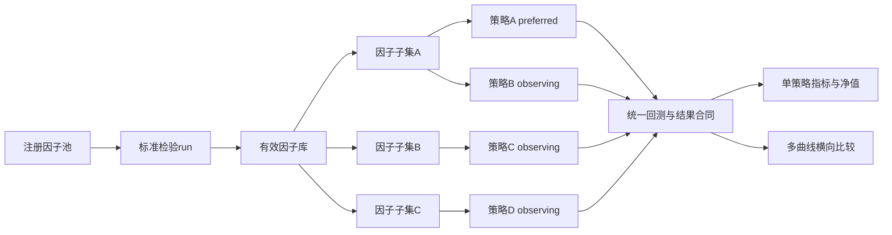

# 框架工作流程与使用方法

> 本文档定义 `multi_factor` 框架的**标准工作流程**：哪些环节可随研究演进，哪些环节必须固化。
> 新使用者请先读本文档 + [README.md](README.md) + [策略基准记录](docs/策略基准记录.md)。
>
> **时间边界**：`date_policy.research_cutoff`统一约束所有会影响因子、策略、参数或准入
> 结论的研究流程；冻结组合的回测、净值、监控和报告通过
> `date_range.end: latest_available`运行到认证数据源最新完整日。截止日后的表现只作前向
> 真实环境观察，不能反向参与调参或选择。
>
> **审计状态（2026-08-22）**：分钟合约根精确匹配、最终20%资产上限、完整60条历史
> IC、T+1收益账本、移仓与停牌冻结等代码修复已实施；本地数据、严格健康、全量测试与
> 全量因子重建已完成。旧全历史运行得到的H20/C13仅作冻结对照；生产批准仍为0，目标
> 权重发布批准门保持关闭。
>
> **运行边界**：本框架不连接交易所、不发送订单、也不接收成交回报。
> `config/target_publication.yaml` 只控制目标权重是否允许发布；外部执行参考信号只表示是否
> 允许生成/发布收盘后的目标权重；
> 实际委托、成交与持仓管理由外部系统或人工完成。

---

## 一、核心理念：可变层与固化层分离

框架分两层，**目的不同、变更策略不同**：

```
┌─────────────────────────────────────────────────┐
│  可变层（随研究不断扩充/修改）                      │
│                                                   │
│  ① 因子产出  → ② 因子检验  → ③ 通过后放入有效因子库 │
│                                                   │
│  允许：新增因子、修改公式；经审阅修改唯一框架契约     │
└─────────────────────────────────────────────────┘
                        ↓ 通过全部门槛的因子
┌─────────────────────────────────────────────────┐
│  固化层（锁定，保证长期稳定可比）                   │
│                                                   │
│  ④ 库内因子信号合成 → ⑤ 权重分配 → ⑥ 组合回测       │
│  ⑦ 根据结果微调研究和目标权重规则                   │
│                                                   │
│  禁止：未经充分验证随意改动权重引擎/调仓频率/锚点    │
└─────────────────────────────────────────────────┘
```

### 因子三大来源（平行结构）

因子进入统一 registry 有三条来源，消费端（research/backtest/combined）不区分来源：

| 来源 | 物理位置 | 数量 | 生命周期 | 注册方式 |
|------|----------|------|----------|----------|
| **人工创造** | `factors/library/` 与 `factors/user/` | 运行时统计 | 静态文件 | `@register_factor` |
| **SPEC 枚举** | `factors/specs/` | 3,024 | 静态定义→运行时展开 | `spec_factor.py` 批量注册 |
| **GP 搜索** | `factor_mining/`（引擎） | 0（待启用） | 动态 | SQLite→JSON 快照→`auto_mined_bridge.py` |

```
factors/library (人工)  ┐
factors/specs  (枚举)   ├→ 统一 Factor registry → research/backtest/combined
GP快照桥接 (搜索)       ┘
```

- `factors/library/intraday.py` 当前注册588个类，其中574个为`intraday_advanced`；完整运行时发现池为4,049（2026-08-21实测）
- GP 因子通过 `main.py --mined-snapshot PATH` 加载，未加载快照时桥接器为空
- 新增人工因子写入 `factors/library/` 对应主题文件；SPEC 新增写 `factors/specs/`；GP 走挖掘流程

**原则**：因子层是"活"的（研究驱动），组合层是"死"的（纪律驱动）。只有因子层的变化经过完整验证后，才能影响固化层。

数量口径不得混用：75个是当前结构化有效因子库；10f是旧固定观察定义；13个是旧全历史
迁移对照的去重观察候选；588个是`intraday.py`现行日频输出发现池；4,049个是导入全部
内置模块后的运行时注册表。有效因子也不自动等于“生产批准因子”。

---

## 二、可变层：因子产出—检验—入库

### ① 因子产出

| 方式 | 位置 | 说明 |
|------|------|------|
| 手工因子 | `factors/library/*.py` | 从公开文献/手册/经验实现 |
| 用户/扩展因子 | `factors/user/*.py` | 按主题隔离的人工扩展 |
| GP 挖掘 | `factor_mining/` | 遗传规划搜索（暂未启用） |

新因子注册即进入**因子池**（`factors.library` 动态注册）。

### ② 因子检验与入库（强制流程）

IDE直接运行项目根目录`run_factor_workflow.py`：保持
`WORKFLOW = FactorWorkflow.VALIDATE_ALL_INTRADAY`即可检验全部注册日内因子。日期窗口由代码
固定解析为90日历日预热 + 126交易日IS + 42交易日OOS，不从命令行参数猜测入口。

数据运行源或品种增减必须修改同一个研究基线并完成重验；不得为了某次因子检验另建平行
研究口径。因子准入后的确定策略允许拥有独立完整YAML，并统一登记到策略库。

人工审阅标准run后，将代码分支改为`FactorWorkflow.ADMIT_COMPLETED_RUN`并填写
`ADMISSION_RUN_DIR`与`ADMITTED_AT`，再点击Run。入库不会自动进入任何策略。

**必须通过的门槛**（`config/default.yaml::validation_policy`）：
- 层级 FDR q=0.10
- |IC| ≥ 0.01, |HAC t| ≥ 2.0
- 分层单调性 PASS
- 月换手 ≤ 60%（诊断）

### ③ 库内筛选与相关性门槛（后续组合阶段）

```
python main.py research --config config/default.yaml \
  --correlation --corr-threshold 0.5 --screening-file runs/<研究>/ic_by_window_period.json
```

**规则**：进入同一后续组合的因子之间 **|corr| ≥ 0.5 → 只保留簇代表**（绝对值，负相关 -0.98 同样属冗余）。
> 注意：框架 `--corr-threshold` **默认 0.6**，入池审查必须**显式传 0.5**（我们的实证门槛）。

**按簇审查建议**：相关矩阵聚类后，按簇查看——确认被拦截的因子确实与同簇因子功能重复，
而非跨簇误伤（如 jump_intensity 与 price_peak_count 相关 0.35~0.45 但逻辑互补，应保留）。
> 原则：同簇高相关因子会造成重复投票，应在训练窗口内做簇内择优；修复前的具体
> OOS数字已失效，不再用于当前因子准入或组合排序。

通过统一126日IS + 42日OOS门槛的因子先进入**有效因子库**；再经过相关性、成本和组合筛选，
方案冻结后从2026-05-15之后的新增数据进行真实前向观察并经人工批准，才可进入生产。已经被历史研究查看过的日期
不能追溯声明为未见样本；正式窗口统一来自`config/default.yaml::validation_policy`。

周期字段不可混用：`registered_horizons`是研究候选，`selected_period`是本次IS选择/OOS检验
周期，`approved_periods`才是组合许可。确认策略的YAML必须设置
`factor_library.enforce_portfolio_periods: true`；单组合对照`backtest.holding_period`，多子
组合对照每个`sleeve.holding_period`。同一因子可出现在不同周期子组合中，但每个周期都必须
位于该因子的`approved_periods`。

---

## 三、固化层：信号合成 → 权重 → 组合

### ④ 信号合成（已固化）

```
10 个固定观察因子方向化排名
→ 统一方向（负向因子排名取反）
→ ICIR窗口参数60 / Ledoit-Wolf动态加权（先排除当日IC，再取完整60条历史IC）
→ 综合得分
→ Top10 做多 / Bottom10 做空
```

实现：`strategies/combined.py::CombinedStrategy.factor_scores()`

### ⑤ 权重分配（已固化）

```
池内 ERC（等风险贡献, 协方差 shrinkage=0.3）
→ 有界单纯形投影，最终单品种权重占每侧单位袖套0.5%～20%
→ 可按品种覆盖上限、按板块配置权重上限；约束不可行时失败关闭
```

实现：Top/Bottom选池、板块名额和池内权重统一位于
`optimization/portfolio_construction.py`；`optimization/asset_selection.py`仅是默认关闭的
后置持仓门，不参与主分支A。

20%限制的是每个单位总敞口多头或空头袖套中的单品种权重，不是板块权重。板块默认
只限制每侧最多入选3个品种；只有显式配置 `sector_weight_caps` 才限制板块权重。

### ⑥ 组合回测（已固化）

```
品种池: 38（见基准记录 A，manual29+9 扩展）
数据源: 因子显式请求原始频率；所选Parquet/DuckDB运行源提供1min/5min，30min由15min显式重采样
因子: 当前 10f（定义以 `strategies/combined.py::FACTORS` 为准）
因子合成: IC_IR(LW) 动态加权 (60日滚动 Ledoit-Wolf 收缩协方差, w*=Σ⁻¹·mean(IC))
权重: 池内 ERC 分开做 (10多/10空各自 ERC, 非20一起) | 选池: 板块配额 cap=3
调仓: 日度；收盘T形成目标W[T]，下一持有区间计入W[T]×R[T+1]，等价为收益日口径W[T-1]×R[T]
状态: 固定观察定义；旧绩效失效，当前全量研究未验证该10f整体组合，`config/target_publication.yaml`关闭，状态为`NO_TARGETS`
```

### ⑦ 目标权重观察规则（固化规则）

- 月换手超 60% → 预警排查
- 连续 3 个月 OOS 夏普 < 0.5 → 因子衰减预警
- 品种池流动性突变 → 重新评估

---

## 四、分支方法（特殊想法单独保存）

模块没有另建编排系统：数据与日期、处理、信号/收益模型、品种筛选、风险、优化、成本、
单/多子组合及元优化仍统一由现有`FrameworkConfig` YAML收口。有效库后的平行因子子集、策略
状态和完整YAML路径统一登记在`config/strategy_library.yaml`。每一套确定方案仍只有一份完整
YAML；IDE入口读取目录即可同时回测，输出新的`runs/portfolio_backtest/<run_id>/`，包含每套
策略完整结果、解析后配置、目录与配置哈希、横向指标和多曲线净值。入口默认只做配置校验，
显式切换`RUN_AND_COMPARE`才执行回测。

这样保留了各环节多方法/多参数的能力，同时避免再引入配置继承、插件数据库或一次性比较脚本。



子集选择可以参考后续品种、杠杆、容量和风险需求；这些理由写入`selection_context`。但实际
杠杆、品种、合成、权重等执行参数只写在完整策略YAML，不回写到子集，避免因果关系和配置
所有权混淆。

### 配置与证据所有权

| 对象 | 唯一权威位置 | 可以改变什么 | 不得承担什么 |
|---|---|---|---|
| 本机运行时 | `config/local.yaml`及数据环境变量 | DuckDB路径、release、结果后端 | 因子、品种、策略、回测语义 |
| 研究基线 | `config/default.yaml` | 研究截止日、126/42窗口、处理与检验政策 | 某一确定策略的独立选择 |
| 有效因子库 | `factor_library/library.json` | 有效成员、方向、批准周期与证据链接 | 因子子集、策略权重、生产批准 |
| 平行目录 | `config/strategy_library.yaml` | 子集成员、用途、策略状态、策略YAML路径 | 杠杆、风险、权重等执行参数 |
| 确定策略 | 每个策略的一份完整YAML | 因子周期分配、合成、品种、杠杆、风险、优化、成本、回测 | 修改有效因子准入事实 |
| 运行证据 | `runs/factor_validation`、`runs/portfolio_backtest` | 保存不可变结果、解析后配置与哈希 | 反向充当当前配置 |
| 发布审批 | `config/target_publication.yaml` | 是否允许发布已审阅部署包 | 自动选择首选策略、生成订单 |

确定策略YAML统一放在`config/`目录并由策略库引用，以继续复用同目录的`local.yaml`机器配置。
`preferred`只表示当前观察首选，不等于生产批准；发布门仍完全独立。

以下带`config`名称的文件不属于当前配置路由，不做强行合并：

- `external_strategies/*/config.yaml`：外部策略适配器自己的独立schema和执行器；
- `snapshot/*/config.yaml`：冻结历史定义，只供审计重放；
- `runs/**/resolved_config.json`及其他JSON：不可变运行证据，不反向加载为当前配置；
- `cache/**/*.json`：可再生数据缓存元数据；
- `Cargo.toml`、`pyproject.toml`：本地数值扩展的构建配置。

旧`research/factor_pools.yaml`与`validated_candidates`已删除：两者没有运行消费者，并与当前
有效因子库/平行子集目录重复。旧10f监控常量也已明确改名为`OBSERVATION_*`，不再使用
`PRODUCTION_*`误导命名。

策略方案编号只用于区分组合分支，不改变因子名称、因子编号或目录语义：

- `A` 是当前主观察分支；以后需要并列记录的主分支均以 `A` 开头。
- `B*` 用于基于框架数据和因子的多品种变种，不进入主生产流程。

如有独立策略想法（如 9 品种只做多、跨市场套利等），**不作为主流程修改**：

1. 可复用实验放 `workflows/experiments/`，一次性探索不作为长期源码保留
2. 结果记录进 `docs/策略基准记录.md`（如 B1 = 9品种指数形式代理）
3. 若想转正，需走完整验证后作为**新固化方案**提交，不覆盖现有方案

已有分支：
| 编号 | 方案 | 状态 |
|------|------|------|
| **A** | 10f+38品种 ICIR+Top10/Bottom10+cap3+ERC | **固定观察基线；未通过发布批准，目标权重发布门关闭** |
| B1 | 9品种全部做多、各因子独立九选五后合成 | 国信趋势指数形式代理；影子对照 |

---

## 五、快速上手

```powershell
# 环境
$PY = 'E:\Python\Pythonvenv\Scripts\python.exe'  # 本机项目解释器
# 或安装依赖后: python -m pip install -r requirements.txt

# 1. 研究新因子
& $PY main.py research --config config/default.yaml --factors "因子名" --multi-period

# 2. 相关性门槛
& $PY main.py research --config config/default.yaml --correlation --screening-file runs/<id>/ic_by_window_period.json

# 3. 看策略信号
& $PY strategies/combined.py --date YYYY-MM-DD  # 显式信号日，不表示OOS边界

# 4. 完整组合回测/多方案比较：编辑run_portfolio_workflow.py顶部IDE SETTINGS后点击Run
#    默认VALIDATE_CONFIGURATIONS；确认后切换RUN_AND_COMPARE

# 5. 全量测试
& $PY -B -m pytest -q -p no:cacheprovider tests/
```

---

## 六、关键文件索引

| 文件 | 作用 |
|------|------|
| `strategies/combined.py` | 固化策略（信号+ERC权重） |
| `docs/策略基准记录.md` | 主分支 A 与多品种变种 B* 的基准登记 |
| `docs/周期一致性与多频率共存设计指南.md` | 周期/频率设计原则 |
| `config/default.yaml` | 默认框架契约与旧10f观察基线；新确定策略使用各自完整YAML |
| `config/strategy_library.yaml` | 平行因子子集、策略状态及完整策略YAML路径的唯一目录 |
| `run_portfolio_workflow.py` | IDE策略配置校验、单/多组合回测与多曲线持久比较入口 |
| `workflows/experiments/` | 隔离研究工作流，不修改生产配置 |
